# JDK的安装

## 1.JDK的下载

打开浏览器输入网址 <https://www.oracle.com/index.html>，进入[Oracle官网](https://www.oracle.com/index.html)


在官网首页菜单栏，点击Products，在Software中找到Java，单击该选项

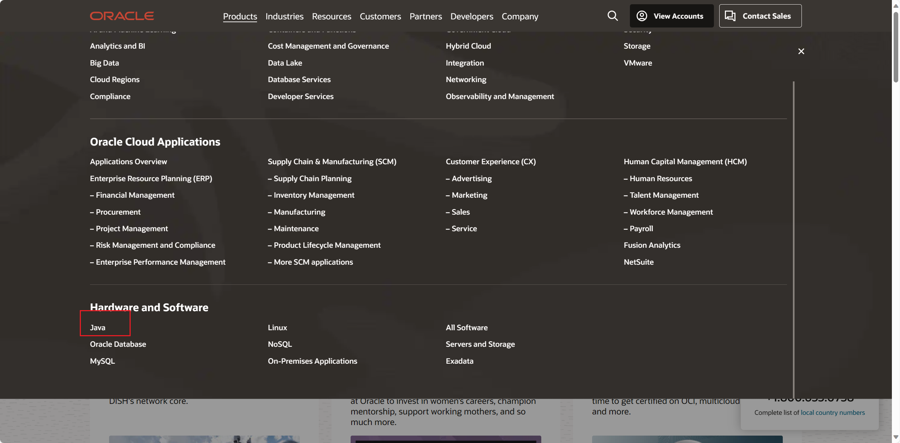

会进入如下界面


在界面中往下滑，可以看到如下选项，在该选项中选择Java SE，找到Oracle JDK，点击进入JDK下载界面

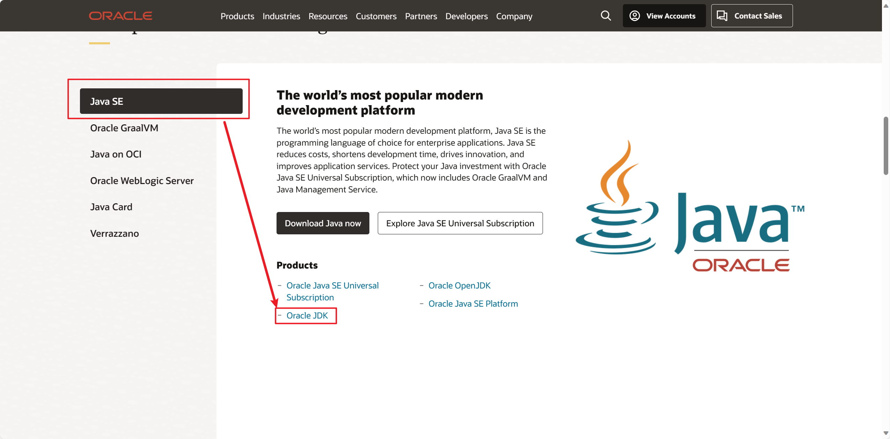

进入后选择适合自己的jdk版本下载，推荐下载JDK8或JDK11系列，因为此版本为Oracle公司会长期更新的版本。

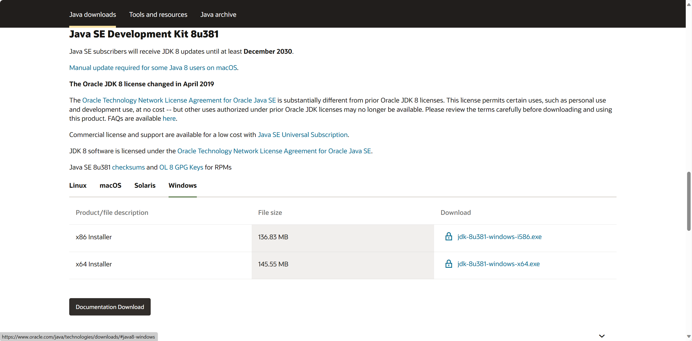

## 2.JDK的安装

在文件夹中找到下载好的安装包，右击以**管理员身份运行**。

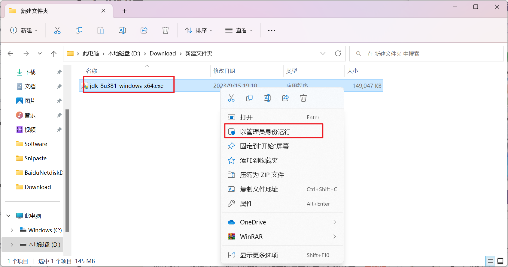

点击下一步。

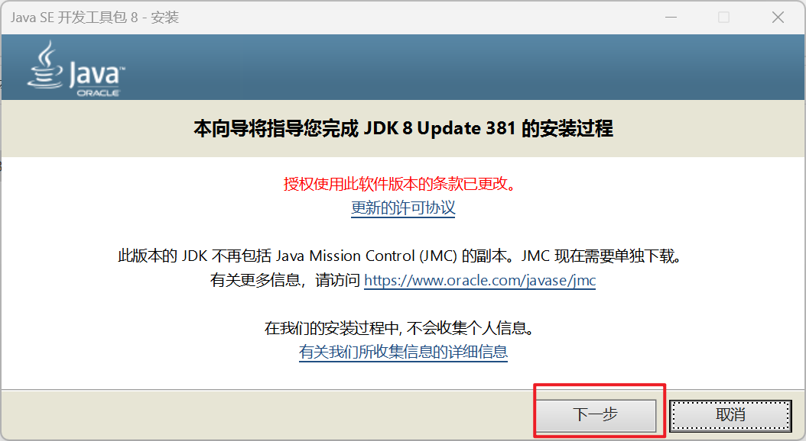


可以直接默认目录，点击下一步。也可以自定义路径，先创建一个文件夹名为 Java，再在该文件夹下创建一个文件夹为 JDK 安装目录，同时创建一个文件夹为 JRE 安装目录

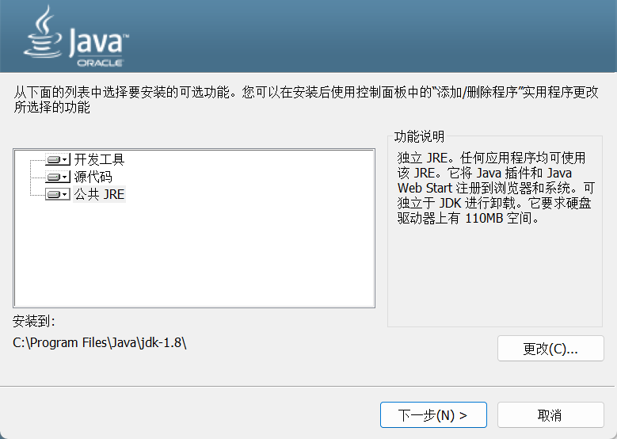

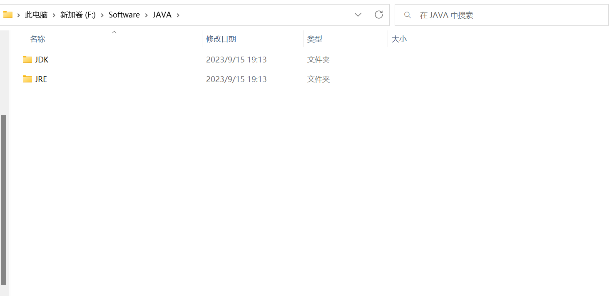

然后回到JDK安装界面，更改安装路径，为上述所创建的 JDK 路径，点击下一步（**这里由于第一项开发工具中已经自带了 JRE，则第三项的公共 JRE 可以取消独立安装，上述创建的 JRE 文件夹也不需要了**）。无其他需求，取消安装 JRE 即可

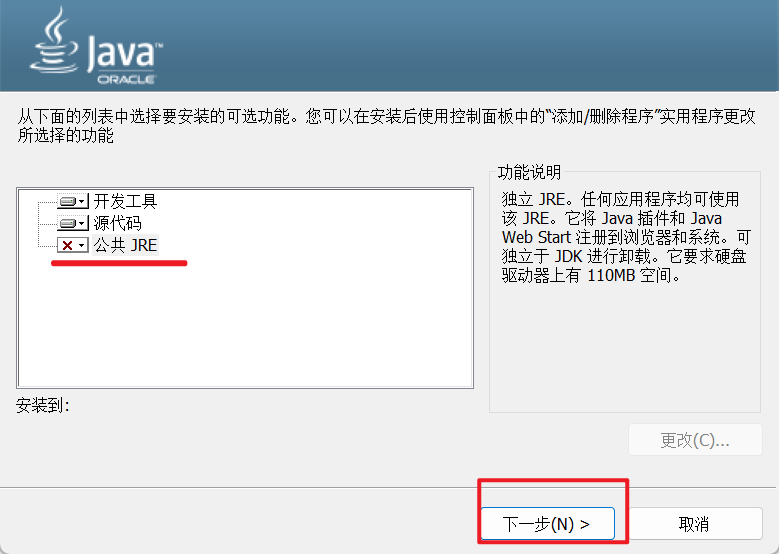

等待一会，会进入 JRE 的安装界面，同样的更改路径，为上述所创建的 JRE 路径，更改完之后点击下一步（**在上一步取消公共 JRE 安装的则不会出现下面的界面，直接到 2.6 安装完成**）。

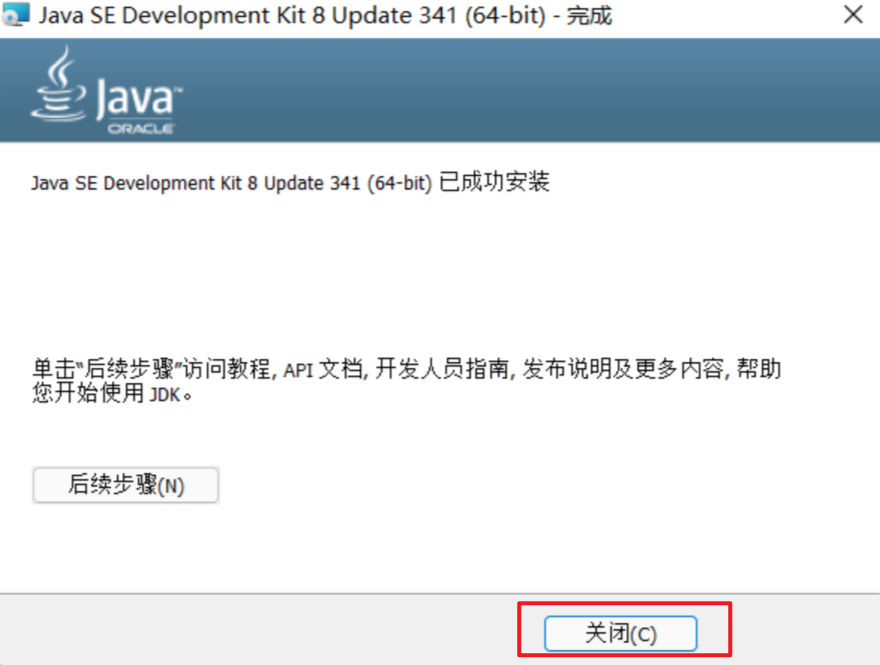

## 3.环境配置

右键单击此电脑，点击属性，会出现以下设置选项，点击高级系统设置，打开。

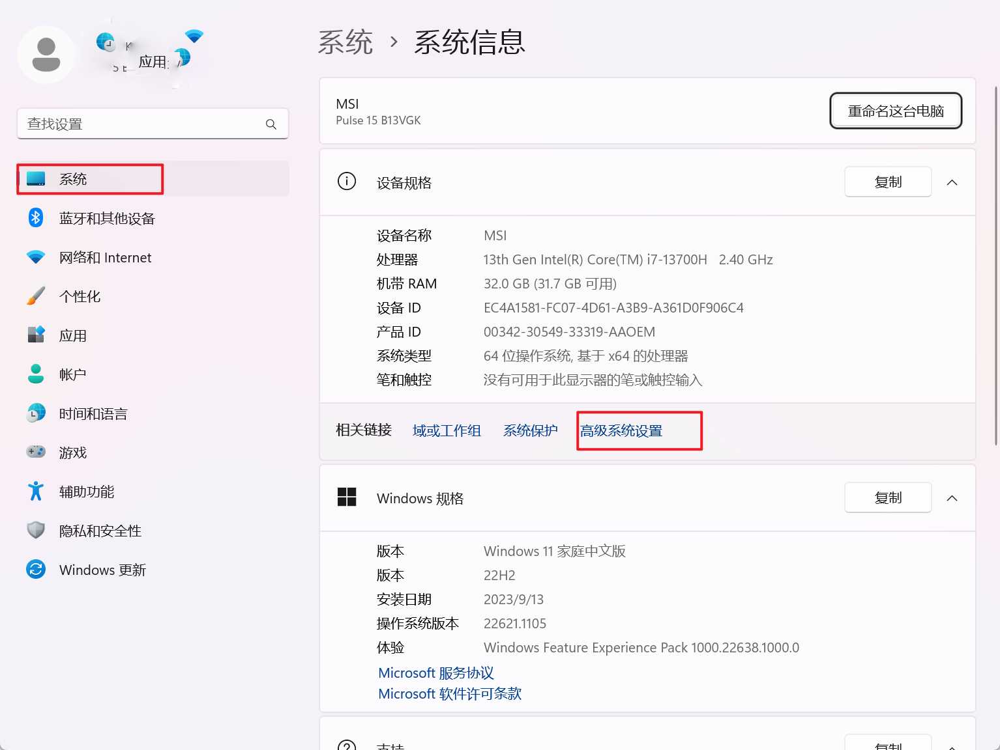

点击**环境变量**


点击新建，变量名为 JAVA_HOME,变量值为刚刚JDK安装的路径，到根目录即可，点击确定

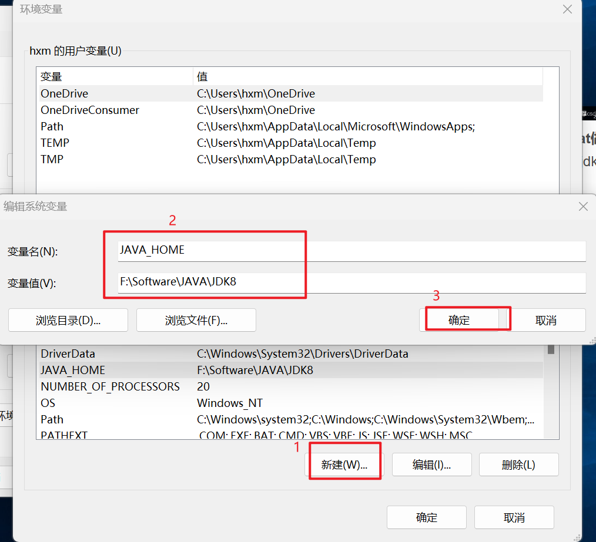

找到Path后，点击编辑。

在变量值的最开头输入 **%JAVA_HOME%\bin;%JAVA_HOME%\jre\bin**。不要对其他数值进行修改（由于我已经进行了配置，所以显示在了中间，第一次输入在最开头即可），假如不小心修改了其他数值，取消重新进入即可。（在前面取消安装了公共 JRE 的则只需要在变量值的最开头输入：**%JAVA_HOME%\bin**，即可）

```
%JAVA_HOME%\bin;%JAVA_HOME%\jre\bin;
%JAVA_HOME%\bin;
```

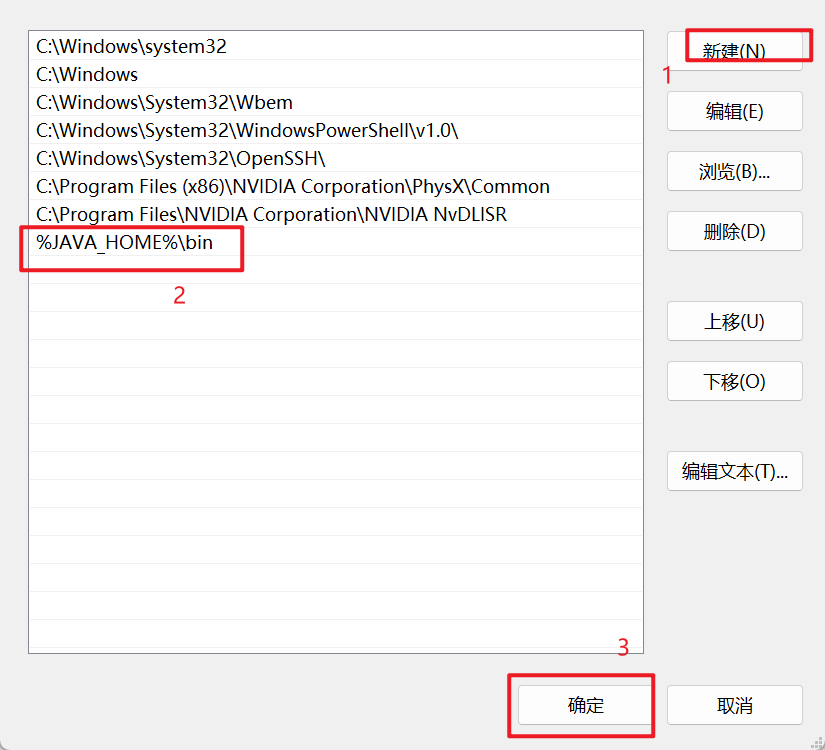

点击确定，全部确定退出后，依旧按 Win+R，输入 cmd 进入命令提示符界面，输入 javac，假如出现如下界面则配置成功。（这时再输入 java，则会出现 2.7 所示界面）

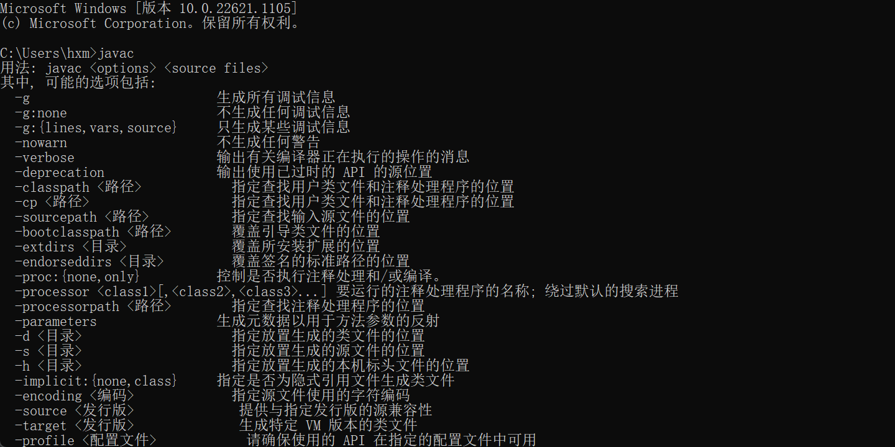

