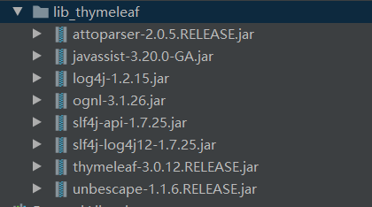
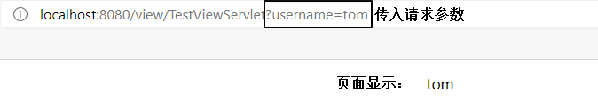

# JavaWeb

## 一、HTML

HTML：超文本标记语言。是解释型语言，不区分大小写。

### html中的基础标签

主体标签

```html
<html>
	<head>
    	<title>页面标题</title>
        <meta charset="UTF-8">
    </head>
	<body></body>
</html>
```

换行标签（单标签）

```html
<br/>
```

直线标签

```html
<hr/>
```

段落标签

```html
<p>段落</p>
```

图像标签

> src：图像的路径，有绝对路径和相对路径
>
> width：图像的宽
>
> height：图像的高
>
> alt：图像解释说明

```html

```

标题标签

```html
<h1>标题一</h1>
<h2>标题二</h2>
<h3>标题三</h3>
<h4>标题四</h4>
<h5>标题五</h5>
<h6>标题六</h6>
```

列表标签

> 有序列表
>
> type：显示的排序类型，A	a	I	i	1(deafult)
>
> start：从第*个开始排序。

```html
<ol type="" start="">
	<li>张三</li>
    <li>李四</li>
    <li>王五</li>
</ol>
```

> 无序列表
>
> type：显示的无序符号，disc(deafult)，circle，square

```html
<ul type="">
	<li>张三</li>
    <li>李四</li>
    <li>王五</li>
</ul>
```

加粗，斜体，下划线，上标，下标标签

```html
<b></b>
<i></i>
<u></u>
<sup></sup>
<sub></sub>
```

超链接标签

> herf：超链接地址
>
> target：新页面创建方式
>
> > _self：本窗口打开
> >
> > _blank：新窗口打开
> >
> > _parent：父窗口打开
> >
> > _top：顶层拆给你看打开

```html
<a href="" target=""></a>
```

实体符号

```html
大于&gt;
版权&copy;
```

块标记标签

```html
<span></span>
```

层标记标签

```html
<div></div>
```

注释

```html
<!--这是注释-->
```

### 表格标签

> table：表格标签
>
> > tr：表行标签
> >
> > > th：表头列标签
> > >
> > > td：普通列标签
>
> table中有如下属性（虽然已经淘汰，但是最好了解一下）
>
> > border：表格边框的粗细
> > width:表格的宽度
> > cellspacing：单元格间距
> > cellpadding：单元格填充
>
> tr中有一个属性
>
> >align：center , left , right 
>
> td中有
>
> > rowspan : 行合并
> >
> > colspan : 列合并

```html
<table border="1" cellspacing="0" cellpadding="4" width="600">
    <tr align="center">
    	<th>姓名</th>
        <th>年龄</th>
        <th>语文</th>
        <th>数学</th>
        <th>操作</th>
    </tr>
    <tr align="center">
    	<td>张三</td>
        <td rowspan="2">18</td>
        <td>60</td>
        <td>81</td>
        <td></td>
    </tr>
    <tr align="center">
    	<td>李四</td>
        <td>60</td>
        <td>81</td>
        <td></td>
    </tr>
    <tr align="center">
    	<td>王五</td>
        <td>21</td>
        <td>60</td>
        <td>81</td>
        <td></td>
    </tr>
    <tr align="center">
    	<td>平均年龄</td>
        <td colspan="4">19</td>
    </tr>
</table>
```

### 表单标签

> form：表单标签
>
> > input：输入标签
> >
> > select：下拉菜单标签
> >
> > > option：下拉选项标签
> >
> > textarea：文本域标签
>
> form的属性：
>
> > action：将表单提交给*。
> >
> > method：表单提交方式。http协议常用的有get，post两种方式。
>
> input：
>
> > \<input type="text"/>：输入文本，有name，value属性。
> >
> > \<input type="password"/>：输入密码，有name属性。
> >
> > \<input type="radio"/>：单选框，有name，value，checked属性。一次提交中，同一name属性所包含的radio只能选一个。包含checked属性代表默认选中。
> >
> > \<input type="checkbox"/>：多选框，有name，value，checked属性。一次提交中，同一name属性所包含的checked可多选。包含checked属性代表默认选中。
> >
> > \<input type="submit"/>：提交按钮，有value属性。
> >
> > \<input type="reset"/>：重置按钮，有value属性。
> >
> > \<input type="button"/>：普通按钮，有value属性。
>
> select的属性：有name属性。
>
> >option：有value属性，包含selected属性表示默认选中。
>
> textarea的属性：有name，rows，cols属性。

```html
<form action="" method="">
    账号：<input type="text" name="account" value="请输入账号"/><br/>
    密码：<input type="password" name="password"/><br/>
    性别：<input type="radio" name="gender" value="male" checked/>男
    	 <input type="radio" name="gender" value="female"/>女<br/>
    爱好：<input type="checkbox" name="hobby" value="basketball" checked/>篮球
    	 <input type="checkbox" name="hobby" value="football"/>足球
    	 <input type="checkbox" name="hobby" value="earth"/>地球<br/>
    星座：<select name="star">
    		<option value="1">魔羯座</option>
             <option value="2" selected>白羊座</option>
             <option value="3">处女座</option>
             <option value="4">天秤座</option>
    	 </select><br/>
    备注：<textarea name="remark" row="4" cols="20"></textarea><br/>
    <input type="submit" value="提交"/>
    <input type="reset" value="重置"/>
    <input type="button" value="普通按钮"/>
</form>
```

## 二、CSS

### CSS的基本分类

```css
/*div标签样式表*/
div{
    
}
/*类样式表*/
.f20{
    
}
/*ID样式表，尽量保持ID唯一*/
#bg45{
    
}
```

### CSS从使用位置上分类

嵌入式样式表

```html
<!--嵌入式样式表-->
<p style="font-size:60px;font-weight:bolder;color:yellow;">
    Hello
</p>
```

内部样式表

```html
<html>
    <head>
        <!--内部样式表-->
        <style type="text/css">
			p{
				color:red;
			}
		</style>
    </head>
</html>
```

外部样式表（常用）

```html
<html>
    <head>
        <!--外部样式表-->
        <link rel="stylesheet" href="css/demo01.css">
    </head>
</html>
```

### CSS盒子模型

> border：边框
>
> margin：外补丁
>
> padding：内补丁

## 三、Javascript

### JS的引用

```html
<html>
    <head>
        <script type="text/javascript" src=""></script>
    </head>
</html>
```

## 四、Servlet

### 1.设置编码

> Tomcat8之前
>
> > get方法：
> >
> > ```java
> > String fname = request.getParameter("fname");
> > 
> > byte[] bytes = fname.getBytes("ISO-8859-1");
> > 
> > fname = new String(bytes,"UTF-8");
> > ```
> >
> > post方法：
> >
> > ```java
> > request.setCharacterEncoding("UTF-8")
> > ```
> >
> > 
>
> Tomcat8之后
>
> > get方法默认使用UTF-8编码
> >
> > post方法：
> >
> > ```java
> > request.setCharacterEncoding("UTF-8")
> > ```
>
> 注意：post中，设置编码的代码要放在获取参数之前。

### 2.Servlet的生命周期

默认情况下：

> 第一次接收请求时，这个Servlet会进行实例化(调用构造方法)、初始化(调用init())、然后服务(调用service())
>
> 从第二次请求开始，每一次都是服务
>
> 当容器关闭时，其中的所有的servlet实例会被销毁，调用销毁方法

如果需要提高系统的启动速度，默认情况就是这样。如果需要提高响应速度，我们应该设置Servlet的初始化时机。

Servlet的初始化时机：

> 默认是第一次接收请求时，实例化，初始化
>
> 我们可以通过<load-on-startup>来设置servlet启动的先后顺序,数字越小，启动越靠前，最小值0
>
> ```xml
> <load-on-startup>1</load-on-startup>
> ```

Servlet在容器中是：单例的、线程不安全的

## 五、HTTP协议

### 1.介绍

**HTTP**：**H**yper **T**ext **T**ransfer **P**rotocol超文本传输协议。

浏览器发送给服务器的数据：请求报文；服务器返回给浏览器的数据：响应报文。

### 2.请求报文

请求报文分为3个部分：请求行，请求（消息）头，请求体。

#### 请求行

作用：展示当前请求的最基本信息

> POST /dynamic/target.jsp HTTP/1.1

- 请求方式
- 访问地址
- HTTP协议的版本

#### 请求头

作用：通过具体的参数对本次请求进行详细的说明

格式：键值对，键和值之间使用冒号隔开

相对比较重要的请求消息头：

| 名称           | 功能                                                 |
| -------------- | ---------------------------------------------------- |
| Host           | 服务器的主机地址                                     |
| Accept         | 声明当前请求能够接受的『媒体类型』                   |
| Referer        | 当前请求来源页面的地址                               |
| Content-Length | 请求体内容的长度                                     |
| Content-Type   | 请求体的内容类型，这一项的具体值是媒体类型中的某一种 |
| Cookie         | 浏览器访问服务器时携带的Cookie数据                   |

#### 请求体

作用：作为请求的主体，发送数据给服务器。具体来说其实就是POST请求方式下的请求参数。

>form data含义：当前请求体是一个表单提交的请求参数。post请求
>
>Request Payload含义：整个请求体以某种特定格式来组织数据，例如JSON格式。json格式。
>
>queryString：get请求。

### 3.响应报文

#### 响应行

> HTTP/1.1 200 OK

- HTTP协议版本
- **响应状态码**
- 响应状态的说明文字

#### 响应头

- 响应体的说明书。
- 服务器端对浏览器端设置数据，例如：服务器端返回Cookie信息。

| 名称           | 功能                                                 |
| -------------- | ---------------------------------------------------- |
| Content-Type   | 响应体的内容类型                                     |
| Content-Length | 响应体的内容长度                                     |
| Set-Cookie     | 服务器返回新的Cookie信息给浏览器                     |
| location       | 在**重定向**的情况下，告诉浏览器访问下一个资源的地址 |

#### 响应体

服务器返回的数据主体，有可能是各种数据类型。

- HTML页面
- 图片
- 视频
- 以下载形式返回的文件
- CSS文件
- JavaScript文件

#### 响应状态码

作用：以编码的形式告诉浏览器当前请求处理的结果

| 状态码 | 含义                                                      |
| ------ | --------------------------------------------------------- |
| 200    | 服务器成功处理了当前请求，成功返回响应                    |
| 302    | 重定向                                                    |
| 400    | [SpringMVC特定环境]请求参数问题                           |
| 403    | 没有权限                                                  |
| 404    | 找不到目标资源                                            |
| 405    | 请求方式和服务器端对应的处理方式不一致                    |
| 406    | [SpringMVC特定环境]请求扩展名和实际返回的响应体类型不一致 |
| 50X    | 服务器端内部错误，通常都是服务器端抛异常了                |

## 六、Session会话

### Http是无状态的

HTTP 无状态 ：服务器无法判断这两次请求是同一个客户端发过来的，还是不同的客户端发过来的。

### 会话跟踪技术

客户端第一次发请求给服务器，服务器获取session，获取不到，则创建新的，然后响应给客户端
下次客户端给服务器发请求时，会把sessionID带给服务器，那么服务器就能获取到了，那么服务器就判断这一次请求和上次某次请求是同一个客户端，从而能够区分开客户端。

常用的API：

```java
request.getSession() // 获取当前的会话，没有则创建一个新的会话
request.getSession(true) // 效果和不带参数相同
request.getSession(false) // 获取当前会话，没有则返回null，不会创建新的
session.getId() // 获取sessionID
session.isNew() // 判断当前session是否是新的
session.getMaxInactiveInterval() // session的非激活间隔时长，默认1800秒
session.setMaxInactiveInterval()
session.invalidate() // 强制性让会话立即失效
```
### session保存作用域

常用的API：

```java
void session.setAttribute(k,v)  //设置作用域变量，传入key，value
Object session.getAttribute(k)  //通过key获取value值
void removeAttribute(k)  //通过key移除作用域变量
```

### 保存作用域

原始情况下，保存作用域我们可以认为有四个： page（页面级别，现在几乎不用） , request（一次请求响应范围） , session（一次会话范围） , application（整个应用程序范围）。

> request：一次请求响应范围
> session：一次会话范围有效
> application： 一次应用程序范围有效

### 路径问题


相对路径：

```html
<link href="../css/login.css"/>
```

绝对路径：

```html
<!--base标签的作用：在base标签中声明好href路径后，在其他他地方用到href路径，则其他地方的路径都拼接在base中的href路径后，形成绝对路径-->
<base href="http://localhost:8080/project/"/>
<link href="css/login.css"/>
<!--thymeleaf中使用，@{} == http://localhost:80880/project-->
<link th:href="@{/css/login.css}"/>
```

## 七、服务器内部转发以及客户端重定向

服务器内部转发 : 

```java
//内部转发到其他servlet组件
request.getRequestDispatcher("...").forward(request,response);
```

客户端重定向：

```java
//给客户端返回响应，让客户端再次向另一个servlet发送请求
response.sendRedirect("....");
```

Thymeleaf渲染：

```java
//url：与配置文件web.xml中的<context-param>有关
super.processTemplate("url", req, resp);
```

## 八、Thymeleaf

### 1.物理视图和逻辑试图

物理视图=视图前缀+逻辑视图+视图后缀

| 视图前缀     | 逻辑视图      | 视图后缀 | 物理视图                       |
| ------------ | ------------- | -------- | ------------------------------ |
| /pages/user/ | login         | .html    | /pages/user/login.html         |
| /pages/user/ | login_success | .html    | /pages/user/login_success.html |

### 2.在服务器端引入Thymeleaf环境

#### 1.加入jar包



#### 2.配置上下文参数

可在web.xml文件中配置。

```xml
<!-- 在上下文参数中配置视图前缀和视图后缀 -->
<context-param>
    <param-name>view-prefix</param-name>
    <param-value>/WEB-INF/view/</param-value>
</context-param>
<context-param>
    <param-name>view-suffix</param-name>
    <param-value>.html</param-value>
</context-param>
```

#### 3.创建Servlet基类

要使用Thymeleaf，则其他Servlet要继承ViewBaseServlet类

```java
import org.thymeleaf.TemplateEngine;
import org.thymeleaf.context.WebContext;
import org.thymeleaf.templatemode.TemplateMode;
import org.thymeleaf.templateresolver.ServletContextTemplateResolver;

import javax.servlet.ServletContext;
import javax.servlet.ServletException;
import javax.servlet.http.HttpServlet;
import javax.servlet.http.HttpServletRequest;
import javax.servlet.http.HttpServletResponse;
import java.io.IOException;

public class ViewBaseServlet extends HttpServlet {

    private TemplateEngine templateEngine;

    @Override
    public void init() throws ServletException {

        // 1.获取ServletContext对象
        ServletContext servletContext = this.getServletContext();

        // 2.创建Thymeleaf解析器对象
        ServletContextTemplateResolver templateResolver = new ServletContextTemplateResolver(servletContext);

        // 3.给解析器对象设置参数
        // ①HTML是默认模式，明确设置是为了代码更容易理解
        templateResolver.setTemplateMode(TemplateMode.HTML);

        // ②设置前缀
        String viewPrefix = servletContext.getInitParameter("view-prefix");

        templateResolver.setPrefix(viewPrefix);

        // ③设置后缀
        String viewSuffix = servletContext.getInitParameter("view-suffix");

        templateResolver.setSuffix(viewSuffix);

        // ④设置缓存过期时间（毫秒）
        templateResolver.setCacheTTLMs(60000L);

        // ⑤设置是否缓存
        templateResolver.setCacheable(true);

        // ⑥设置服务器端编码方式
        templateResolver.setCharacterEncoding("utf-8");

        // 4.创建模板引擎对象
        templateEngine = new TemplateEngine();

        // 5.给模板引擎对象设置模板解析器
        templateEngine.setTemplateResolver(templateResolver);

    }

    protected void processTemplate(String templateName, HttpServletRequest req, HttpServletResponse resp) throws IOException {
        // 1.设置响应体内容类型和字符集
        resp.setContentType("text/html;charset=UTF-8");

        // 2.创建WebContext对象
        WebContext webContext = new WebContext(req, resp, getServletContext());

        // 3.处理模板数据
        templateEngine.process(templateName, webContext, resp.getWriter());
    }
}
```

### 3.基本语法


```html
<html lang="en" xmlns:th="http://www.thymeleaf.org"></html>
```

#### 1.访问域对象

##### ①操作请求域

Servlet中的代码：

```java
String requestAttrName = "helloRequestAttr";
String requestAttrValue = "helloRequestAttr-VALUE";

request.setAttribute(requestAttrName, requestAttrValue);
```

Thymeleaf表达式：

```html
<p th:text="${helloRequestAttr}">request field value</p>
```

##### ②操作会话域

Servlet中的代码：

```java
// ①通过request对象获取session对象
HttpSession session = request.getSession();

// ②存入数据
session.setAttribute("helloSessionAttr", "helloSessionAttr-VALUE");
```

Thymeleaf表达式：

```html
<p th:text="${session.helloSessionAttr}">这里显示会话域数据</p>
```

##### ③操作应用域

Servlet中的代码：

```java
// ①通过调用父类的方法获取ServletContext对象
ServletContext servletContext = getServletContext();

// ②存入数据
servletContext.setAttribute("helloAppAttr", "helloAppAttr-VALUE");
```

Themeleaf表达式：

```html
<p th:text="${application.helloAppAttr}">这里显示应用域数据</p>
```

#### 2.获取请求参数

##### ①一个名字一个值

```html
<p th:text="${param.username}">这里替换为请求参数的值</p>
```



##### ②一个名字多个值

```html
<p th:text="${param.team}">这里替换为请求参数的值</p>
```


如果想要精确获取某一个值，可以使用数组下标。

```html
<p th:text="${param.team[0]}">这里替换为请求参数的值</p>
<p th:text="${param.team[1]}">这里替换为请求参数的值</p>
```


#### 3.内置对象

所谓内置对象其实就是在表达式中**可以直接使用**的对象。

##### ①基本内置对象


```html
<h3>表达式的基本内置对象</h3>
<p th:text="${#request.getClass().getName()}">这里显示#request对象的全类名</p>
<p th:text="${#request.getContextPath()}">调用#request对象的getContextPath()方法</p>
<p th:text="${#request.getAttribute('helloRequestAttr')}">调用#request对象的getAttribute()方法，读取属性域</p>
```

基本思路：

- 如果不清楚这个对象有哪些方法可以使用，那么就通过getClass().getName()获取全类名，再回到Java环境查看这个对象有哪些方法
- 内置对象的方法可以直接调用
- 调用方法时需要传参的也可以直接传入参数

##### ②公共内置对象


Servlet中将List集合数据存入请求域：

```java
request.setAttribute("aNotEmptyList", Arrays.asList("aaa","bbb","ccc"));
request.setAttribute("anEmptyList", new ArrayList<>());
```

页面代码：

```html
<p>#list对象isEmpty方法判断集合整体是否为空aNotEmptyList：<span th:text="${#lists.isEmpty(aNotEmptyList)}">测试#lists</span></p>
<p>#list对象isEmpty方法判断集合整体是否为空anEmptyList：<span th:text="${#lists.isEmpty(anEmptyList)}">测试#lists</span></p>
```

#### 4.分支和迭代

##### ①if和unless

if配合not关键词和unless配合原表达式效果是一样的，看自己的喜好。

```html
<table>
    <tr>
        <th>员工编号</th>
        <th>员工姓名</th>
        <th>员工工资</th>
    </tr>
    <tr th:if="${#lists.isEmpty(employeeList)}">
        <td colspan="3">抱歉！没有查询到你搜索的数据！</td>
    </tr>
    <tr th:if="${not #lists.isEmpty(employeeList)}">
        <td colspan="3">有数据！</td>
    </tr>
    <tr th:unless="${#lists.isEmpty(employeeList)}">
        <td colspan="3">有数据！</td>
    </tr>
</table>
```

##### ②switch

```html
<h3>测试switch</h3>
<div th:switch="${user.memberLevel}">
    <p th:case="level-1">银牌会员</p>
    <p th:case="level-2">金牌会员</p>
    <p th:case="level-3">白金会员</p>
    <p th:case="level-4">钻石会员</p>
</div>
```

##### ③each

```html
<h3>测试each</h3>
<table>
    <thead>
        <tr>
            <th>员工编号</th>
            <th>员工姓名</th>
            <th>员工工资</th>
        </tr>
    </thead>
    <tbody th:if="${#lists.isEmpty(employeeList)}">
        <tr>
            <td colspan="3">抱歉！没有查询到你搜索的数据！</td>
        </tr>
    </tbody>
    <tbody th:if="${not #lists.isEmpty(employeeList)}">
        <!-- 遍历出来的每一个元素的名字 : ${要遍历的集合} -->
        <tr th:each="employee : ${employeeList}">
            <td th:text="${employee.empId}">empId</td>
            <td th:text="${employee.empName}">empName</td>
            <td th:text="${employee.empSalary}">empSalary</td>
        </tr>
    </tbody>
</table>
```

#### 5.包含其他模板文件

##### ①应用场景

抽取各个页面的公共部分：

![./images](data:image/png;base64,iVBORw0KGgoAAAANSUhEUgAAAcMAAAGLCAIAAAA0726IAAAbY0lEQVR42u3d34tV1fvA8dMfIGifrkRkUrvoSiMrML3QCxWDSLrwR0EjhKkXqSQaZfgVrHAuGo3SkqK50yhQokS9GEVF6Ic1QtGNM4l4mR+t/oC+z3fWt8Vq77X3rLPPc86ZWc/7dSF25px9zjPm273XOjPzQCvw999/u9888MAD3Jj3jTXC+wOYkvy1eqCV9rcLOZFW1vyh138UQMj9feHvjEWUFNBCSe2ipIAWSmoXJQW0/H9JW6yT4t8oKZCOkiKOkgLpKCniKCmQjpL2zo0bN/76669HH330P//5T79fy/9hnRTQ0s8dp6tXr65YseLw4cN79+5tdofeePPNN69fvy4vY/HixZ0cZ+3atefPn79y5cry5cv7OI5HSQEtM7ukU34dzvbt2zdv3lz10VmzZqXEUauAlBTI1cwu6dDQ0K1bt44fP75mzZpVq1b52/ft27dw4cKtW7eeOHFifHy86gXIo86dO+f/U0onv4a3+NujBXTnqoODgxs3bkyZl5ICuernOqnK1X30PjKVq+SNGzdWrlwpVR0eHg4fdefOnU2bNskZ67Fjx8JHRT8PVQV0txee2t3Y7BPS93WMECUF0vWhpBMTE19++aX8pnA6uWzZsmvXroX3jJ5vunv6qNWXtDWZtpuTwiNUParVcUndiWp08O++++7evXtLly6t2nFKP73tAUoKpOtDSV3FyrdLkuSqPOUIYbxSSiq9K0w3NDQkz1WIo0pJwzGj9y8cR86aZ82atWDBgt588tNRUiBdH0p69+7dX3/9VX7zyy+/bNu2zW8K/fnnn88880x9Jatukev3RYsW+aeQYPmSumiOjY2Fm0ty6vf555///vvv4emhYkndkxZWD8rHkU/FI488Ir+5ePFih28MaIB1UkDLNNpxSu9mWyU9derUpk2bvvnmm3Xr1vk7yJ3nzJnz/fffFz4XLaWSSiKfeuqp8fHxN9544+23344eR+4jt/zwww+F4PYMJQW0ZFLSmqt7uXxesmRJeIeJiQkpb7lfulf3brPr3r17J0+edKufheO48+KlS5fK6+zLe/UpKaAl/5KKBx988Mknn/T/6c5SfeDCRzWYombD/ezZs+F6RVhS97L7mNEWJQX09P9dUHJuuHjx4k8++WR4eLhLJS2sikYXSVv/vJ+0rGrP3d1e/9YlOTP1C6CFc1J55dPnK0fLKCmQrm8llfO1r7/++vjx4+4/58yZ89VXX3VjnVR8/PHH27Ztcyehd+/efeihhzZs2CBnpokvterqXo5w+/bt8C1Znf/so+nzllJKCqTrQ0ndNa//T0neq6++um7duqp3R5W1W1K3MOpuqbq0r5H+tUlDQ0NVH/rxxx/lRLg1+W/G66+/XnW3sMv9RUmBdP15P+mzzz4rIRsYGNi3b19hnTR8H375nfnulnav7lv/XNGPj4+vXr36v5MKr0oKOzIyEn1vfE1Jq77ANDryvXv33H/2a7O+gHVSQEsfdpzk+totDvZsx8nfTc4Hq1Y23TtAox+qKWnVdn/InQXL62lNnixLRuUfg+kQ0x6UlB/1jJmiw//bc967379//507d+bNm+cK6IIol/nffvtteZ+nGyWVfzPeeust6abbo3/hhRfccdxX/cuNcprcx69u6k1JObHF9Nf5/6iZlNR9odS1a9f++OOP69evh99DxN3Zvw1eTkvl13K/1Et648aN559/fnx83J9+hsdxJ6ryYt59991XXnml95/8FiUF/qFW0tY0+F5Q7Zb07Nmz77//vnsrUnhYOdeTVsq556FDh+SE1L3TaMeOHW7JVVoWfRenYkml2u+9994777zT+vfmWOE48vpffPFF9/6q4eHhabLRFI5GSWGE6ZL6HSo5wRwYGFi2bJn/zs2FdVKfUbnF/b4cU62Sysnm/v375VTUva8rfEj5OBMTE/J63Bm0vKTXXnsts+8FRUkxI5guaf1UrpuFlUqXzieeeEJOWgvLlJ2X1F/Oy+83bNjw4Ycflt/5X/W+VBdf98D0N7p2FSWFHTOypP57QX3wwQfSso8++sgtFDZ7P2nVVFJSudvLL7/sohmegYZrpn6Z0pW02UT+UyeNlqv1kZGR6KV6TZHlJX366adffPFFL794lHVSwJmRO07uq4z8f8q5mDsxLL+ftKz8ftKqqaSecmTpWvT0UF6D20n3b9F37ydtdxZ3Ye4/e/4NXlEGf/oIJcWMMCNL2gq+Fij8kh65OpazwvrvG59yn9Zksx5//PGnn376559/rmmu1LPDdUk3SOLXd1JSYHqaqSXFdEBJAWdGrpNiRqCksIOSolsoKeygpOgWSgo7KCmaY50UcNhxQnOUFHAoKZqjpIBDSdEcJQUc1knRLZQUdlBSdAslhR2UFN1CSWEHJUVzrJMCDjtOaI6SAg4lRXOUFHAoKZqjpIDDOim6hZLCjvxLumjRovHx8cJrm5iYWLhwYf13znffgb9n31Z5x44dFy5cuHnzZuF299OYp3wZ7udB+Z/nPB1QUtjRo5K6crV7aOmC/Hr8+PF2H+i7U5WhoaGhEydOlLNVc58wvvKh0dFR/5NHa7jvch/9UOHT1W5JC59S98LkxgULFpSftC+FpaSwo8/npM3O+1LOKF2ACjf6H7zsTlQLHy3kRu6zdetW/xThk/ofGOVjWv90BRJNOVrhQ81K6n+KVEhKKr/648sgq1ev7kZJWScFnD7vOLmfx9nuY92j/A/Ci3IBCu/j++V+dF0hZDJGWFLXysJTyH3CfPuf5Fx+3nAi6ZocJAxZ+ZaWdknD41NSoNv6XNJoU1QeVVNSeXj5J+IVShp9isJ9oi0rP7BwbuuOUy7gtC3ppUuXjh49evr06fKHKCng9LqkbmNkSmGwJDFtLZW66FSVVBpaOGf0L8w/qYtUeW1xyiS5B5bPZMPeRc92Wx2vkzrusPI6Dx065J+xcUnHxsYOHjx469atAwcOPPfcc9E/TUoKtHq/Tho9HSsonFKFiXH5CLMS7guFq65VJZXfrFq1qrzAGl65u3ZHS1peXW0F3ZcHyq/ho8ovuHz5719e+j8YcsC5c+dGz0nLpW5w4n///n1p6JkzZ3bu3Cn/9syePTv9seGnlJLCiP6XtHzx29WS+h2nwtmfL6k/15M+bt68WQ5YGKFqp6t8kiifkPJZanS7qeb2KlVX94XFXP9pkd/I/evfruDI5fyWLVuWLFkyPDw8MDDQxv8LpT9rSgojLJZUfpWrXXneMFs+QG7jWw5YviKu3x9zJ5VuOn9PX7Go8FAqJV00Kf0gBdLQ3bt3ywmpNFRK2uwg3sMPP/zbb791fhBKiulvRpa0cEx/qlUuaeGefqu9/D4q98LmzZvnLo1XTyqUtOZN8v7pCiWt+jy47HZe0sKN8uzlqf2H6hdVbt26tX79+rGxsdmTUl6DPKTmpLX+o4nkIJQU018fdpwKf6XLt/Tg6r7177dS+fO727dvz58/X15MdJemZrvc/XsgB0wvaWF/qfAm0ClVvZjyFx1U7XFFHTlyRE5Ld+3aJaeliX/2zT6aiKt7zAh9Lmm5jK1elbQVXAuXq1S1312zDx4epFlJq74ayimksKqk6bNUkat7ialc6R84cGBwcHDKP/tmH01ESTEj9LmkrjjtnpMWjllzdV9fUrm/lEIeWw50VX3KV+VeuaRV19qHDx8eHR29OSn8zFR9Tad70sSSFl5k1ZurpiSX+XKxL5f5p0+frrpIp6SA0+d10vDtpT5kPTsn9dJL6p6i8I+BewFtnZMWruXLhw3Vl/Ty5cv+7VN+Idh9/ZXcv/zAtrR1sR/9P6PZ8+oeBOi2fn7dvdSqNblL3gqubaNvtOx2ScsriTVXxPJSw9NJ//Ki74KqmT3cZK851W3FShrup0X761+Myvey+p9J7T6KksKO/pS0/B1AHNfTwu09KGn5zjUldc/i9/39PdPPSQtHqPqSqvAz0NbVvTu+fFRem3w+p9y17xJKCjt6XVJ/7llzyem+lMj//e/kq0ULH6r65kyF08zWVLs07uDSvj179vicTVnScCkjfCXR76Aaaquk7ln87f7z0Mk1fhXWSQGnRztO/u9z/bfC88KztvQ9k/RzUle68LGF0Ey53+3fcl9V50Tl11mWWFL3r1TNWWpL+7txU1LA4ec4oTlKCjiUFM1RUsDJ/+c4oV8oKeygpOgWSgo7KCm6hZLCDkqK5lgnBRx2nNAcJQUcSormKCngUFI0R0kBh3VSdAslhR2UFN1CSWEHJUW3UFLYQUnRHOukgMOOE5qjpIBDSdEcJQUcSormKCngsE6KbqGksIOSolsoKeygpOgWSgo7KCmaY50UcNhxQnOUFHAoKZqjpIBDSdEcJQUc1knRLZQUdlBSdAslhR2UFN2iVdJ+zwEkoaRoqAfrpIAR7DjZRUkBLZTULkoKaKGkdlFSQAvrpIijpEA6Soo4Sgqko6SIo6RAOkpqF+ukgBZ2nOyipIAWSmoXJQW0UFK7KCmghXVSxFFSIB0lRRwlBdJRUsRRUiAdJbWLdVJACztOdlFSQAsltYuSAlooqV2UFNDCOiniKCmQjpIijpIC6Sgp4igpkI6S2sU6KaCFHSe7elDSzH5KM39NUIWS2tWbkmbzv1ZOs0AdJbWLkpqdBepYJ0UcJc14FqijpIijpBnPAnWUFHGUNONZoI6S2sU6qdlZoI4dJ7soqdlZoI6S2kVJzc4CdZTULkpqdhaoY50UcZQ041mgjpIijpJmPAvUUVLEUdKMZ4E6SmoX66RmZ4E6dpzsoqRmZ4E6SmoXJTU7C9RRUrsoqdlZoI51UsRR0oxngTpKijhKmvEsUEdJEUdJM54F6iipXayTmp0F6thxsouSmp0F6iipXZTU7CxQR0ntoqRmZ4E61kkRR0kzngXqKCniKGnGs0AdJUUcJc14FqijpHaxTmp2Fqhjx8kuSmp2FqijpHZRUrOzQB0ltYuSmp0F6lgnRRwlzXgWqKOkiKOkGc8CdZQUcZQ041mgjpLaxTqp2Vmgjh0nuyip2VmgjpLaRUnNzgJ1lNQuSmp2FqhjnRRxlDTjWaCOkiKOkmY8C9RRUsRR0oxngTpKahfrpGZngTp2nOyipGZngTpKahclNTsL1FFSuyip2VmgjnVSxFHSjGeBOkqKOEqa8SxQR0kRR0kzngXqKKldrJOanQXq2HGyi5KanQXqKKldlNTsLFBHSe2ipGZngTrWSRFHSTOeBeooKeIoacazQB0lRRwlzXgWqKOkdrFOanYWqGPHyS5KanYWqKOkdlFSs7NAHSW1i5KanQXqWCdFHCXNeBaoo6SIo6QZzwJ1lBRxlDTjWaCOktrFOqnZWaCOHSe7KKnZWaCOktpFSc3OAnWU1C5KanYWqGOdFHGUNONZoI6SIo6SZjwL1FFSxFHSjGeBOkpqF+ukZmeBOnac7KKkZmeBOkpqFyU1OwvUUVK7KKnZWaCOdVLEUdKMZ4E6Soo4SprxLFBHSRFHSTOeBeooqV2sk5qdBerYcbKLkpqdBeooqV2U1OwsUEdJ7aKkZmeBOtZJEUdJM54F6igp4ihpxrNAHSVFHCXNeBaoo6R2sU5qdhaoY8fJLkpqdhaoo6R2UVKzs0AdJbWLkpqdBepYJ0UcJc14FqijpIijpBnPAnWUFHGUNONZoI6S2sU6qdlZoI4dJ7soqdlZoI6S2kVJzc4CdZTULkpqdhaoY50UcZQ041mgjpIijpJmPAvUUVLEUdKMZ4E6SmoX66RmZ4E6dpzsoqRmZ4E6SmoXJTU7C9RRUrsoqdlZoG66r5MuWrRofHy88NomJiYWLlx4+PDhvXv3Vj3w6tWrK1asuHLlyvLly3vwOnfs2HHhwoWbN28Wbj916tSmTZumfBnyxyC/bt++/dixYz14tSkoacazQF1SSV252j20dEF+PX78eLsP9N2pytDQ0NCJEyfK2aq5Txhf+dDo6Oi5c+emfCVr1649f/589EOFT1e7JS18St0LkxsXLFhQftK+FJaSZjwL1HV0TtrsvC/ljNIFqHDjmjVrXP7ciWrho4XcyH22bt3qnyJ8Uvey/dGmfLoCiaYcrfChZiU9efLkxo0bCw+Rksqv/vgyyOrVqylp3+U0C9R1VFI5udu3b1+7D3SPkhTK+VfVfVyAwvv4fsmHRkZGCiGTMcKSulYWnkLuE+Zb/rPcSve84UTSNTlIGLLyLS3tkobH77Ck9+/fl0/Xrl27yh9indTsLFDX0Y5TtCkqj6opqTx8cHCwEKBCSaNPUbhPtGXlBxbObd1xygWcniW9dOnSli1bBgYGLl68WP4oJTU7C9S1V1K3MTKlMFiSmLaWSl10qkoqDS2cM/oX5p/URaq8tjhlktwDy2eyYe+iZ7utjtdJHXdYeZ2HDh3yz9ispNLQ3bt3z549e3h4eMmSJVV/mpTU5ixQ13ZJo6dRocIpVZgYl48wK+G+ULjqWlVS+c2qVavKC6zhlbtrd7Sk5dXVVtB9eaD8Gj6q/ILLl//+5aX/gyEHnDt3bvSctFzqdk/85XL+4MGDZ86c2blzp/zDIzGt/7Nv9tFEOdUnp1mgrr110nJJyxe/XS2p33EqnP35kvpzPenj5s2b5YCFEap2usonifIJKZ+lRrebam6vUnV1X1jM9Z8W+Y3cv/7tCm5J9OjRoy+99NKuXbtqGpqCkmY8C9TNvJLKr3K1K88bZssHyG18ywHLV8T1+2PupNJN5+/pKxYVHkqlpIsmpR8kJBlduXLl2NiY/L7qcr4tcqjOjyMHyaY+lBQ1+lDSwjH9qVa5pIV7+q328vuo3AubN2+euzRePalQ0po3yfunK5S06vPgstt5SQs3yrOXp/Yfql9UaU1ma/369fKb4eHhgYGBxFdS5bHHHvvpp586P0g29aGkqNFpScu39ODqvvXvt1L587vbt2/Pnz9fXkx0l6Zmu9z9eyAHTC9pYX+p8CbQKVW9mPIXHVTtcVU5cuTI7t275epeepryZ9/so4lyqk9Os0BdRztO5TK2elXSVnAtXK5S1X53zT54eJBmJa36aiinkMKqkqbPUm/Lli0jIyOfffbZ4OBg/Z99s48myqk+Oc0CdR2V1BWn3XPSwjFrru7rSyr3l0zIY8uBrqpP+arcK5e06lr78OHDo6OjNyeFn5mqr+l0T5pY0sKLrHpzVQq52D948OCtW7ekp9EVT0pqdhao66ik4dtLfch6dk7qpZfUPUXhHwP3Ato6Jy1cy5cPG6ov6eXLl/3bp/xCsPv6K7l/+YHtcrv50RVPSmp2Fqhr/tWiUqvW5C55K7i2jb7RstslLa8k1lwRy0sNTyf9y4u+C6pm9nCTveZUtxUrabifFu2vfzE9+15WZZQ041mgrklJy98BxHE9Ldzeg5KW71xTUvcsft/f3zP9nLRwhKovqQo/A21d3bvjy0fltcnnM2XXvhsoacazQF17JfXnnjWXnO5Lifzf/06+WrTwoapvzlQ4zWxNtUvjDi7t27Nnj8/ZlCUNlzLCVxL9DqqhtkrqnsXf7j8PHV7jN0BJM54F6pJK6v8+138rPC88a0vfM0k/J3WlCx9bCM2U+93+LfdVdU5Ufp1liSV1/0rVnKW2tL8bN+ukZmeBOn76iF2U1OwsUEdJ7aKkZmeBOkpqFyU1OwvUTfefiId+oaQZzwJ1lBRxlDTjWaCOkiKOkmY8C9RRUrtYJzU7C9Sx42QXJTU7C9RRUrsoqdlZoI6S2kVJzc4CdayTIo6SZjwL1FFSxFHSjGeBOkqKOEqa8SxQR0ntYp3U7CxQx46TXZTU7CxQR0ntoqRmZ4E6SmoXJTU7C9SxToo4SprxLFBHSRFHSTOeBeooKeIoacazQB0ltYt1UrOzQB07TnZRUrOzQB0ltYuSmp0F6iipXZTU7CxQxzop4ihpxrNAHSVFHCXNeBaoo6SIo6QZzwJ1lNQu1knNzgJ17DjZRUnNzgJ1lNQuSmp2FqijpHZRUrOzQB3rpIijpBnPAnWUFHGUNONZoI6SIo6SZjwL1FFSu1gnNTsL1LHjZBclNTsL1FFSuyip2VmgjpLaRUnNzgJ1rJMijpJmPAvUUVLEUdKMZ4E6Soo4SprxLFBHSe1indTsLFDHjpNdlNTsLFBHSe2ipGZngTpKahclNTsL1LFOijhKmvEsUEdJEUdJM54F6igp4ihpxrNAHSW1i3VSs7NAHTtOdlFSs7NAHSW1i5KanQXqKKldlNTsLFDHOiniKGnGs0AdJUUcJc14FqijpIijpBnPAnWU1C7WSc3OAnXsONlFSc3OAnWU1C5KanYWqKOkdlFSs7NAHeukiKOkGc8CdZQUcZQ041mgjpIijpJmPAvUUVK7WCc1OwvUseNkFyU1OwvUUVK7KKnZWaCOktpFSc3OAnWskyKOkmY8C9RRUsRR0oxngTpKijhKmvEsUEdJ7WKd1OwsUMeOk12U1OwsUEdJ7aKkZmeBOkpqFyU1OwvUsU6KOEqa8SxQR0kRR0kzngXqKCniKGnGs0AdJbWLdVKzs0AdO052UVKzs0AdJbWLkpqdBeooqV2U1OwsUMc6KeIoacazQB0lRRwlzXgWqKOkiKOkGc8CdZTULtZJzc4Cdew42UVJzc4CdZTULkpqdhaoo6R2UVKzs0Ad66SIo6QZzwJ1lBRxlDTjWaCOkiKOkmY8C9RRUrtYJzU7C9Sx42QXJTU7C9RRUrsoqdlZoI6S2kVJzc4CdayTIo6SZjwL1FFSxFHSjGeBOkqKOEqa8SxQR0ntYp3U7CxQx46TXZTU7CxQR0ntoqRmZ4E6SmpXb0ra7yk18dcEVVgnRRynYEA6Soo4Sgqko6SIo6RAOkpqVw/WSQEj2HGyi5ICWiipXZQU0EJJ7aKkgBbWSRFHSYF0lBRxlBRIR0kRR0mBdJTULtZJAS3sONlFSQEtlNQuSgpooaR2UVJAC+ukiKOkQDpKijhKCqSjpIijpEA6SmoX66SAFnac7KKkgBZKahclBbRQUrsoKaCFdVLEUVIgHSVFHCUF0lFSxFFSIB0ltYt1UkALO052UVJACyW1i5ICWiipXZQU0MI6KeIoKZCOkiKOkgLpKCniKCmQjpLaxTopoIUdJ7soKaCFktpFSQEtlNQuSgpoYZ0UcZQUSEdJEUdJgXSUFHGUFEhHSe1inRTQwo6TXZQU0EJJ7aKkgBZKahclBbSwToo4Sgqko6SIo6RAOkqKOEoKpKOkdrFOCmhhx8kuSgpooaR2UVJACyW1i5ICWlgnRRwlBdJRUsRRUiAdJUUcJQXSUVK7WCcFtLDjZBclBbRQUrsoKaCFktpFSQEtrJMijpIC6Sgp4igpkI6SIo6SAukiJZWb/Ie5Me8b69dJWwCSseMEAAr+FwUWj2F6xZ1rAAAAAElFTkSuQmCC)

##### ②创建页面的代码片段

使用th:fragment来给这个片段命名：

```html
<div th:fragment="header">
    <p>被抽取出来的头部内容</p>
</div>
```

##### ③包含到有需要的页面

| 语法       | 效果                                                     |
| ---------- | -------------------------------------------------------- |
| th:insert  | 把目标的代码片段整个插入到当前标签内部                   |
| th:replace | 用目标的代码替换当前标签                                 |
| th:include | 把目标的代码片段去除最外层标签，然后再插入到当前标签内部 |

页面代码举例：

```html
<!-- 代码片段所在页面的逻辑视图 :: 代码片段的名称 -->
<div id="badBoy" th:insert="segment :: header">
    div标签的原始内容
</div>

<div id="worseBoy" th:replace="segment :: header">
    div标签的原始内容
</div>

<div id="worstBoy" th:include="segment :: header">
    div标签的原始内容
</div>
```

##### ④th:href

```html
<!-- modify.do(key=${object.field}) == modify.do?key=object.filed
                小括号里面添加键值对，thymeleaf默认将括号里面的代码做字符串拼接，非thymeleaf表达式默认为字符串类型。
-->
<a th:href="@{/modify.do(key=${object.field})}"></a>
```

##### ⑤th:object

```html
<!--th:object：定义局域变量对象。
            作用：
                未定义：th:value="${fruit.fname}"
                定义：th:value="*{fname}"-->
```

