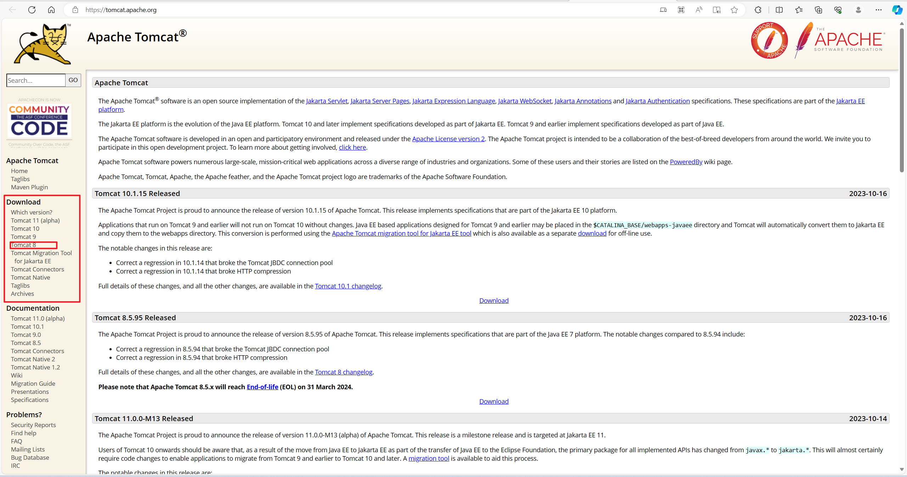
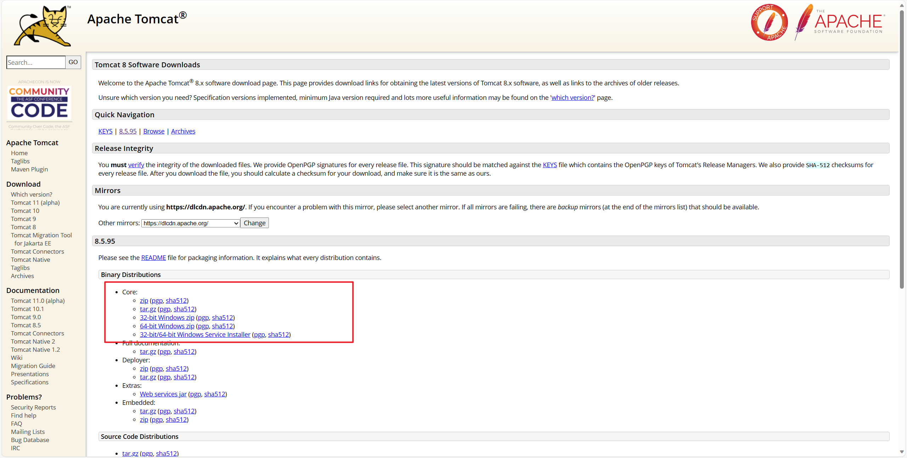
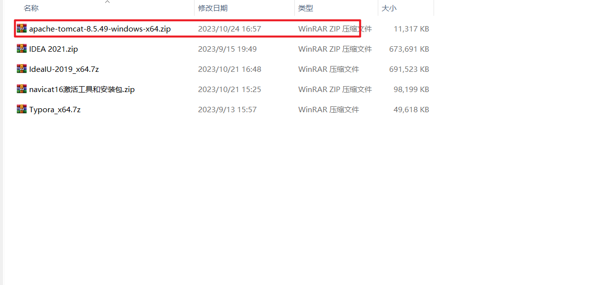
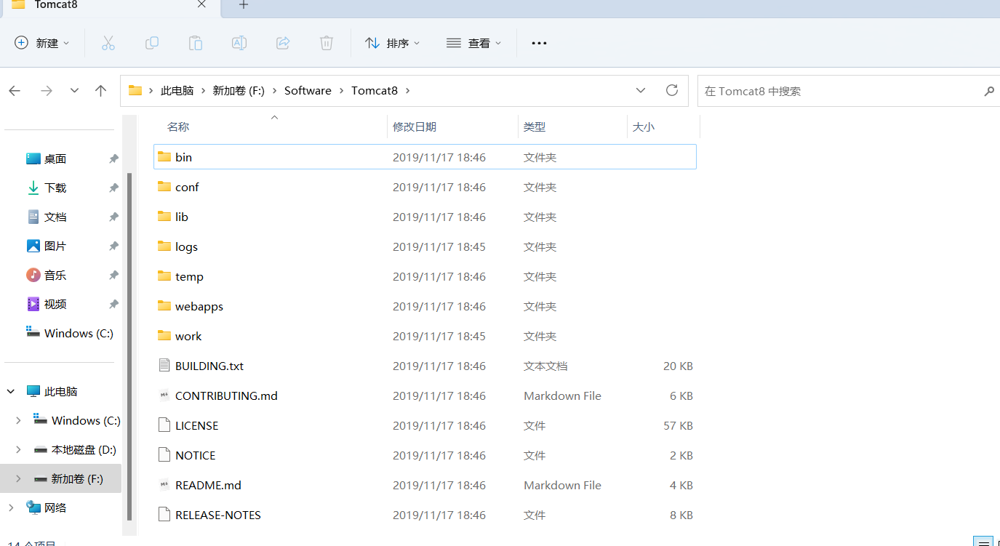
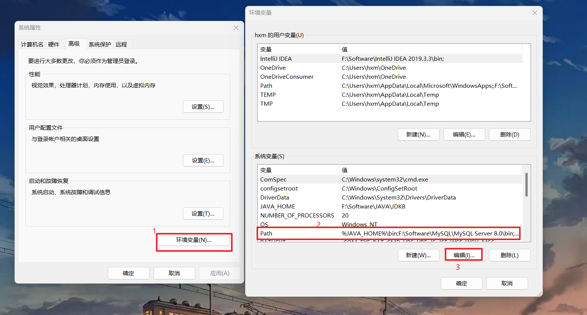
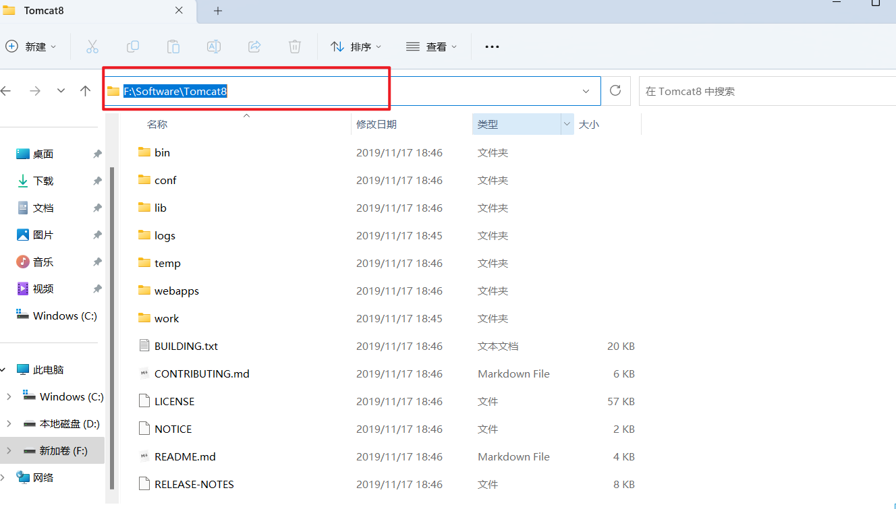
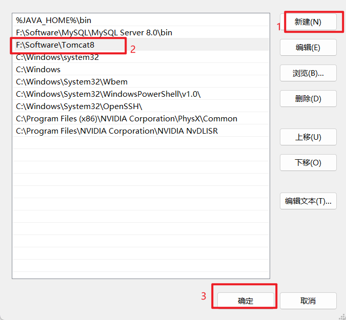
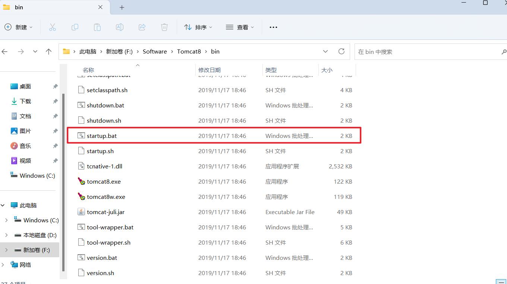
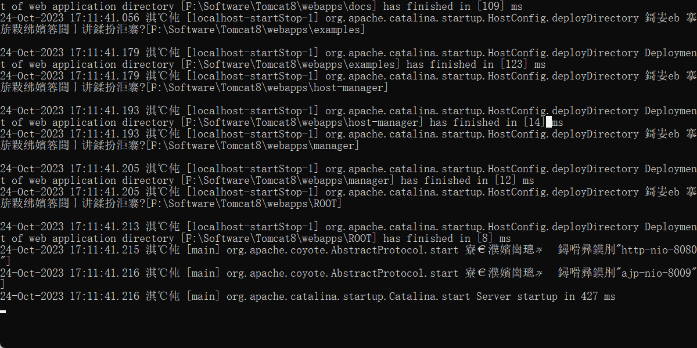
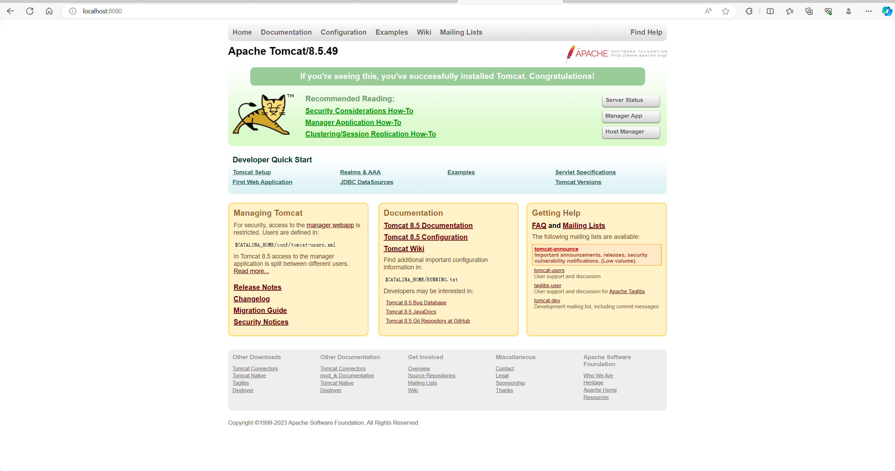

# Tomcat的安装配置

## 1.安装包的下载

进入tomcat的官网。[下载链接](https://tomcat.apache.org/)

右侧**Download**中，选择你要下载的版本，这里我下载tomcat8系列。

选择对应的版本下载压缩包即可。

下载好后，解压到文件夹中。

解压好后，就安装完成了。

## 2.配置Tomcat运行环境

打开**系统属性**，点击**环境变量**，找到**Path**，然后点击**编辑**。

将刚才解压好的文件，黏贴文件路径，定位到bin目录上一层即可。

点击新建，复制文件路径，然后点击确定。可以选择它点击**上移**将其向上移动。

## 3.测试环境是否配置成功

在bin目录下找到**startup.bat**，双击。

出现如下小黑框。

然后打开浏览器，输入**http://localhost:8080**，出现如下界面代表tomcat安装及配置成功。

