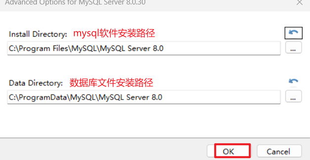
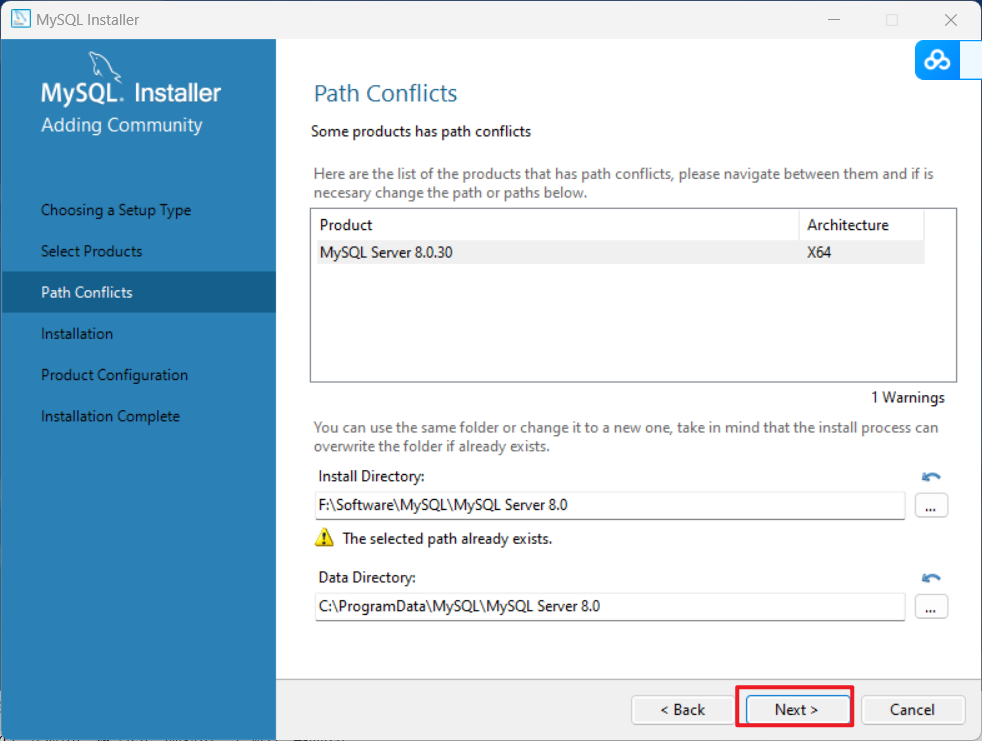

# MYSQL的安装（8.x版本为例）

## 1.安装包的下载

[下载地址](https://www.mysql.com/cn/downloads/)


​	选择历史版本，下载离线版。


## 2.安装mysql

在文件中找到下载好的安装包，双击**左键**进行安装。


等待完成后，出现如下界面。选择**Custom**，自定义模式安装。点击**Next**


下拉菜单，然后选中**MySQl Server 8.0.30- x64**，然后点击向右的小箭头。


**左键单击MySQl Server 8.0.30- x64**，然后点击**Advanced Options**。修改安装路径。


修改好之后，点击**ok**，在点击**Next**。


点击**Next**。


可能会出现一个警告，忽略即可。


点击**Excute**。


安装完成，点击**Next**。


## 3.mysql的配置

点击**Next**，开始配置mysql。


**Config Type**

>Development Computer：开发者的电脑，尽可能占用更少的资源。
>
>Server Computer：服务器端的电脑，占用中等的资源。
>
>Dedicated Computer：MySQL专用电脑，占用更多的资源。

**Port**

>端口号，MySQL数据库的端口号默认为**3306**，最好不要修改。

点击**Next**


根据需求选择加密方式.


默认提供**root**用户,所以我们只要设置密码即可.如果不需要添加其他用户,可以点击**Next**。


无特殊需求,保持默认,点击**Next**.


点击**Excute**


全部打上小绿勾后,表示安装完成.点击**Finish**


点击**Next**


点击**Finish**


安装完成.

## 4.mysql环境变量的配置

找到安装好的mysql软件的bin目录，复制文件路径。


打开系统环境变量。


在**Path**文件下新建路径。


然后一直点击**确定**。

打开**命令行控制窗口**，快捷键**win+r**，输入**cmd**，回车。


输入**mysql --version**

```cmd
mysql --version
```


出现mysql版本号，则环境配置成功。

