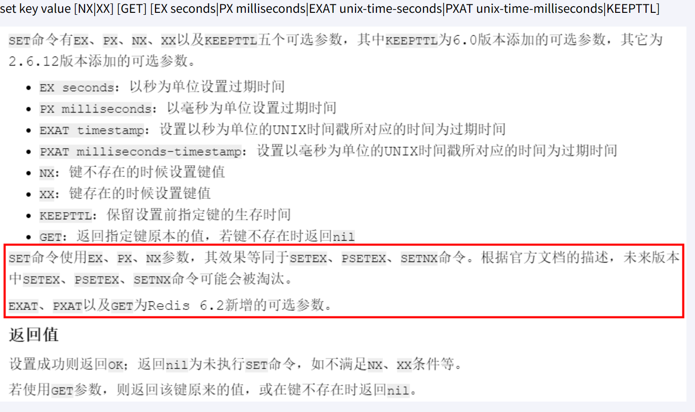

# Redis

## 基础篇

### 入门概述

#### 官网

https://redis.io/

#### 下载安装包

下载地址：https://redis.io/download/

版本：redis-7.0.15.tar.gz

#### 总体功能概述


### 安装配置

下载VMWare安装Linux系统，本笔记中使用的是CentOS操作系统。

#### Linux版安装介绍

Linux环境安装Redis必须具备gcc编译环境

在Linux中输入命令

```
gcc -v
```

如果提示未安装或未知命令，则表示系统不具备gcc编译环境，使用下面的命令安装gcc，安装完成后再次调用**gcc -v**。

```
yum -y install gcc-c++
```


1.下载获得redis-7.0.15.tar.gz后放入Linux目录/opt下

下载命令

```
wget https://download.redis.io/releases/redis-7.0.0.tar.gz
```


2.在/opt目录下解压redis

```
tar -zxvf redis7.0.15.tar.gz
```

解压后的目录


3.进入目录

```
cd redis-7.0.15
```

4.在redis-7.0.15目录下执行make命令，安装完成之后提示**It's a goot idea to run 'make test'**，代表安装成功

```
make && make install
```


5.查看默认安装目录：usr/local/bin

```
cd /
cd /usr/local/bin
ll
```


> redis-benchmark：性能测试工具，服务启动后运行该命令，可查看自己电脑性能如何
>
> redis-check-aof：修复有问题的AOF文件
>
> redis-check-dump：修复有问题的dump.rdb文件
>
> redis-cli：客户端，操作入口
>
> redis-sentinel：redist集群使用
>
> redis-server：Redis服务器启动命令

6.将默认的redis.conf拷贝到自己定义好的一个路径下，例如/myredis

```
mkdir /myredis
cp redis.conf /myredis/
```


7.修改/myredis目录下redis.conf配置文件做初始化设置

redis.conf配置文件，改完后确保生效，记得重启，记得重启

   1 默认daemonize no              改为  daemonize yes

   2 默认protected-mode  yes    改为  protected-mode no

   3 默认bind 127.0.0.1          改为  直接注释掉(默认bind 127.0.0.1只能本机访问)或改成本机IP地址，否则影响远程IP连接

   4 添加redis密码                      改为 requirepass 你自己设置的密码


8.启动服务

```
redis-server /myredis/redis.conf
```

9.连接服务

```
redis-cli -a password
```


10.关闭服务

```
//单实例关闭
redis-cli -a password shutdown

//多实例关闭，指定端口关闭
redis-cli -p 6379 shutdown

//或在服务内输入shutdown
shutdown
```

#### 卸载介绍

1.停止redis服务


2.删除redis

```
ls -l /usr/local/bin/redis-*
rm -rf /usr/local/bin/redis-*
```


### 十大数据类型

Redis命令不区分大小写，但key是区分大小写的。

帮助命令

```
help @类型
help @string
help @list
...
```

#### 通用命令

```
//查看当前库所有的key
keys *

//判断某个key是否存在
exists key

//查看key的类型
type key

//删除指定的key数据（不推荐使用）
del key

//非阻塞删除，仅仅将keys从keyspace元数据中删除，真正的删除会在后续异步中操作
unlink key

//查看还有多少秒过期，-1表示永不过期，-2表示过期
ttl key

//为给定的key设置过期时间
expire key seconds

//将当前数据库的key移动到给定的数据库db当中
move key dbindex [0-15]

//切换数据库，默认为0
select dbindex [0-15]

//查看当前数据库key的数量
dbsize

//清空当前库
flushdb

//清空所有库
flushall
```

#### String

单key单value

常用

> set key value
>
> get key



同时设置/获取多个键值

> mset key value [key value ...]
>
> mget key [key ...]
>
> msetnx key value [key value ...]

获取指定范围内的值

> getrange key start end
>
> setrange key offset value


数值增减，一定要是数字才能进行加减

```
//递增数字，默认加1
incr key

//增加指定的整数
incrby key increment

//递减数值
decr key

//减少指定的整数
decrby key decrement
```

```
//获取字符串长度
strlen key

//字符串内容追加
append key value
```

getset:将给定 key 的值设为 value ，并返回 key 的旧值(old value)。简单一句话，先get然后立即set

> getset key value


#### List

单key多value

一个双端链表的结构，容量是2的32次方减1个元素，大概40多亿，主要功能有push/pop等，一般用在栈、队列、消息队列等场景。

left、right都可以插入添加；

如果键不存在，创建新的链表；

如果键已存在，新增内容；

如果值全移除，对应的键也就消失了。


常用

```
//从左往右向key中插入值
lpush key element [element ...]

//从右往左向key中插入值
rpush key element [element ...]

//从左往右遍历list，0表示第一个元素，-1表示最后一个元素
lrange key strat stop

//从左侧弹出count个元素，count默认为1
lpop key [count]

//从右侧弹出count个元素，count默认为1
rpop key [count]

//按照索引下标获取元素
lindex key index

//获取列表中元素的个数
llen key

// 从left往right删除2个值等于v1的元素，返回的值为实际删除的数量
// LREM list3 0 element，表示删除全部给定的值。零个就是全部值
lrem key count element

//截取指定范围的值后再赋值给key
ltrim key start stop

//移除列表的最后一个元素，并将该元素添加到另一个列表并返回
rpoplpush source destination

//从左往右，将指定key中索引为index的值设置为新值value
lset key index value

//在list某个已有值pivot的前before后after再添加具体值element
linsert key <before | after> pivot element
```

#### Hash

kv模式不变，但v是一个键值对

常用

```
//
hset key field value [field value ...]

//
hget key field

//
hmset key field value [field value ...]

//
hmget key field [field ...]

//
hgetall key

//
hdel key field [field]

//获取某个key内的全部参数的个数
hlen

//查看某个key中是否含有键field
hexists key field

//获取key中的所有键field
hkeys key

//获取key中所有值value 
hvals key

//给key中的键field的值value增加incremetn（正负整数）
hincrby key field increment

//给key中的键field的值value增加incremetn（正负浮点数）
hincrbyfloat

//若不存在，则设置
hsetnx key field value
```

#### Set

单值多value，且无重复

```
//添加元素
sadd key member [member ...]

//遍历集合中所有元素member
smembers key

//判断元素member是否在集合中
sismember key member

//删除元素member
srem key member [member ...]

//获取集合中的元素member个数
scard key

//从集合中随机展示设置的元素member个数count，默认为count为1，元素不删除
//从set集合里面随机取出2个，如果超过最大数量就全部取出，如果写的值是负数，比如-3 ，表示需要取出3个，但是可能会有重复值。
srandember key [count]

//从集合中随机弹出count个元素member，并且从集合中删除
spop key [count]

//将source中已经存在的某个值member移动到destination中
smove source destination member

//差集运算，属于k1但不属于k2的元素构成的集合
//哪个key在前就返回哪个key相对于其他key的集合
sdiff key [key ...]

//并集运算，属于k1或属于k2的元素合并后的集合
sunion key [key ...]

//交集运算，同时属于k1、k2的元素构成的集合
sinter key [key ...]

//不反悔结果集，只返回结果的基数。numkeys规定了key的个数
sintercard numkeys key [key ...] [LIMIT limit]
```


#### ZSet（Sorted Set）

#### BitMap

#### HyperLogLog

#### GEO

#### Stream

#### BitFiled

### 持久化

### 事务

### 管道

## 高阶篇