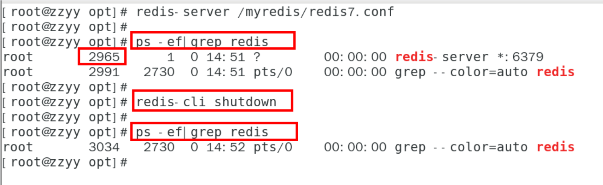
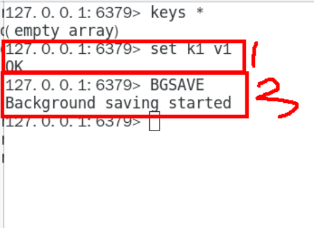
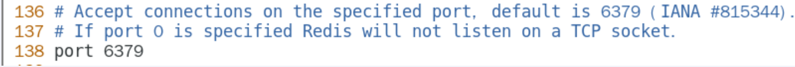
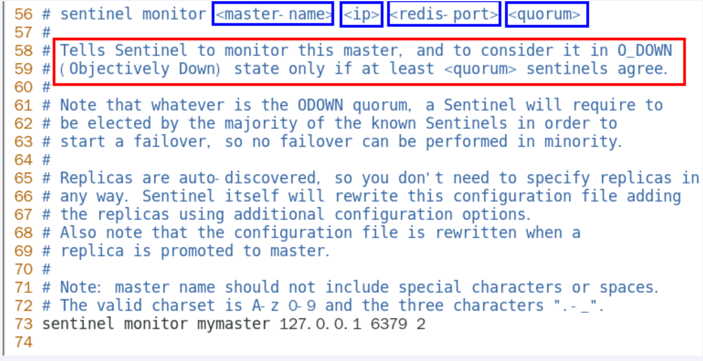

# Redis

## 基础篇

### 入门概述

#### 官网

https://redis.io/

#### 下载安装包

下载地址：https://redis.io/download/

版本：redis-7.0.15.tar.gz

#### 总体功能概述


### 安装配置

下载VMWare安装Linux系统，本笔记中使用的是CentOS操作系统。

#### Linux版安装介绍

Linux环境安装Redis必须具备gcc编译环境

在Linux中输入命令

```
gcc -v
```

如果提示未安装或未知命令，则表示系统不具备gcc编译环境，使用下面的命令安装gcc，安装完成后再次调用**gcc -v**。

```
yum -y install gcc-c++
```


1.下载获得redis-7.0.15.tar.gz后放入Linux目录/opt下

下载命令

```
wget https://download.redis.io/releases/redis-7.0.15.tar.gz
```


2.在/opt目录下解压redis

```
tar -zxvf redis-7.0.15.tar.gz
```

解压后的目录


3.进入目录

```
cd redis-7.0.15
```

4.在redis-7.0.15目录下执行make命令，安装完成之后提示**It's a goot idea to run 'make test'**，代表安装成功

```
make && make install
```


5.查看默认安装目录：usr/local/bin

```
cd /
cd /usr/local/bin
ll
```


> redis-benchmark：性能测试工具，服务启动后运行该命令，可查看自己电脑性能如何
>
> redis-check-aof：修复有问题的AOF文件
>
> redis-check-dump：修复有问题的dump.rdb文件
>
> redis-cli：客户端，操作入口
>
> redis-sentinel：redist集群使用
>
> redis-server：Redis服务器启动命令

6.将默认的redis.conf拷贝到自己定义好的一个路径下，例如/myredis

```
mkdir /myredis
cp redis.conf /myredis/
```


7.修改/myredis目录下redis.conf配置文件做初始化设置

redis.conf配置文件，改完后确保生效，记得重启，记得重启

   1 默认daemonize no              改为  daemonize yes

   2 默认protected-mode  yes    改为  protected-mode no

   3 默认bind 127.0.0.1          改为  直接注释掉(默认bind 127.0.0.1只能本机访问)或改成本机IP地址，否则影响远程IP连接

   4 添加redis密码                      改为 requirepass 你自己设置的密码


8.启动服务

```
redis-server /myredis/redis.conf
```

9.连接服务

```
redis-cli -a password
```


10.关闭服务

```
//单实例关闭
redis-cli -a password shutdown

//多实例关闭，指定端口关闭
redis-cli -p 6379 shutdown

//或在服务内输入shutdown
shutdown
```

#### 卸载介绍

1.停止redis服务



2.删除redis

```
ls -l /usr/local/bin/redis-*
rm -rf /usr/local/bin/redis-*
```


### 十大数据类型

Redis命令不区分大小写，但key是区分大小写的。

帮助命令

```
help @类型
help @string
help @list
...
```

#### 通用命令

```
//查看当前库所有的key
keys *

//判断某个key是否存在
exists key

//查看key的类型
type key

//删除指定的key数据（不推荐使用）
del key

//非阻塞删除，仅仅将keys从keyspace元数据中删除，真正的删除会在后续异步中操作
unlink key

//查看还有多少秒过期，-1表示永不过期，-2表示过期
ttl key

//为给定的key设置过期时间
expire key seconds

//将当前数据库的key移动到给定的数据库db当中
move key dbindex [0-15]

//切换数据库，默认为0
select dbindex [0-15]

//查看当前数据库key的数量
dbsize

//清空当前库
flushdb

//清空所有库
flushall
```

#### String

单key单value

常用

> set key value
>
> get key


同时设置/获取多个键值

> mset key value [key value ...]
>
> mget key [key ...]
>
> msetnx key value [key value ...]

获取指定范围内的值

> getrange key start end
>
> setrange key offset value


数值增减，一定要是数字才能进行加减

```
//递增数字，默认加1
incr key

//增加指定的整数
incrby key increment

//递减数值
decr key

//减少指定的整数
decrby key decrement
```

```
//获取字符串长度
strlen key

//字符串内容追加
append key value
```

getset:将给定 key 的值设为 value ，并返回 key 的旧值(old value)。简单一句话，先get然后立即set

> getset key value


#### List

单key多value

一个双端链表的结构，容量是2的32次方减1个元素，大概40多亿，主要功能有push/pop等，一般用在栈、队列、消息队列等场景。

left、right都可以插入添加；

如果键不存在，创建新的链表；

如果键已存在，新增内容；

如果值全移除，对应的键也就消失了。


常用

```
//从左往右向key中插入值
lpush key element [element ...]

//从右往左向key中插入值
rpush key element [element ...]

//从左往右遍历list，0表示第一个元素，-1表示最后一个元素
lrange key strat stop

//从左侧弹出count个元素，count默认为1
lpop key [count]

//从右侧弹出count个元素，count默认为1
rpop key [count]

//按照索引下标获取元素
lindex key index

//获取列表中元素的个数
llen key

// 从left往right删除2个值等于v1的元素，返回的值为实际删除的数量
// LREM list3 0 element，表示删除全部给定的值。零个就是全部值
lrem key count element

//截取指定范围的值后再赋值给key
ltrim key start stop

//移除列表的最后一个元素，并将该元素添加到另一个列表并返回
rpoplpush source destination

//从左往右，将指定key中索引为index的值设置为新值value
lset key index value

//在list某个已有值pivot的前before后after再添加具体值element
linsert key <before | after> pivot element
```

#### Hash

kv模式不变，但v是一个键值对

常用

```
//
hset key field value [field value ...]

//
hget key field

//
hmset key field value [field value ...]

//
hmget key field [field ...]

//
hgetall key

//
hdel key field [field]

//获取某个key内的全部参数的个数
hlen

//查看某个key中是否含有键field
hexists key field

//获取key中的所有键field
hkeys key

//获取key中所有值value 
hvals key

//给key中的键field的值value增加incremetn（正负整数）
hincrby key field increment

//给key中的键field的值value增加incremetn（正负浮点数）
hincrbyfloat

//若不存在，则设置
hsetnx key field value
```

#### Set

单值多value，且无重复

```
//添加元素
sadd key member [member ...]

//遍历集合中所有元素member
smembers key

//判断元素member是否在集合中
sismember key member

//删除元素member
srem key member [member ...]

//获取集合中的元素member个数
scard key

//从集合中随机展示设置的元素member个数count，默认为count为1，元素不删除
//从set集合里面随机取出2个，如果超过最大数量就全部取出，如果写的值是负数，比如-3 ，表示需要取出3个，但是可能会有重复值。
srandember key [count]

//从集合中随机弹出count个元素member，并且从集合中删除
spop key [count]

//将source中已经存在的某个值member移动到destination中
smove source destination member

//差集运算，属于k1但不属于k2的元素构成的集合
//哪个key在前就返回哪个key相对于其他key的集合
sdiff key [key ...]

//并集运算，属于k1或属于k2的元素合并后的集合
sunion key [key ...]

//交集运算，同时属于k1、k2的元素构成的集合
sinter key [key ...]

//不反悔结果集，只返回结果的基数。numkeys规定了key的个数
sintercard numkeys key [key ...] [LIMIT limit]
```

#### ZSet（Sorted Set）

```
//向有序集合中加入一个元素和该元素的分数
zadd key score member [score member ...]

//按照元素分数从小到大的顺序返回索引从start到stop之间的所有元素member，withscores：将分数同时返回
zrange key start stop [withscores]

//按照元素分数从大到小的顺序返回索引从start到stop之间的所有元素member，withscores：将分数同时返回
zrevrange key start stop [withscores]

//获取指定分数范围的元素
//withscores：将分数同时返回
//(min max：范围内不包括min。min (max：范围内不包括max。
//LIMIT offset count：返回限制，从offset下标开始，返回count个，类似于Mybatis的分页插件
zrangebyscore key min max [withscores] [LIMIT offset count]

//获取元素的分数
zscore key member

//获取集合中元素的数量
zcard key

//删除key下面对应的member
zrem key member [member ...]

//增加某个元素的分数
zincrby key incrememt member

//获得指定分数范围内的元素个数
zcount key min max

//从键名列表中的第一个非空排序集中弹出一个或多个元素，他们是成员分数对
zmpop numkeys key [key ...] <MIN | MAX> [COUNT count]

//分数从小到大排序，获取member的下标
zrank key member [WITHSCORE]

//分数从大到小排序，获取member的下标
zrevrank key member [WITHSCORE]
```

#### BitMap

由0和1状态表现的二进制位的bit数组

```
//offset：偏移量，从0开始计算。value：只能是0或1
setbit key offset value

//获取bit
getbit key offset

//全部键里面含有1的数量
bitcount key [start end [BYTE | BIT]]

//对key做与或非异或运算，并将结果存入destkey中
bittop <AND | OR | XOR | NOT> destkey key [key ...]
```

#### HyperLogLog

一种去重复统计功能的基数估计算法

```
//添加指定元素到HyperLogLog中
pfadd key element [elememt ...]

//返回给定HyperLogLog的基数估计值
pfcount key [key ...]

//将多个HyperLogLog合并为一个HyperLogLog
pfmerge destkey sourcekey [sourcekey ...]
```

#### GEO

地球上的地理位置是使用二维的经纬度表示，经度范围 (-180, 180]，纬度范围 (-90, 90]，只要我们确定一个点的经纬度就可以名取得他在地球的位置。

```
//添加经纬度坐标
GEOADD key longitude latitude member

//返回经纬度
GEOPOS key [member [member ...]]

//返回坐标的geohash表示
GEOHASH key [member [member ...]]

//返回两个位置之间的距离
GEODIST key member1 member2 [M | KM | FT | MI]

/**
以给定的经纬度为中心， 返回键包含的位置元素当中， 与中心的距离不超过给定最大距离的所有位置元素。
WITHDIST: 在返回位置元素的同时， 将位置元素与中心之间的距离也一并返回。 距离的单位和用户给定的范围单位保持一致。
WITHCOORD: 将位置元素的经度和维度也一并返回。
WITHHASH: 以 52 位有符号整数的形式， 返回位置元素经过原始 geohash 编码的有序集合分值。 这个选项主要用于底层应用或者调试， 实际中的作用并不大
COUNT 限定返回的记录数。
**/
GEORADIUS key longitude latitude radius <M | KM | FT | MI>
  [WITHCOORD] [WITHDIST] [WITHHASH] [COUNT count [ANY]] [ASC | DESC]
  [STORE key | STOREDIST key]

//找出指定范围内的元素，中心点是由给定的位置元素决定
GEORADIUSBYMEMBER key member radius <M | KM | FT | MI> [WITHCOORD]
  [WITHDIST] [WITHHASH] [COUNT count [ANY]] [ASC | DESC] [STORE key
  | STOREDIST key]
```

#### Stream

作用

实现消息队列，支持消息的持久化、支持自动生成全局唯一ID、支持ack确认消息的模式、支持消费组模式等，让消息队列更加稳定和可靠。

结构


四个特殊符合

> `-` + ：最小和最大可能出现的id
>
> $ ：表示只消费新的消息，当前流中信息的最大的id，可用于将要到来的信息。
>
> `>` ：用于xreadgroup命令，表示迄今为止还没有发送给组中使用者的信息，会更新消费者组的最后id
>
> `*` ：用于xadd命令中，让系统自动生成id

队列相关命令

```
//新增消息，*表示自动生成id
xadd key <* | id> field value [field value ...]

//用于获取消息列表。start表示开始值：-表示最小值。end表示结束值：+表示最大值。count表示最多获取多少个值
xrange key start end [COUNT count]

//反方向开始
xrevrange key end start [COUNT count]

//删除key中指定id的消息
xdel key id [id ...]

//获取key中消息的长度
xlen key

//用于对Stream的长度进行截取。MAXLEN：允许的最大长度，对流进行修剪限制长度。MINID：允许的最id，从某个id值开始比该id值小的将会被抛弃。
xtrim key <MAXLEN | MINID> [LIMIT count]

//用于获取消息，只会返回大于指定id的消息。
xread [COUNT count] [BLOCK milliseconds] STREAMS key [key ...] id
  [id ...]
```

消费组相关指令

```
//用于创建消费者组
XGROUP CREATE key group <id | $> [MKSTREAM]
  [ENTRIESREAD entries-read]

//">"：从第一条尚未被消费的信息开始读取
XREADGROUP GROUP group consumer [COUNT count] [BLOCK milliseconds]
  [NOACK] STREAMS key [key ...] id [id ...] | >

//查询每个消费组内所有消费者已读取但尚未确认的消息
XPENDING key group [[IDLE min-idle-time] start end count [consumer]]

//向消息队列确认消息处理完成
XACK key group id [id ...]

//用于打印Stream、Consumer、Group的详细信息
XINFO STREAM key [FULL [COUNT count]]
XINFO CONSUMERS key group
XINFO GROUPS key
```

#### BitFiled

将一个Redis字符串看作是一个由二进制组成的数组，并能对变长位宽和任意没有字节对齐的指定整形位域进行寻址和修改。

### 持久化

Redis持久化方式有两种：RDB（Redis DataBase）和AOF（AppendOnly File）。


#### RDB

##### 简介

实现类似照片记录效果的方式，就是把某一时刻的数据和状态以文件的形式写到磁盘上，也就是

快照。这样一来即使故障宕机，快照文件也不会丢失，数据的可靠性也就得到了保证。

这个快照文件就称为RDB文件(dump.rdb)，其中，RDB就是Redis DataBase的缩写。

Redis保存备份时执行的是**全量快照**，保存的是**dump.rdb**文件。

##### 自动触发

修改redis.conf里配置的`save <seconds> <changes>`。


修改dump文件保存路径


修改dump文件名称


恢复数据

将备份文件（dump.rdb）移动到redis安装目录并启动服务即可。

注意

- 不可以把备份文件dump.rdb和生产redis服务器放在同一台机器，必须分开各自存储，

  以防生产机物理损坏后备份文件也挂了。

- 执行flushall/flushdb命令也会产生dump.rdb文件，但里面是空的，毫无意义。

##### 手动触发

SAVE

在主程序中执行会阻塞当前redis服务器，直到持久化工作完成执行save命令期间，Redis不能处理其他命令，线上禁止使用。


BGSAVE

Redis会在后台异步进行快照操作，不阻塞快照同时还可以响应客户端请求，该触发方式会fork一个子进程由子进程复制持久化过程。




```
//获取最后一次成功执行快照的时间
lastsave
```


##### 优势

- 适合大规模的数据恢复
- 按照业务定时备份
- 对数据完整性和一致性要求不高
- RDB文件在内存中的加载速度要比AOF快得多

##### 劣势

- 在一定间隔内做一次备份，所以如果redis意外down掉的话，就会丢失从当前至最近一次快照间的数据，快照之间的数据会丢失
- 内存数据的全量同步，如果数据量太大会导致I/O严重影响服务器性能
- RDB依赖于主进程的的fork，在更大的数据集中，这可能会导致服务请求的瞬间延迟。fork的时候内存中的数据被克隆了一份，大致2倍的膨胀性，需要考虑。

##### 检查修复dump.rdb文件


##### 触发RDB快照的方式

- 配置文件中默认的快照配置
- 手动save/bgsave命令
- 执行flushall/flushdb命令也会产生dump.rdb
- 执行shutdown且没有设置开启AOF持久化
- 主从复制时，主节点自动触发

##### 禁用快照

动态执行：`redis-cli config set save ""`

或


##### RDB优化配置项详解

```
save <seconds> <changes>
```

```
dbfilename
```

```
dir
```

```
stop-writes-on-bgsave-error
```


```
rdbcompression
```


```
rdbchecksum
```


```
rdb-del-sync-files
```


##### 总结


#### AOF

##### 简介

以日志的形式来记录每个写操作，将Redis执行过的所有写指令记录下来（读操作不会记录），只许追加文件但不可以改写文件，redis启动之初会读取该文件重新构建数据，换言之，redis重启的话就会根据日志文件的内容将写指令从前到后执行一次以完成数据的恢复工作。

开启AOF功能需要设置配置：**appendonly yes**

AOF保存的是**appendonly.aof**文件。

##### AOF持久化工作流程


##### AOF缓冲区三种写回策略

- Always：同步写回，每个写命令执行完立刻同步的将日志写回磁盘。
- everysec：每秒写回，每个写命令执行完，只是先把日志文件写到AOF文件的内存缓冲区，每隔1秒吧缓冲区中的内容写入磁盘。
- no：操作系统的控制写回，每个写命令执行完，只是先把日志写到AOF文件的内存缓冲区，由操作系统决定何时将缓冲区内容写回磁盘。


##### AOF配置

开启aof


写回策略


aof文件保存路径


最终保存路径


文件保存名称


##### AOF启动

redis启动时读取appendonly.aof文件，恢复数据

##### AOF修复

```
//只修复增量文件
redis-check-aof --fix file
```


##### 优势

- 更好的保护数据不丢失、性能高、可做紧急恢复

##### 劣势

+ 相同数据集的数据而言aof文件要远大于rdb文件，恢复速度慢于rdb
+ aof运行效率要慢于rdb，每秒同步策略效率较好，不同步效率和rdb相同

##### AOF重写机制

启动AOF文件的内容压缩，只保留可以恢复数据的最小指令集。

###### 触发配置


###### 自动触发

满足配置文件中的选项后，触发重写，并且会记录上次重写时的AOF文件大小。

###### 手动触发

客户端向服务器发送`bgrewriteaof`命令

###### 原理

1：在重写开始前，redis会创建一个“重写子进程”，这个子进程会读取现有的AOF文件，并将其包含的指令进行分析压缩并写入到一个临时文件中。

2：与此同时，主进程会将新接收到的写指令一边累积到内存缓冲区中，一边继续写入到原有的AOF文件中，这样做是保证原有的AOF文件的可用性，避免在重写过程中出现意外。

3：当“重写子进程”完成重写工作后，它会给父进程发一个信号，父进程收到信号后就会将内存中缓存的写指令追加到新AOF文件中

4：当追加结束后，redis就会用新AOF文件来代替旧AOF文件，之后再有新的写指令，就都会追加到新的AOF文件中

5：重写aof文件的操作，并没有读取旧的aof文件，而是将整个内存中的数据库内容用命令的方式重写了一个新的aof文件，这点和快照有点类似

##### AOF优化配置项详解


##### 总结


#### RDB+AOF混合持久化

##### 数据恢复顺序和加载流程


##### RDB + AOF混合使用


#### 纯缓存模式

同时关闭RDB + AOF

> save "" ：禁用rdb，但仍可以使用bgsave生成rdb文件
>
> appendonly no ：禁用aof，但仍可以使用bgrewriteaof生成aof文件

### 事务

#### 简介

可以一次执行多个命令，本质是一组命令的集合，一个事务中的所有命令都会序列化，按顺序的串行执行而不会被其他命令插入，不许加塞。

#### Redis事务 VS 数据库事务


#### 示例


##### 正常执行


##### 放弃事务


##### 全体连坐


##### 冤头债主

Redis不提供事务回滚的功能，开发者必须在事务执行出错后，自行恢复数据库状态。


##### watch监控

- 一旦执行了exec，之前加的监控锁都会被取消掉
- 当客户端链接丢失的时候（比如退出链接），所有东西都会被取消监视

正常watch


不正常watch


##### unwatch


#### 总结

- 开启：以MULTI开始一个事务。
- 入队：将多个命令入队到事务中，接到这些命令并不会立即执行，而是放到等待执行的事务队列里面。
- 执行：由EXEC命令触发事务

### 管道

#### 简介

Pipeline是为了解决RTT（**Round Trip Time(简称RTT,数据包往返于两端的时间)**）往返时，仅仅是将命令打包一次性发送，对整个Redis的执行不造成其他任何影响。

批处理命令变种优化措施，类似Redis的原生批命令（mget和mset）。

#### 示例

若文件中含有错误代码，使用的策略是冤头债主。


#### 总结

##### 与原生批量命令对比

- 原生批量命令是原子性，pipeline是非原子性
- 原生批量命令一次只能执行一种命令，pipeline支持批量执行不同命令
- 原生批量命令服务端实现，而pipeline需要服务端与客户端共同完成

##### 与事务对比

- 事务具有原子性，管道不具有原子性
- 管道一次性将多条命令发送到服务器，事务是一条一条的发，事务只有在接收到exec命令后才会执行
- 执行事务时会阻塞其他命令的执行，而执行管道中的命令时不会

##### 注意事项

- pipeline缓冲的指令只是会依次执行，不保证原子性，如果执行中指令发生异常，将会继续执行后续的指令
- 使用pipeline组装的命令个数不能太多，不然数据量过大客户端阻塞时间可能过久，同时服务端也被迫回复一个队列答复，占用很多内存

### 发布订阅

#### 简介

一种消息通信模式，发送者（PUBLISH）发送消息，订阅者（SUBSCRIBE）接收消息，可以实现进程间的消息传递。

不推荐使用Redis原生的PUB/SUB，专业的事交给专业的人做。

### 复制（Replica）

#### 简介

就是主从复制，master以写为主，slave以读为主。当master数据变化的时候，自动将新的数据以异步方式同步到其他slave数据库。具有读写分离、容灾恢复、数据备份、水平扩容支持高并发等特性。

#### 基本操作命令

```
//可以查看复制节点的主从关系和配置信息
info replication

//一般写入进redis.conf配置文件内。host：主机ip。port：主机中redis的端口号。
replicaof host port

//在运行期间修改slave节点的信息，如果该数据库已经是某个主数据库的从数据库，那么会停止和原主数据的同步关系，转而和新的主数据库同步。
slaveof host port

//使当前数据库停止与其他数据库的同步，转成主数据库。
slaveof no one
```

#### 示例

##### 架构说明

三台Redis服务器，三边网络相互能ping，且不会被防火墙拦截。


##### 配置文件

配从（库）不配主（库）。以redis6379.conf为例。

1. 开启daemonize yes


2. 注释掉bind 127.0.0.1 - : : 1


3. protected-mode no


4. 指定端口



5. 指定当前工作目录，dir


6. pid文件名字，pidfile


7. log文件名字，logfile


8. requirepass


9. dump.rdb名字


10. aof文件，appendfilename


11. 从机访问主机的通行密码masterauth，从机配主机不配。


##### 一主二仆

###### 方案1：配置文件固定写死

配置redis.conf文件。先启动master在启动slave。

主从关系查看

- 主机或从机的日志文件
- **info replication** 命令查看

从机可以执行写命令吗？

> 不可以

从机切入点问题？

> 首次一锅端，全量复制，后续跟随，master写，slave跟

主机shutdown后情况如何？从机是上位还是原地待命 ？

> 从机不动，原地待命，从机数据可以正常使用；等待主机重启动归来

主机shutdown后，重启后主从关系还在吗？

> 保持原主从关系

###### 方案2：命令操作手动指定

在预设的从机上面执行命令

```
slaveof hostIP port
```

##### 薪火相传

- 上一个slave可以是下一个slave的master，slave同样可以接收其他slaves的链接和同步请求，那么该slave作为了链条中下一个的master，可以有效减轻主master的写压力。
- 中途变更转向：会清除之前的数据，重新建立拷贝最新的
- 命令：`slaveof hostIP port`

##### 反客为主

使当前数据库停止与其他数据库的同步，转为主数据库。但之前存在的数据不丢失。

```
slaveof no one
```

#### 原理和工作流程

slave启动，同步初请

> slave启动成功连接到master后会发送一个sync命令。slave首次全新连接master，一次完全同步（全量复制）将会被自动执行，slave自身原有数据会被master数据覆盖清除。

首次连接，全量复制

> master节点收到sync命令后会开始在后台保存快照（即RDB持久化，主从复制时会触发RDB），同时收集所有接收到的用于修改数据集命令缓存起来，master节点执行RDB持久化后，master将rdb快照文件和所有缓存的命令发送到所有slave，以完成一次完全同步。
>
> 而slave服务将在接收到数据库文件数据后，将其存盘并加载到内存中，从而完成复制初始化

心跳持续，保持通信

> master发出PING包的周期，默认是10秒
>
> redis.conf文件中：repl-ping-replica-period 10

进入平稳，增量复制

> Master继续将性能的所有收集到的修改命令自动一次传给slave，完成同步

从机下线，重连续传

> master会检查backlog里面的offset，master和slave都会保存一个复制的offset还有一个masterID，offset时保存在backlog中的。Master只会把已经复制的offset后面的数据复制给slave，类似断点续传。

#### 劣势

复制延时，信号衰减。由于所有的写操作都是先在Master上操作，然后同步更新到Slave上，所以从Master同步到Slave机器有一定的延迟，当系统很繁忙的时候，延迟问题会更加严重，Slave机器数量的增加也会使这个问题更加严重。

master挂了的话，默认情况下，不会在slave节点中自动重选一个master。

### 哨兵（sentinel）

#### 简介

巡查监控后台master主机是否故障，如果故障了根据投票数自动将某一个从库转化为新主库，继续对外服务。

1、监控redis运行状态，包括master和slave

2、当master down机，能自动将slave切换成新master

- 主从监控：监控主从redis库运行是否正常
- 消息通知：哨兵可以将故障转移的结果发送给客户端
- 故障转移：如果master异常，则会进行主从切换，将其中一个slave作为新master
- 配置中心：客户端通过连接哨兵来获得当前redis服务器的主节点地址

#### 示例

Redis Sentinel架构：**一主二从三哨兵**。先启动redis主从机，在启动哨兵。


##### 重要参数说明

```
//设置要监控的master服务器，quorum表示最少有几个哨兵认可客观下线，同意故障迁移的法定票数
sentinel monitor <master-name> <ip> <redis-port> <quorum>

//master设置了密码，连接master服务的密码
sentinel auth-pass <master-name> <password>
```

以sentinel26379.conf为例

```
bind 0.0.0.0
daemonize yes
protected-mode no
port 26380
logfile "/myredis/sentinel26380.log"
pidfile /var/run/redis-sentinel26380.pid
dir "/myredis"
sentinel monitor mymaster 192.168.111.169 6379 2
sentinel auth-pass mymaster 111111
```

报错*`master_link_status:down`*

> redis.conf配置文件内没有配置`masterauth`项访问密码。

##### 启动哨兵

```
redis-sentinel sentinel26379.conf --sentinel
redis-sentinel sentinel26380.conf --sentinel
redis-sentinel sentinel26381.conf --sentinel
```

##### 原有的master挂了

**两台从机数据是否ok**

> 数据没问题

**是否会从剩下的2台机器上选出新的master**

> 会，通过哨兵投票重新选择master

**之前down机的master机器重启回来，谁将会是新老大？会不会双master冲突**

> 重连回来的原master将变成slave。

##### 配置文件的改动

- 文件的内容，在运行期间会被sentinel动态进行更改
- Master-Slave切换后，master_redis.conf、slave_reids.conf的内容都会发生改变，即master_redis.conf中会多一行slaveof的配置，sentinel.conf的监控目标会随之调换。

#### 哨兵运行流程和选举原理

当一个主从配置中的master失效后，sentinel可以选举出一个新的master，用于自动接替原master的工作，主从配置中的其他redis服务器自动指向新的master同步数据。一般建议sentinel采取**奇数**台，防止某一台sentinel无法连接到master导致误切换。

##### 运行流程，故障切换

###### **1. SDown主观下线（Subjectively Down）**

所谓主观下线（Subjectively Down， 简称 SDOWN）指的是单个Sentinel实例对服务器做出的下线判断，即单个sentinel认为某个服务下线（有可能是接收不到订阅，之间的网络不通等等原因）。主观下线就是说如果服务器在[sentinel down-after-milliseconds]给定的毫秒数之内没有回应PING命令或者返回一个错误消息， 那么这个Sentinel会主观的(单方面的)认为这个master不可以用了。

> sentinel down-after-milliseconds <masterName> <timeout>

 表示master被当前sentinel实例认定为失效的间隔时间，这个配置其实就是进行主观下线的一个依据

master在多长时间内一直没有给Sentine返回有效信息，则认定该master主观下线。也就是说如果多久没联系上redis-servevr，认为这个redis-server进入到失效（SDOWN）状态。


###### **2. ODown客观下线（Objectively Down）**

ODown需要一定数量的sentinel，即多个哨兵达成一致意见才能认为一个master客观上已经宕机挂了。



**quorum这个参数是进行客观下线的一个依据**，法定人数/法定票数

意思是至少有quorum个sentinel认为这个master有故障才会对这个master进行下线以及故障转移。因为有的时候，某个sentinel节点可能因为自身网络原因导致无法连接master，而此时master并没有出现故障，所以这就需要多个sentinel都一致认为该master有问题，才可以进行下一步操作，这就保证了公平性和高可用。

###### **3. 选举出领导者哨兵（哨兵中选出兵王）**

当主节点被判断客观下线后，各个哨兵节点会进行协商，先选举出一个领导者哨兵节点（兵王），并由该领导者节点进行`failover`（故障迁移）。

领导者哨兵通过**Raft算法**产生。


###### **4. 由兵王开始推动故障切换流程并选出一个新master**

**1.某个Slave被选中成为新Master**

选出新master的规则，剩余slave节点健康前提下

> redis.conf文件中，优先级slave-priority或者replica-priority最高的从节点（数字越小优先级越高）
>
> 复制偏移位置offset最大的从节点
>
> 最小Run ID的从节点


**2.一朝天子一朝臣，换个码头重新拜**

执行`slaveof no one`命令让选出来的从节点成为新的主节点，并通过`slaveof`命令让其他节点成为其从节点。

`Sentinel leader`会对选举出的新`master`执行`slaveof no one`操作，将其提升为`master`节点

`Sentinel leader`向其他`slave`发送命令，让剩余的`slave`成为新的`master`节点的`slave`

**3.老master回来也认怂**

将之前已下线的老`master`设置为新选出的新`master`的从节点，当老`master`重新上线后，他会成为新`master`的从节点。

`Sentinel leader`会让原来的`master`降级为`slave`并恢复正常工作

**上述的failover操作均有sentinel自己独自完成，完全无需人工干预。**

### 哨兵使用建议

- 哨兵节点的数量应为多个，哨兵本身应该集群，保证高可用
- 哨兵节点的数量应该是奇数
- 各个哨兵节点的配置应一致
- 如果哨兵节点部署在Docker等容器里面，尤其要注意端口的正确映射
- 哨兵集群+主从复制，并不能保证数据零丢失

## 高阶篇