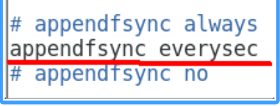

# Redis

## 基础篇

### 入门概述

#### 官网

https://redis.io/

#### 下载安装包

下载地址：https://redis.io/download/

版本：redis-7.0.15.tar.gz

#### 总体功能概述


### 安装配置

下载VMWare安装Linux系统，本笔记中使用的是CentOS操作系统。

#### Linux版安装介绍

Linux环境安装Redis必须具备gcc编译环境

在Linux中输入命令

```
gcc -v
```

如果提示未安装或未知命令，则表示系统不具备gcc编译环境，使用下面的命令安装gcc，安装完成后再次调用**gcc -v**。

```
yum -y install gcc-c++
```


1.下载获得redis-7.0.15.tar.gz后放入Linux目录/opt下

下载命令

```
wget https://download.redis.io/releases/redis-7.0.15.tar.gz
```


2.在/opt目录下解压redis

```
tar -zxvf redis-7.0.15.tar.gz
```

解压后的目录


3.进入目录

```
cd redis-7.0.15
```

4.在redis-7.0.15目录下执行make命令，安装完成之后提示**It's a goot idea to run 'make test'**，代表安装成功

```
make && make install
```


5.查看默认安装目录：usr/local/bin

```
cd /
cd /usr/local/bin
ll
```


> redis-benchmark：性能测试工具，服务启动后运行该命令，可查看自己电脑性能如何
>
> redis-check-aof：修复有问题的AOF文件
>
> redis-check-dump：修复有问题的dump.rdb文件
>
> redis-cli：客户端，操作入口
>
> redis-sentinel：redist集群使用
>
> redis-server：Redis服务器启动命令

6.将默认的redis.conf拷贝到自己定义好的一个路径下，例如/myredis

```
mkdir /myredis
cp redis.conf /myredis/
```


7.修改/myredis目录下redis.conf配置文件做初始化设置

redis.conf配置文件，改完后确保生效，记得重启，记得重启

   1 默认daemonize no              改为  daemonize yes

   2 默认protected-mode  yes    改为  protected-mode no

   3 默认bind 127.0.0.1          改为  直接注释掉(默认bind 127.0.0.1只能本机访问)或改成本机IP地址，否则影响远程IP连接

   4 添加redis密码                      改为 requirepass 你自己设置的密码


8.启动服务

```
redis-server /myredis/redis.conf
```

9.连接服务

```
redis-cli -a password
```


10.关闭服务

```
//单实例关闭
redis-cli -a password shutdown

//多实例关闭，指定端口关闭
redis-cli -p 6379 shutdown

//或在服务内输入shutdown
shutdown
```

#### 卸载介绍

1.停止redis服务


2.删除redis

```
ls -l /usr/local/bin/redis-*
rm -rf /usr/local/bin/redis-*
```


### 十大数据类型

Redis命令不区分大小写，但key是区分大小写的。

帮助命令

```
help @类型
help @string
help @list
...
```

#### 通用命令

```
//查看当前库所有的key
keys *

//判断某个key是否存在
exists key

//查看key的类型
type key

//删除指定的key数据（不推荐使用）
del key

//非阻塞删除，仅仅将keys从keyspace元数据中删除，真正的删除会在后续异步中操作
unlink key

//查看还有多少秒过期，-1表示永不过期，-2表示过期
ttl key

//为给定的key设置过期时间
expire key seconds

//将当前数据库的key移动到给定的数据库db当中
move key dbindex [0-15]

//切换数据库，默认为0
select dbindex [0-15]

//查看当前数据库key的数量
dbsize

//清空当前库
flushdb

//清空所有库
flushall
```

#### String

单key单value

常用

> set key value
>
> get key


同时设置/获取多个键值

> mset key value [key value ...]
>
> mget key [key ...]
>
> msetnx key value [key value ...]

获取指定范围内的值

> getrange key start end
>
> setrange key offset value


数值增减，一定要是数字才能进行加减

```
//递增数字，默认加1
incr key

//增加指定的整数
incrby key increment

//递减数值
decr key

//减少指定的整数
decrby key decrement
```

```
//获取字符串长度
strlen key

//字符串内容追加
append key value
```

getset:将给定 key 的值设为 value ，并返回 key 的旧值(old value)。简单一句话，先get然后立即set

> getset key value


#### List

单key多value

一个双端链表的结构，容量是2的32次方减1个元素，大概40多亿，主要功能有push/pop等，一般用在栈、队列、消息队列等场景。

left、right都可以插入添加；

如果键不存在，创建新的链表；

如果键已存在，新增内容；

如果值全移除，对应的键也就消失了。


常用

```
//从左往右向key中插入值
lpush key element [element ...]

//从右往左向key中插入值
rpush key element [element ...]

//从左往右遍历list，0表示第一个元素，-1表示最后一个元素
lrange key strat stop

//从左侧弹出count个元素，count默认为1
lpop key [count]

//从右侧弹出count个元素，count默认为1
rpop key [count]

//按照索引下标获取元素
lindex key index

//获取列表中元素的个数
llen key

// 从left往right删除2个值等于v1的元素，返回的值为实际删除的数量
// LREM list3 0 element，表示删除全部给定的值。零个就是全部值
lrem key count element

//截取指定范围的值后再赋值给key
ltrim key start stop

//移除列表的最后一个元素，并将该元素添加到另一个列表并返回
rpoplpush source destination

//从左往右，将指定key中索引为index的值设置为新值value
lset key index value

//在list某个已有值pivot的前before后after再添加具体值element
linsert key <before | after> pivot element
```

#### Hash

kv模式不变，但v是一个键值对

常用

```
//
hset key field value [field value ...]

//
hget key field

//
hmset key field value [field value ...]

//
hmget key field [field ...]

//
hgetall key

//
hdel key field [field]

//获取某个key内的全部参数的个数
hlen

//查看某个key中是否含有键field
hexists key field

//获取key中的所有键field
hkeys key

//获取key中所有值value 
hvals key

//给key中的键field的值value增加incremetn（正负整数）
hincrby key field increment

//给key中的键field的值value增加incremetn（正负浮点数）
hincrbyfloat

//若不存在，则设置
hsetnx key field value
```

#### Set

单值多value，且无重复

```
//添加元素
sadd key member [member ...]

//遍历集合中所有元素member
smembers key

//判断元素member是否在集合中
sismember key member

//删除元素member
srem key member [member ...]

//获取集合中的元素member个数
scard key

//从集合中随机展示设置的元素member个数count，默认为count为1，元素不删除
//从set集合里面随机取出2个，如果超过最大数量就全部取出，如果写的值是负数，比如-3 ，表示需要取出3个，但是可能会有重复值。
srandember key [count]

//从集合中随机弹出count个元素member，并且从集合中删除
spop key [count]

//将source中已经存在的某个值member移动到destination中
smove source destination member

//差集运算，属于k1但不属于k2的元素构成的集合
//哪个key在前就返回哪个key相对于其他key的集合
sdiff key [key ...]

//并集运算，属于k1或属于k2的元素合并后的集合
sunion key [key ...]

//交集运算，同时属于k1、k2的元素构成的集合
sinter key [key ...]

//不反悔结果集，只返回结果的基数。numkeys规定了key的个数
sintercard numkeys key [key ...] [LIMIT limit]
```

#### ZSet（Sorted Set）

```
//向有序集合中加入一个元素和该元素的分数
zadd key score member [score member ...]

//按照元素分数从小到大的顺序返回索引从start到stop之间的所有元素member，withscores：将分数同时返回
zrange key start stop [withscores]

//按照元素分数从大到小的顺序返回索引从start到stop之间的所有元素member，withscores：将分数同时返回
zrevrange key start stop [withscores]

//获取指定分数范围的元素
//withscores：将分数同时返回
//(min max：范围内不包括min。min (max：范围内不包括max。
//LIMIT offset count：返回限制，从offset下标开始，返回count个，类似于Mybatis的分页插件
zrangebyscore key min max [withscores] [LIMIT offset count]

//获取元素的分数
zscore key member

//获取集合中元素的数量
zcard key

//删除key下面对应的member
zrem key member [member ...]

//增加某个元素的分数
zincrby key incrememt member

//获得指定分数范围内的元素个数
zcount key min max

//从键名列表中的第一个非空排序集中弹出一个或多个元素，他们是成员分数对
zmpop numkeys key [key ...] <MIN | MAX> [COUNT count]

//分数从小到大排序，获取member的下标
zrank key member [WITHSCORE]

//分数从大到小排序，获取member的下标
zrevrank key member [WITHSCORE]
```

#### BitMap

由0和1状态表现的二进制位的bit数组

```
//offset：偏移量，从0开始计算。value：只能是0或1
setbit key offset value

//获取bit
getbit key offset

//全部键里面含有1的数量
bitcount key [start end [BYTE | BIT]]

//对key做与或非异或运算，并将结果存入destkey中
bittop <AND | OR | XOR | NOT> destkey key [key ...]
```

#### HyperLogLog

一种去重复统计功能的基数估计算法

```
//添加指定元素到HyperLogLog中
pfadd key element [elememt ...]

//返回给定HyperLogLog的基数估计值
pfcount key [key ...]

//将多个HyperLogLog合并为一个HyperLogLog
pfmerge destkey sourcekey [sourcekey ...]
```

#### GEO

地球上的地理位置是使用二维的经纬度表示，经度范围 (-180, 180]，纬度范围 (-90, 90]，只要我们确定一个点的经纬度就可以名取得他在地球的位置。

```
//添加经纬度坐标
GEOADD key longitude latitude member

//返回经纬度
GEOPOS key [member [member ...]]

//返回坐标的geohash表示
GEOHASH key [member [member ...]]

//返回两个位置之间的距离
GEODIST key member1 member2 [M | KM | FT | MI]

/**
以给定的经纬度为中心， 返回键包含的位置元素当中， 与中心的距离不超过给定最大距离的所有位置元素。
WITHDIST: 在返回位置元素的同时， 将位置元素与中心之间的距离也一并返回。 距离的单位和用户给定的范围单位保持一致。
WITHCOORD: 将位置元素的经度和维度也一并返回。
WITHHASH: 以 52 位有符号整数的形式， 返回位置元素经过原始 geohash 编码的有序集合分值。 这个选项主要用于底层应用或者调试， 实际中的作用并不大
COUNT 限定返回的记录数。
**/
GEORADIUS key longitude latitude radius <M | KM | FT | MI>
  [WITHCOORD] [WITHDIST] [WITHHASH] [COUNT count [ANY]] [ASC | DESC]
  [STORE key | STOREDIST key]

//找出指定范围内的元素，中心点是由给定的位置元素决定
GEORADIUSBYMEMBER key member radius <M | KM | FT | MI> [WITHCOORD]
  [WITHDIST] [WITHHASH] [COUNT count [ANY]] [ASC | DESC] [STORE key
  | STOREDIST key]
```

#### Stream

作用

实现消息队列，支持消息的持久化、支持自动生成全局唯一ID、支持ack确认消息的模式、支持消费组模式等，让消息队列更加稳定和可靠。

结构


四个特殊符合

> `-` + ：最小和最大可能出现的id
>
> $ ：表示只消费新的消息，当前流中信息的最大的id，可用于将要到来的信息。
>
> `>` ：用于xreadgroup命令，表示迄今为止还没有发送给组中使用者的信息，会更新消费者组的最后id
>
> `*` ：用于xadd命令中，让系统自动生成id

队列相关命令

```
//新增消息，*表示自动生成id
xadd key <* | id> field value [field value ...]

//用于获取消息列表。start表示开始值：-表示最小值。end表示结束值：+表示最大值。count表示最多获取多少个值
xrange key start end [COUNT count]

//反方向开始
xrevrange key end start [COUNT count]

//删除key中指定id的消息
xdel key id [id ...]

//获取key中消息的长度
xlen key

//用于对Stream的长度进行截取。MAXLEN：允许的最大长度，对流进行修剪限制长度。MINID：允许的最id，从某个id值开始比该id值小的将会被抛弃。
xtrim key <MAXLEN | MINID> [LIMIT count]

//用于获取消息，只会返回大于指定id的消息。
xread [COUNT count] [BLOCK milliseconds] STREAMS key [key ...] id
  [id ...]
```

消费组相关指令

```
//用于创建消费者组
XGROUP CREATE key group <id | $> [MKSTREAM]
  [ENTRIESREAD entries-read]

//">"：从第一条尚未被消费的信息开始读取
XREADGROUP GROUP group consumer [COUNT count] [BLOCK milliseconds]
  [NOACK] STREAMS key [key ...] id [id ...] | >

//查询每个消费组内所有消费者已读取但尚未确认的消息
XPENDING key group [[IDLE min-idle-time] start end count [consumer]]

//向消息队列确认消息处理完成
XACK key group id [id ...]

//用于打印Stream、Consumer、Group的详细信息
XINFO STREAM key [FULL [COUNT count]]
XINFO CONSUMERS key group
XINFO GROUPS key
```

#### BitFiled

将一个Redis字符串看作是一个由二进制组成的数组，并能对变长位宽和任意没有字节对齐的指定整形位域进行寻址和修改。

### 持久化

Redis持久化方式有两种：RDB（Redis DataBase）和AOF（AppendOnly File）。


#### RDB

##### 简介

实现类似照片记录效果的方式，就是把某一时刻的数据和状态以文件的形式写到磁盘上，也就是

快照。这样一来即使故障宕机，快照文件也不会丢失，数据的可靠性也就得到了保证。

这个快照文件就称为RDB文件(dump.rdb)，其中，RDB就是Redis DataBase的缩写。

Redis保存备份时执行的是**全量快照**，保存的是**dump.rdb**文件。

##### 自动触发

修改redis.conf里配置的`save <seconds> <changes>`。


修改dump文件保存路径


修改dump文件名称


恢复数据

将备份文件（dump.rdb）移动到redis安装目录并启动服务即可。

注意

- 不可以把备份文件dump.rdb和生产redis服务器放在同一台机器，必须分开各自存储，

  以防生产机物理损坏后备份文件也挂了。

- 执行flushall/flushdb命令也会产生dump.rdb文件，但里面是空的，毫无意义。

##### 手动触发

SAVE

在主程序中执行会阻塞当前redis服务器，直到持久化工作完成执行save命令期间，Redis不能处理其他命令，线上禁止使用。


BGSAVE

Redis会在后台异步进行快照操作，不阻塞快照同时还可以响应客户端请求，该触发方式会fork一个子进程由子进程复制持久化过程。


```
//获取最后一次成功执行快照的时间
lastsave
```


##### 优势

- 适合大规模的数据恢复
- 按照业务定时备份
- 对数据完整性和一致性要求不高
- RDB文件在内存中的加载速度要比AOF快得多

##### 劣势

- 在一定间隔内做一次备份，所以如果redis意外down掉的话，就会丢失从当前至最近一次快照间的数据，快照之间的数据会丢失
- 内存数据的全量同步，如果数据量太大会导致I/O严重影响服务器性能
- RDB依赖于主进程的的fork，在更大的数据集中，这可能会导致服务请求的瞬间延迟。fork的时候内存中的数据被克隆了一份，大致2倍的膨胀性，需要考虑。

##### 检查修复dump.rdb文件


##### 触发RDB快照的方式

- 配置文件中默认的快照配置
- 手动save/bgsave命令
- 执行flushall/flushdb命令也会产生dump.rdb
- 执行shutdown且没有设置开启AOF持久化
- 主从复制时，主节点自动触发

##### 禁用快照

动态执行：`redis-cli config set save ""`

或


##### RDB优化配置项详解

```
save <seconds> <changes>
```

```
dbfilename
```

```
dir
```

```
stop-writes-on-bgsave-error
```


```
rdbcompression
```


```
rdbchecksum
```


```
rdb-del-sync-files
```


##### 总结


#### AOF

##### 简介

以日志的形式来记录每个写操作，将Redis执行过的所有写指令记录下来（读操作不会记录），只许追加文件但不可以改写文件，redis启动之初会读取该文件重新构建数据，换言之，redis重启的话就会根据日志文件的内容将写指令从前到后执行一次以完成数据的恢复工作。

开启AOF功能需要设置配置：**appendonly yes**

AOF保存的是**appendonly.aof**文件。

##### AOF持久化工作流程


##### AOF缓冲区三种写回策略

- Always：同步写回，每个写命令执行完立刻同步的将日志写回磁盘。
- everysec：每秒写回，每个写命令执行完，只是先把日志文件写到AOF文件的内存缓冲区，每隔1秒吧缓冲区中的内容写入磁盘。
- no：操作系统的控制写回，每个写命令执行完，只是先把日志写到AOF文件的内存缓冲区，由操作系统决定何时将缓冲区内容写回磁盘。


##### AOF配置

开启aof


写回策略



aof文件保存路径


最终保存路径


文件保存名称


##### AOF启动

redis启动时读取appendonly.aof文件，恢复数据

##### AOF修复

```
//只修复增量文件
redis-check-aof --fix file
```


##### 优势

- 更好的保护数据不丢失、性能高、可做紧急恢复

##### 劣势

+ 相同数据集的数据而言aof文件要远大于rdb文件，恢复速度慢于rdb
+ aof运行效率要慢于rdb，每秒同步策略效率较好，不同步效率和rdb相同

##### AOF重写机制

启动AOF文件的内容压缩，只保留可以恢复数据的最小指令集。

###### 触发配置


###### 自动触发

满足配置文件中的选项后，触发重写，并且会记录上次重写时的AOF文件大小。

###### 手动触发

客户端向服务器发送`bgrewriteaof`命令

###### 原理

1：在重写开始前，redis会创建一个“重写子进程”，这个子进程会读取现有的AOF文件，并将其包含的指令进行分析压缩并写入到一个临时文件中。

2：与此同时，主进程会将新接收到的写指令一边累积到内存缓冲区中，一边继续写入到原有的AOF文件中，这样做是保证原有的AOF文件的可用性，避免在重写过程中出现意外。

3：当“重写子进程”完成重写工作后，它会给父进程发一个信号，父进程收到信号后就会将内存中缓存的写指令追加到新AOF文件中

4：当追加结束后，redis就会用新AOF文件来代替旧AOF文件，之后再有新的写指令，就都会追加到新的AOF文件中

5：重写aof文件的操作，并没有读取旧的aof文件，而是将整个内存中的数据库内容用命令的方式重写了一个新的aof文件，这点和快照有点类似

##### AOF优化配置项详解


##### 总结


#### RDB+AOF混合持久化

##### 数据恢复顺序和加载流程


##### RDB + AOF混合使用


#### 纯缓存模式

同时关闭RDB + AOF

> save "" ：禁用rdb，但仍可以使用bgsave生成rdb文件
>
> appendonly no ：禁用aof，但仍可以使用bgrewriteaof生成aof文件

### 事务

#### 简介

可以一次执行多个命令，本质是一组命令的集合，一个事务中的所有命令都会序列化，按顺序的串行执行而不会被其他命令插入，不许加塞。

#### Redis事务 VS 数据库事务


#### 示例


##### 正常执行


##### 放弃事务


##### 全体连坐


##### 冤头债主

Redis不提供事务回滚的功能，开发者必须在事务执行出错后，自行恢复数据库状态。


##### watch监控

- 一旦执行了exec，之前加的监控锁都会被取消掉
- 当客户端链接丢失的时候（比如退出链接），所有东西都会被取消监视

正常watch


不正常watch


##### unwatch


#### 总结

- 开启：以MULTI开始一个事务。
- 入队：将多个命令入队到事务中，接到这些命令并不会立即执行，而是放到等待执行的事务队列里面。
- 执行：由EXEC命令触发事务

### 管道

#### 简介

Pipeline是为了解决RTT（**Round Trip Time(简称RTT,数据包往返于两端的时间)**）往返时，仅仅是将命令打包一次性发送，对整个Redis的执行不造成其他任何影响。

批处理命令变种优化措施，类似Redis的原生批命令（mget和mset）。

#### 示例

若文件中含有错误代码，使用的策略是冤头债主。


#### 总结

##### 与原生批量命令对比

- 原生批量命令是原子性，pipeline是非原子性
- 原生批量命令一次只能执行一种命令，pipeline支持批量执行不同命令
- 原生批量命令服务端实现，而pipeline需要服务端与客户端共同完成

##### 与事务对比

- 事务具有原子性，管道不具有原子性
- 管道一次性将多条命令发送到服务器，事务是一条一条的发，事务只有在接收到exec命令后才会执行
- 执行事务时会阻塞其他命令的执行，而执行管道中的命令时不会

##### 注意事项

- pipeline缓冲的指令只是会依次执行，不保证原子性，如果执行中指令发生异常，将会继续执行后续的指令
- 使用pipeline组装的命令个数不能太多，不然数据量过大客户端阻塞时间可能过久，同时服务端也被迫回复一个队列答复，占用很多内存

### 发布订阅

#### 简介

一种消息通信模式，发送者（PUBLISH）发送消息，订阅者（SUBSCRIBE）接收消息，可以实现进程间的消息传递。

不推荐使用Redis原生的PUB/SUB，专业的事交给专业的人做。

### 复制（Replica）

#### 简介

就是主从复制，master以写为主，slave以读为主。当master数据变化的时候，自动将新的数据以异步方式同步到其他slave数据库。具有读写分离、容灾恢复、数据备份、水平扩容支持高并发等特性。

#### 基本操作命令

```
//可以查看复制节点的主从关系和配置信息
info replication

//一般写入进redis.conf配置文件内。host：主机ip。port：主机中redis的端口号。
replicaof host port

//在运行期间修改slave节点的信息，如果该数据库已经是某个主数据库的从数据库，那么会停止和原主数据的同步关系，转而和新的主数据库同步。
slaveof host port

//使当前数据库停止与其他数据库的同步，转成主数据库。
slaveof no one
```

#### 示例

##### 架构说明

三台Redis服务器，三边网络相互能ping，且不会被防火墙拦截。


##### 配置文件

配从（库）不配主（库）。以redis6379.conf为例。

1. 开启daemonize yes


2. 注释掉bind 127.0.0.1 - : : 1


3. protected-mode no


4. 指定端口


5. 指定当前工作目录，dir


6. pid文件名字，pidfile


7. log文件名字，logfile


8. requirepass


9. dump.rdb名字


10. aof文件，appendfilename


11. 从机访问主机的通行密码masterauth，从机配主机不配。


##### 一主二仆

###### 方案1：配置文件固定写死

配置redis.conf文件。先启动master在启动slave。

主从关系查看

- 主机或从机的日志文件
- **info replication** 命令查看

从机可以执行写命令吗？

> 不可以

从机切入点问题？

> 首次一锅端，全量复制，后续跟随，master写，slave跟

主机shutdown后情况如何？从机是上位还是原地待命 ？

> 从机不动，原地待命，从机数据可以正常使用；等待主机重启动归来

主机shutdown后，重启后主从关系还在吗？

> 保持原主从关系

###### 方案2：命令操作手动指定

在预设的从机上面执行命令

```
slaveof hostIP port
```

##### 薪火相传

- 上一个slave可以是下一个slave的master，slave同样可以接收其他slaves的链接和同步请求，那么该slave作为了链条中下一个的master，可以有效减轻主master的写压力。
- 中途变更转向：会清除之前的数据，重新建立拷贝最新的
- 命令：`slaveof hostIP port`

##### 反客为主

使当前数据库停止与其他数据库的同步，转为主数据库。但之前存在的数据不丢失。

```
slaveof no one
```

#### 原理和工作流程

slave启动，同步初请

> slave启动成功连接到master后会发送一个sync命令。slave首次全新连接master，一次完全同步（全量复制）将会被自动执行，slave自身原有数据会被master数据覆盖清除。

首次连接，全量复制

> master节点收到sync命令后会开始在后台保存快照（即RDB持久化，主从复制时会触发RDB），同时收集所有接收到的用于修改数据集命令缓存起来，master节点执行RDB持久化后，master将rdb快照文件和所有缓存的命令发送到所有slave，以完成一次完全同步。
>
> 而slave服务将在接收到数据库文件数据后，将其存盘并加载到内存中，从而完成复制初始化

心跳持续，保持通信

> master发出PING包的周期，默认是10秒
>
> redis.conf文件中：repl-ping-replica-period 10

进入平稳，增量复制

> Master继续将性能的所有收集到的修改命令自动一次传给slave，完成同步

从机下线，重连续传

> master会检查backlog里面的offset，master和slave都会保存一个复制的offset还有一个masterID，offset时保存在backlog中的。Master只会把已经复制的offset后面的数据复制给slave，类似断点续传。

#### 劣势

复制延时，信号衰减。由于所有的写操作都是先在Master上操作，然后同步更新到Slave上，所以从Master同步到Slave机器有一定的延迟，当系统很繁忙的时候，延迟问题会更加严重，Slave机器数量的增加也会使这个问题更加严重。

master挂了的话，默认情况下，不会在slave节点中自动重选一个master。

### 哨兵（sentinel）

#### 简介

巡查监控后台master主机是否故障，如果故障了根据投票数自动将某一个从库转化为新主库，继续对外服务。

1、监控redis运行状态，包括master和slave

2、当master down机，能自动将slave切换成新master

- 主从监控：监控主从redis库运行是否正常
- 消息通知：哨兵可以将故障转移的结果发送给客户端
- 故障转移：如果master异常，则会进行主从切换，将其中一个slave作为新master
- 配置中心：客户端通过连接哨兵来获得当前redis服务器的主节点地址

#### 示例

Redis Sentinel架构：**一主二从三哨兵**。先启动redis主从机，在启动哨兵。


##### 重要参数说明

```
//设置要监控的master服务器，quorum表示最少有几个哨兵认可客观下线，同意故障迁移的法定票数
sentinel monitor <master-name> <ip> <redis-port> <quorum>

//master设置了密码，连接master服务的密码
sentinel auth-pass <master-name> <password>
```

以sentinel26379.conf为例

```
bind 0.0.0.0
daemonize yes
protected-mode no
port 26380
logfile "/myredis/sentinel26380.log"
pidfile /var/run/redis-sentinel26380.pid
dir "/myredis"
sentinel monitor mymaster 192.168.111.169 6379 2
sentinel auth-pass mymaster 111111
```

报错*`master_link_status:down`*

> redis.conf配置文件内没有配置`masterauth`项访问密码。

##### 启动哨兵

```
redis-sentinel sentinel26379.conf --sentinel
redis-sentinel sentinel26380.conf --sentinel
redis-sentinel sentinel26381.conf --sentinel
```

##### 原有的master挂了

**两台从机数据是否ok**

> 数据没问题

**是否会从剩下的2台机器上选出新的master**

> 会，通过哨兵投票重新选择master

**之前down机的master机器重启回来，谁将会是新老大？会不会双master冲突**

> 重连回来的原master将变成slave。

##### 配置文件的改动

- 文件的内容，在运行期间会被sentinel动态进行更改
- Master-Slave切换后，master_redis.conf、slave_reids.conf的内容都会发生改变，即master_redis.conf中会多一行slaveof的配置，sentinel.conf的监控目标会随之调换。

#### 哨兵运行流程和选举原理

当一个主从配置中的master失效后，sentinel可以选举出一个新的master，用于自动接替原master的工作，主从配置中的其他redis服务器自动指向新的master同步数据。一般建议sentinel采取**奇数**台，防止某一台sentinel无法连接到master导致误切换。

##### 运行流程，故障切换

###### **1. SDown主观下线（Subjectively Down）**

所谓主观下线（Subjectively Down， 简称 SDOWN）指的是单个Sentinel实例对服务器做出的下线判断，即单个sentinel认为某个服务下线（有可能是接收不到订阅，之间的网络不通等等原因）。主观下线就是说如果服务器在[sentinel down-after-milliseconds]给定的毫秒数之内没有回应PING命令或者返回一个错误消息， 那么这个Sentinel会主观的(单方面的)认为这个master不可以用了。

> sentinel down-after-milliseconds <masterName> <timeout>

 表示master被当前sentinel实例认定为失效的间隔时间，这个配置其实就是进行主观下线的一个依据

master在多长时间内一直没有给Sentine返回有效信息，则认定该master主观下线。也就是说如果多久没联系上redis-servevr，认为这个redis-server进入到失效（SDOWN）状态。


###### **2. ODown客观下线（Objectively Down）**

ODown需要一定数量的sentinel，即多个哨兵达成一致意见才能认为一个master客观上已经宕机挂了。


**quorum这个参数是进行客观下线的一个依据**，法定人数/法定票数

意思是至少有quorum个sentinel认为这个master有故障才会对这个master进行下线以及故障转移。因为有的时候，某个sentinel节点可能因为自身网络原因导致无法连接master，而此时master并没有出现故障，所以这就需要多个sentinel都一致认为该master有问题，才可以进行下一步操作，这就保证了公平性和高可用。

###### **3. 选举出领导者哨兵（哨兵中选出兵王）**

当主节点被判断客观下线后，各个哨兵节点会进行协商，先选举出一个领导者哨兵节点（兵王），并由该领导者节点进行`failover`（故障迁移）。

领导者哨兵通过**Raft算法**产生。


###### **4. 由兵王开始推动故障切换流程并选出一个新master**

**1.某个Slave被选中成为新Master**

选出新master的规则，剩余slave节点健康前提下

> redis.conf文件中，优先级slave-priority或者replica-priority最高的从节点（数字越小优先级越高）
>
> 复制偏移位置offset最大的从节点
>
> 最小Run ID的从节点


**2.一朝天子一朝臣，换个码头重新拜**

执行`slaveof no one`命令让选出来的从节点成为新的主节点，并通过`slaveof`命令让其他节点成为其从节点。

`Sentinel leader`会对选举出的新`master`执行`slaveof no one`操作，将其提升为`master`节点

`Sentinel leader`向其他`slave`发送命令，让剩余的`slave`成为新的`master`节点的`slave`

**3.老master回来也认怂**

将之前已下线的老`master`设置为新选出的新`master`的从节点，当老`master`重新上线后，他会成为新`master`的从节点。

`Sentinel leader`会让原来的`master`降级为`slave`并恢复正常工作

**上述的failover操作均有sentinel自己独自完成，完全无需人工干预。**

#### 哨兵使用建议

- 哨兵节点的数量应为多个，哨兵本身应该集群，保证高可用
- 哨兵节点的数量应该是奇数
- 各个哨兵节点的配置应一致
- 如果哨兵节点部署在Docker等容器里面，尤其要注意端口的正确映射
- 哨兵集群+主从复制，并不能保证数据零丢失

### 集群（cluster）

#### 简介

由于数据量过大，单个Master复制集难以承担，因此需要对多个复制集进行集群，形成水平扩展每个复制集只负责存储整个数据集

的一部分，这就是Redis的集群，其作用是提供在多个Redis节点间共享数据的程序集。


Redis集群支持多个Master，每个Master又可以挂在多个Slave。读写分离，支持数据的高可用，支持海量数据的读写存储操作。

Cluster自带Sentinel的故障转移机制，内置了高可用的支持，无需再去使用哨兵功能。

客户端与Redis的节点连接，不再需要连接集群中所有的节点，只需要任意连接集群中的一个可用节点即可。

槽位slot负责分配到各个物理服务节点，由对应的集群来负责维护节点、插槽和数据之间的关系。

#### 集群算法-分片-槽位slot

##### redis集群的槽位


##### redis集群的分片

|                       |                                                              |      |
| --------------------- | ------------------------------------------------------------ | ---- |
| 分片是什么            | 使用Redis集群时我们会将存储的数据分散到多台redis机器上，这称为分片。简言之，集群中的每个Redis实例都被认为是整个数据的一个分片。 |      |
| 如何找到给定key的分片 | 为了找到给定key的分片，我们对key进行CRC16(key)算法处理并通过对总分片数量取模。然后，使用确定性哈希函数，这意味着给定的key将多次始终映射到同一个分片，我们可以推断将来读取特定key的位置。 |      |

##### slot槽位映射

###### 哈希取余分区

| 2亿条记录就是2亿个k,v，我们单机不行必须要分布式多机，假设有3台机器构成一个集群，用户每次读写操作都是根据公式：hash(key) % N个机器台数，计算出哈希值，用来决定数据映射到哪一个节点上。 |
| ------------------------------------------------------------ |
| 优点： 简单粗暴，直接有效，只需要预估好数据规划好节点，例如3台、8台、10台，就能保证一段时间的数据支撑。使用Hash算法让固定的一部分请求落到同一台服务器上，这样每台服务器固定处理一部分请求（并维护这些请求的信息），起到负载均衡+分而治之的作用。 |
| 缺点：  原来规划好的节点，进行扩容或者缩容就比较麻烦了额，不管扩缩，每次数据变动导致节点有变动，映射关系需要重新进行计算，在服务器个数固定不变时没有问题，如果需要弹性扩容或故障停机的情况下，原来的取模公式就会发生变化：Hash(key)/3会变成Hash(key) /?。此时地址经过取余运算的结果将发生很大变化，根据公式获取的服务器也会变得不可控。某个redis机器宕机了，由于台数数量变化，会导致hash取余全部数据重新洗牌。 |


###### 一致性哈希算法分区

一致性Hash的提出，目的是当服务器个数发生变动时，尽量减少影响客户端到服务器的映射关系。

**哈希算法分区步骤**

1.构建一次性哈希换

> 一致性哈希算法必然有个hash函数并按照算法产生hash值，这个算法的所有可能哈希值会构成一个全量集，这个集合可以成为一个hash空间[0,2^32-1^]，这个是一个线性空间，但是在算法中，我们通过适当的逻辑控制将它首尾相连(0 = 2^32^),这样让它逻辑上形成了一个环形空间。

> 它也是按照使用取模的方法，前面笔记介绍的节点取模法是对节点（服务器）的数量进行取模。而一致性Hash算法是对2^32^取模，简单来说，一致性Hash算法将整个哈希值空间组织成一个虚拟的圆环，如假设某哈希函数H的值空间为0-2^32-1^（即哈希值是一个32位无符号整形），整个哈希环如下图：整个空间按顺时针方向组织，圆环的正上方的点代表0，0点右侧的第一个点代表1，以此类推，2、3、4、……直到2^32-1^，也就是说0点左侧的第一个点代表2^32-1^， 0和2^32-1^在零点中方向重合，我们把这个由2^32^个点组成的圆环称为Hash环。


2.redis服务器IP节点映射

> 将集群中各个IP节点映射到环上的某一个位置。将各个服务器使用Hash进行一个哈希，具体可以选择服务器的IP或主机名作为关键字进行哈希，这样每台机器就能确定其在哈希环上的位置。假如4个节点NodeA、B、C、D，经过IP地址的哈希函数计算(hash(ip))，使用IP地址哈希后在环空间的位置如下： 


3.key落到服务器的落键规则

> 当我们需要存储一个kv键值对时，首先计算key的hash值，hash(key)，将这个key使用相同的函数Hash计算出哈希值并确定此数据在环上的位置，**从此位置沿环顺时针“行走”**，第一台遇到的服务器就是其应该定位到的服务器，并将该键值对存储在该节点上。

> 如我们有Object A、Object B、Object C、Object D四个数据对象，经过哈希计算后，在环空间上的位置如下：根据一致性Hash算法，数据A会被定为到Node A上，B被定为到Node B上，C被定为到Node C上，D被定为到Node D上。


**优缺点**

容错性

> 假设Node C宕机，可以看到此时对象A、B、D不会受到影响。一般的，在一致性Hash算法中，如果一台服务器不可用，则受影响的数据仅仅是此服务器到其环空间中前一台服务器（即沿着逆时针方向行走遇到的第一台服务器）之间数据，其它不会受到影响。简单说，就是C挂了，受到影响的只是B、C之间的数据且这些数据会转移到D进行存储。


扩展性

> 数据量增加了，需要增加一台节点NodeX，X的位置在A和B之间，那收到影响的也就是A到X之间的数据，重新把A到X的数据录入到X上即可，
>
> 不会导致hash取余全部数据重新洗牌。


数据倾斜问题

> 一致性Hash算法在服务**节点太少时**，容易因为节点分布不均匀而造成**数据倾斜**（被缓存的对象大部分集中缓存在某一台服务器上）问题，


###### 哈希槽分区

哈希槽分区为了解决一致性哈希数据倾斜问题，哈希槽实质就是一个数组，数组[0,2^14 -1]形成hash slot空间。

解决均匀分配的问题，在数据和节点之间又加入了一层，把这层称为哈希槽（slot），用于管理数据和节点之间的关系，现在就相当于节点上放的是槽，槽里放的是数据。槽解决的是粒度问题，相当于把粒度变大了，这样便于数据移动。哈希解决的是映射问题，使用key的哈希值来计算所在的槽，便于数据分配


一个集群只能有16384个槽，编号0-16383（0-2^14-1）。这些槽会分配给集群中的所有主节点，分配策略没有要求。

集群会记录节点和槽的对应关系，解决了节点和槽的关系后，接下来就需要对key求哈希值，然后对16384取模，余数是几key就落入对应的槽里。HASH_SLOT = CRC16(key) mod 16384。以槽为单位移动数据，因为槽的数目是固定的，处理起来比较容易，这样数据移动问题就解决了。

```
HASH_SLOT = CRC16(key) mod 16384
```

Redis 集群中内置了 16384 个哈希槽，redis 会根据节点数量大致均等的将哈希槽映射到不同的节点。当需要在 Redis 集群中放置一个 key-value时，redis先对key使用crc16算法算出一个结果然后用结果对16384求余数[ CRC16(key) % 16384]，这样每个 key 都会对应一个编号在 0-16383 之间的哈希槽，也就是映射到某个节点上。如下代码，key之A 、B在Node2， key之C落在Node3上

##### 经典面试题

为社么redis集群的最大槽数是16384个？


*(1)如果槽位为65536，发送心跳信息的消息头达8k，发送的心跳包过于庞大。*

在消息头中最占空间的是myslots[CLUSTER_SLOTS/8]。 当槽位为65536时，这块的大小是: 65536÷8÷1024=8kb 

在消息头中最占空间的是myslots[CLUSTER_SLOTS/8]。 当槽位为16384时，这块的大小是: 16384÷8÷1024=2kb 

因为每秒钟，redis节点需要发送一定数量的ping消息作为心跳包，如果槽位为65536，这个ping消息的消息头太大了，浪费带宽。

 

*(2)redis的集群主节点数量基本不可能超过1000个。*

集群节点越多，心跳包的消息体内携带的数据越多。如果节点过1000个，也会导致网络拥堵。因此redis作者不建议redis cluster节点数量超过1000个。 那么，对于节点数在1000以内的redis cluster集群，16384个槽位够用了。没有必要拓展到65536个。


*(3)槽位越小，节点少的情况下，压缩比高，容易传输*

Redis主节点的配置信息中它所负责的哈希槽是通过一张bitmap的形式来保存的，在传输过程中会对bitmap进行压缩，但是如果bitmap的填充率slots / N很高的话(N表示节点数)，bitmap的压缩率就很低。 如果节点数很少，而哈希槽数量很多的话，bitmap的压缩率就很低。

##### 不保证强一致性

Redis集群**不保证强一致性**，这意味着在特定的条件下，Redis集群可能会丢掉一些被系统收到的写入请求命令。

#### 集群环境案例步骤

###### 1. 3主3从redis集群配置

```
//在虚拟机上新建目录
mkdir -p /myredis/cluster
```

新建6个独立的redis实例服务

```
vim /myredis/cluster/redisCluster6381.conf
vim /myredis/cluster/redisCluster6382.conf
vim /myredis/cluster/redisCluster6383.conf
vim /myredis/cluster/redisCluster6384.conf
vim /myredis/cluster/redisCluster6385.conf
vim /myredis/cluster/redisCluster6386.conf
```

以`redisCluster6381.conf`为例

```
bind 0.0.0.0
daemonize yes
protected-mode no
port 6381
logfile "/myredis/cluster/cluster6381.log"
pidfile /myredis/cluster6381.pid
dir /myredis/cluster
dbfilename dump6381.rdb
appendonly yes
appendfilename "appendonly6381.aof"
requirepass 111111
masterauth 111111
 
cluster-enabled yes
cluster-config-file nodes-6381.conf
cluster-node-timeout 5000
```

启动6台主机实例

```
redis-server /myredis/cluster/redisCluster6381.conf
redis-server /myredis/cluster/redisCluster6381.conf
...
redis-sever /myredis/cluster/redisCluster6386.conf
```

通过redis-cli命令为6台机器构建集群关系

```
//注意，注意，注意自己的真实IP地址     //注意，注意，注意自己的真实IP地址
redis-cli -a 111111 --cluster create --cluster-replicas 1 192.168.111.175:6381 192.168.111.175:6382 192.168.111.172:6383 192.168.111.172:6384 192.168.111.174:6385 192.168.111.174:6386
```

链接进入6381作为切入点，查看并检验集群状态

```
//查看本机的状态
info replication

//查看集群信息
cluster info

//查看集群节点信息
cluster nodes
```

###### 2. 3主3从redis集群读写

如果以`redis-cli -a 111111 -p 6381`连入集群，对于某些key会报错，因为6381端口号机无法路由到其他端口号机。

正确的连入方式应该是`redis-cli -a 111111 -p 6381 -c`

```
redis-cli -a 111111 -p 6381 -c
```

```
//查看某个key属于哪个对应的槽位值
cluster keyslot key
```

###### 3. 主从容错切换迁移案例

当主机宕机后，从机会自动上位成为新的master，此后若是原主机重新连接回来，原主机不会上位，并以**从节点**的形式回归，成为新master的slave。

Redis集群不保证强一致性，这意味着在特定的条件下，Redis集群可能会丢掉一些被系统收到的写入请求命令。

手动故障转移 or 节点从属调整

```
cluster fallover
```

###### 4. 主从扩容案例

新建6387、6388两个服务实例配置文件，并启动

```
vim /myredis/cluster/redisCluster6387.conf
vim /myredis/cluster/redisCluster6388.conf

redis-server /myredis/cluster/redisCluster6387.conf
redis-server /myredis/cluster/redisCluster6388.conf
```

将新增的6387作为master节点加入原有集群

```
//redis-cli -a 密码 --cluster add-node 自己实际IP地址:6387 自己实际IP地址:6381
//6387 就是将要作为master新增节点
//6381 就是原来集群节点里面的领路人，相当于6387拜拜6381的码头从而找到组织加入集群
redis-cli -a 111111  --cluster add-node 192.168.111.174:6387 192.168.111.175:6381
```

检查集群情况，此时新加入的6387实例是没有槽位号和slave的

```
//redis-cli -a 密码 --cluster check 真实ip地址:6381
redis-cli -a 111111 --cluster check 192.168.111.175:6381
```

重新分派槽号

```
//redis-cli -a 密码 --cluster reshard IP地址:端口号
redis-cli -a 密码 --cluster reshard 192.168.111.175:6381
```

完成重新分派槽号后，6378会得到3个不连续的槽号区间，因为重新分配成本太高，所以前3家各自匀出来一部分，从6381/6383/6385三个旧节点分别匀出1364个坑位给新节点6387。

为主节点6387分配从节点6388

```
命令：redis-cli -a 密码 --cluster add-node ip:新slave端口 ip:新master端口 --cluster-slave --cluster-master-id 新主机节点ID
 
redis-cli -a 111111 --cluster add-node 192.168.111.174:6388 192.168.111.174:6387 --cluster-slave --cluster-master-id 4feb6a7ee0ed2b39ff86474cf4189ab2a554a40f-------这个是6387的编号，按照自己实际情况
```

再次检查集群情况，集群分布变成4主4从。

###### 5. 主从缩容案例

一般扩容后不会缩容，了解即可。

检查集群情况，先获得从节点6388的节点ID

```
redis-cli -a 密码 --cluster check 192.168.111.174:6388
```

从集群中将6388从节点删除

```
//命令：redis-cli -a 密码 --cluster del-node ip:从机端口 从机6388节点ID
 redis-cli -a 111111 --cluster del-node 192.168.111.174:6388 218e7b8b4f81be54ff173e4776b4f4faaf7c13da
```

将6387的槽号清空，重新分配，本例将清出来的槽号都给6381

```
redis-cli -a 111111 --cluster reshard 192.168.111.175:6381
```

将6387删除

```
//命令：redis-cli -a 密码 --cluster del-node ip:端口 6387节点ID
 
redis-cli -a 111111 --cluster del-node 192.168.111.174:6387 4feb6a7ee0ed2b39ff86474cf4189ab2a554a40f
```

检查集群情况，查看6387 / 6388是否别彻底替祛除。

```
redis-cli -a 111111 --cluster check 192.168.111.175:6381
```

#### 集群常用操作命令和CRC16算法分析

不在同一个slot槽位下的键值无法使用mset、mget等多键操作，可以通过{}来定义同一个组的概念，使key中{}内相同内容的键值对放到一个slot槽位去，对照下图类似k1k2k3都映射为x，自然槽位一样。


集群是否完整才对外提供服务


```
//查看槽位是否被占用。1：被占用。0：未占用
cluster countkeysinslot slot

//键key存在哪个槽位上
cluster keyslot key
```

### SpringBoot集成Redis

#### 集成Jedis

Jedis Client是Redis官网推荐的一个面向java客户端，库文件实现了对各类API进行封装调用。

##### maven仓库

```xml
<!--jedis-->
<dependency>
    <groupId>redis.clients</groupId>
    <artifactId>jedis</artifactId>
    <version>4.3.1</version>
</dependency>
```

##### 入门案例

```java
package com.my.redis7.demo;

import redis.clients.jedis.Jedis;

import java.util.*;

/**
 * @author hxm
 * @date 2024/3/13 19:17
 * @description
 */
public class JedisDemo {
    public static void main(String[] args) {
        Jedis jedis = new Jedis("192.168.234.129", 6379);
        jedis.auth("0108");
        System.out.println("是否连接成功：" + jedis.ping());

        Set<String> keys = jedis.keys("*");
        for(Iterator iterator = keys.iterator();iterator.hasNext();){
            String key = (String) iterator.next();
            System.out.println(key);
        }
        System.out.println("jedis.exists====>" + jedis.exists("k2"));
        System.out.println(jedis.ttl("k1"));

        //string
//        jedis.append("k1", "myredis");
        System.out.println("------------string----------------");
        System.out.println(jedis.get("k1"));
        jedis.set("k4", "v4_redis");

        jedis.mset("str1", "str11", "str2", "str22", "str3", "str33");
        System.out.println(jedis.mget("str1", "str2", "str3", "k4"));
        System.out.println("------------string----------------");

        System.out.println("------------list----------------");
        jedis.lpush("mylist", "v1", "v2", "v3", "v4", "v5");
        List<String> mylist = jedis.lrange("mylist", 0, -1);
        for (String element : mylist) {
            System.out.println(element);
        }
        System.out.println("------------list----------------");

        System.out.println("------------set----------------");
        jedis.sadd("orders", "jd001");
        jedis.sadd("orders", "jd002");
        jedis.sadd("orders", "jd003");
        jedis.sadd("orders", "jd004");
        Set<String> set1 = jedis.smembers("orders");
        for(Iterator iterator = set1.iterator();iterator.hasNext();){
            String string = (String) iterator.next();
            System.out.println(string);
        }
        jedis.srem("orders", "jd002");
        System.out.println(jedis.smembers("orders").size());
        System.out.println("------------set----------------");

        System.out.println("------------hash----------------");
        jedis.hset("hash1", "username", "lisi");
        System.out.println(jedis.hget("hash1", "username"));
        Map<String, String> map = new HashMap<>();
        map.put("telphone", "133********");
        map.put("address", "beijing");
        map.put("email", "2354****@qq.com");
        jedis.hmset("hash2", map);
        List<String> hmget = jedis.hmget("hash2", "telphone", "email");
        for (String element : hmget) {
            System.out.println(element);
        }
        System.out.println("------------hash----------------");

        System.out.println("------------zset----------------");
        jedis.zadd("zset01", 60d, "v1");
        jedis.zadd("zset02", 70.0, "v2");
        jedis.zadd("zset03", 80d, "v3");
        List<String> zset01 = jedis.zrange("zset01", 0, -1);
        zset01.forEach(System.out::println);
        System.out.println("------------zset----------------");
    }
}

```

#### 集成Lettuce

Lettuce是一个Redis的Java驱动包。

##### maven仓库

```xml
<!--lettuce-->
<dependency>
    <groupId>io.lettuce</groupId>
    <artifactId>lettuce-core</artifactId>
    <version>6.2.1.RELEASE</version>
</dependency>
```

##### 入门案例

```java
package com.my.redis7.demo;

import io.lettuce.core.RedisClient;
import io.lettuce.core.RedisURI;
import io.lettuce.core.SortArgs;
import io.lettuce.core.api.StatefulRedisConnection;
import io.lettuce.core.api.sync.RedisCommands;
import lombok.extern.slf4j.Slf4j;

import java.util.HashMap;
import java.util.List;
import java.util.Map;
import java.util.Set;

/**
 * @author hxm
 * @date 2024/3/13 20:26
 * @description
 */
@Slf4j
public class LettuceDemo {
    public static void main(String[] args) {
        //1. 使用构建器RedisURI.builder()
        RedisURI uri = RedisURI.builder().withHost("192.168.234.129").withPort(6379).withAuthentication("default", "0108").build();
        //2. 创建连接客户端
        RedisClient client = RedisClient.create(uri);
        StatefulRedisConnection conn = client.connect();
        //3. 操作命令
        RedisCommands commands = conn.sync();
        List<String> keys = commands.keys("*");
        for (String key : keys) {
            System.out.println("key = " + key);
        }
        //String
        System.out.println("--------------string-----------------");
        commands.set("k1", "v111");
        System.out.println("k1 = " + commands.get("k1"));
        System.out.println("--------------string-----------------");
        //list
        System.out.println("--------------list-----------------");
        commands.lpush("mylist", "list1", "list2", "list3");
        List<String> mylist = commands.lrange("mylist", 0, -1);
        for (String list : mylist) {
            System.out.println("list = " + list);
        }
        System.out.println("--------------list-----------------");
        //hash
        System.out.println("--------------hash-----------------");
        Map<String, String> map = new HashMap<>();
        map.put("name", "zhangsan");
        map.put("age", "23");
        map.put("email", "1234123@qq.com");
        commands.hset("user", map);

        Map<String, String> user = commands.hgetall("user");
        for (String filed : user.keySet()) {
            System.out.println("field = " + filed);

        }
        System.out.println("--------------hash-----------------");
        //set
        System.out.println("--------------set-----------------");
        commands.sadd("myset", "set1", "set2", "set3");
        Set<String> myset = commands.smembers("myset");
        for (String set : myset) {
            System.out.println("myset = " + set);
        }
        System.out.println("--------------set-----------------");
        //zset
        System.out.println("--------------zset-----------------");
        commands.zadd("myzset", 10d, "z1", 12.0, "z2", 55d, "z3");
        List<String> myzset = commands.zrange("myzset", 0, -1);
        for (String z : myzset) {
            System.out.println("zset = " + z);
        }
        System.out.println("--------------zset-----------------");

        //sort
        SortArgs sortArgs = new SortArgs();
        sortArgs.alpha();
        sortArgs.desc();

        List<String> mylist1 = commands.sort("mylist", sortArgs);
        for (String s : mylist1) {
            System.out.println("sort = " + s);
        }

        //4. 关闭资源
        conn.close();
        client.shutdown();

    }
}
```

#### 集成RedisTemplate

##### 连接单机

###### maven坐标

```xml
<!--SpringBoot与Redis整合依赖-->
<dependency>
    <groupId>org.springframework.boot</groupId>
    <artifactId>spring-boot-starter-data-redis</artifactId>
</dependency>
<dependency>
    <groupId>org.apache.commons</groupId>
    <artifactId>commons-pool2</artifactId>
</dependency>
```

###### yml配置

```yml
#单机版
spring:
    redis:
        database: 0
        host: 192.168.234.129
        port: 6379
        lettuce:
          pool:
            max-active: 8
            max-wait: -1ms
            max-idle: 8
            min-idle: 0
```

SwaggerConfig

```java
@Configuration
@EnableSwagger2
public class SwaggerConfig
{
    @Value("${spring.swagger2.enabled}")
    private Boolean enabled;

    @Bean
    public Docket createRestApi() {
        return new Docket(DocumentationType.SWAGGER_2)
                .apiInfo(apiInfo())
                .enable(enabled)
                .select()
                .apis(RequestHandlerSelectors.basePackage("com.my.redis7")) //你自己的package
                .paths(PathSelectors.any())
                .build();
    }
    public ApiInfo apiInfo() {
        return new ApiInfoBuilder()
                .title("springboot利用swagger2构建api接口文档 "+"\t"+ DateTimeFormatter.ofPattern("yyyy-MM-dd").format(LocalDateTime.now()))
                .description("springboot+redis整合,有问题给管理员阳哥邮件:zzyybs@126.com")
                .version("1.0")
                .termsOfServiceUrl("https://www.atguigu.com/")
                .build();
    }
}
```

service

```java
@Service
@Slf4j
public class OrderService {

    public static final String ORDER_KEY = "order:";

    @Autowired
    private RedisTemplate redisTemplate;

    public void addOrder(){
        int keyId = ThreadLocalRandom.current().nextInt(1000) + 1;
        String orderNo = UUID.randomUUID().toString();
        redisTemplate.opsForValue().set(ORDER_KEY + keyId, "京东订单" + orderNo);
    }

    public String getOrderById(Integer id){

        return (String) redisTemplate.opsForValue().get(ORDER_KEY + id);
    }
}
```

controller

```java
@RestController
@Slf4j
@Api(tags = "订单接口")
public class OrderController {
    @Autowired
    private OrderService orderService;

    @PostMapping("/order/add")
    @ApiOperation("添加订单")
    public void addOrder(){
        orderService.addOrder();
    }

    @GetMapping("/order/{orderId}")
    @ApiOperation("获取订单编号")
    public String getOrder(@PathVariable Integer orderId){
        return orderService.getOrderById(orderId);
    }
}
```

如果使用RedisTemplate，在redis端会出现序列化问题。RedisTemplate默认使用的是**JDK序列化方式**，解决方法

1. 编写RedisConfig配置项

   ```Java
   @Configuration
   public class RedisConfig
   {
       /**
        * redis序列化的工具配置类，下面这个请一定开启配置
        * 127.0.0.1:6379> keys *
        * 1) "ord:102"  序列化过
        * 2) "\xac\xed\x00\x05t\x00\aord:102"   野生，没有序列化过
        * this.redisTemplate.opsForValue(); //提供了操作string类型的所有方法
        * this.redisTemplate.opsForList(); // 提供了操作list类型的所有方法
        * this.redisTemplate.opsForSet(); //提供了操作set的所有方法
        * this.redisTemplate.opsForHash(); //提供了操作hash表的所有方法
        * this.redisTemplate.opsForZSet(); //提供了操作zset的所有方法
        * @param lettuceConnectionFactory
        * @return
        */
       @Bean
       public RedisTemplate<String, Object> redisTemplate(LettuceConnectionFactory lettuceConnectionFactory)
       {
           RedisTemplate<String,Object> redisTemplate = new RedisTemplate<>();
   
           redisTemplate.setConnectionFactory(lettuceConnectionFactory);
           //设置key序列化方式string
           redisTemplate.setKeySerializer(new StringRedisSerializer());
           //设置value的序列化方式json，使用GenericJackson2JsonRedisSerializer替换默认序列化
           redisTemplate.setValueSerializer(new GenericJackson2JsonRedisSerializer());
   
           redisTemplate.setHashKeySerializer(new StringRedisSerializer());
           redisTemplate.setHashValueSerializer(new GenericJackson2JsonRedisSerializer());
   
           redisTemplate.afterPropertiesSet();
   
           return redisTemplate;
       }
   }
   ```

2. 将RedisTemplate改用成StringRedisTemplate。

   ```java
   @Resource
   private StringRedisTemplate stringRedisTemplate;
   ```

##### 连接集群

```properties
# ========================redis集群=====================
spring.redis.password=111111
# 获取失败 最大重定向次数
spring.redis.cluster.max-redirects=3
spring.redis.lettuce.pool.max-active=8
spring.redis.lettuce.pool.max-wait=-1ms
spring.redis.lettuce.pool.max-idle=8
spring.redis.lettuce.pool.min-idle=0
#支持集群拓扑动态感应刷新,自适应拓扑刷新是否使用所有可用的更新，默认false关闭
spring.redis.lettuce.cluster.refresh.adaptive=true
#定时刷新,2秒
spring.redis.lettuce.cluster.refresh.period=2000
spring.redis.cluster.nodes=192.168.111.175:6381,192.168.111.175:6382,192.168.111.172:6383,192.168.111.172:6384,192.168.111.174:6385,192.168.111.174:6386
```

如果在application中不配置

```properties
#支持集群拓扑动态感应刷新,自适应拓扑刷新是否使用所有可用的更新，默认false关闭
spring.redis.lettuce.cluster.refresh.adaptive=true
#定时刷新,2秒
spring.redis.lettuce.cluster.refresh.period=2000
```

则redis集群中，若有一台机器宕机后，java端无法感知redis的拓扑图发生改变，因此设置这段配置项，可以定时2秒刷新redis拓扑图结构，以防redis某台机器宕机而java端无法察觉。

## 高阶篇

```
ps -ef|grep redis
```

