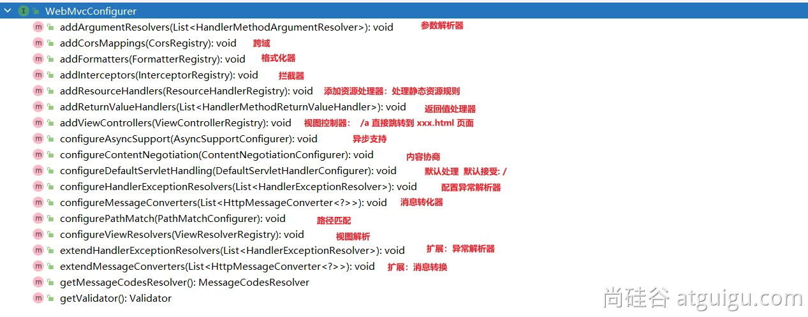
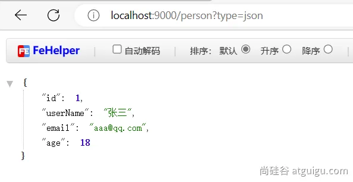
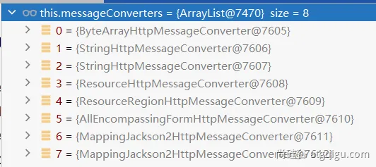
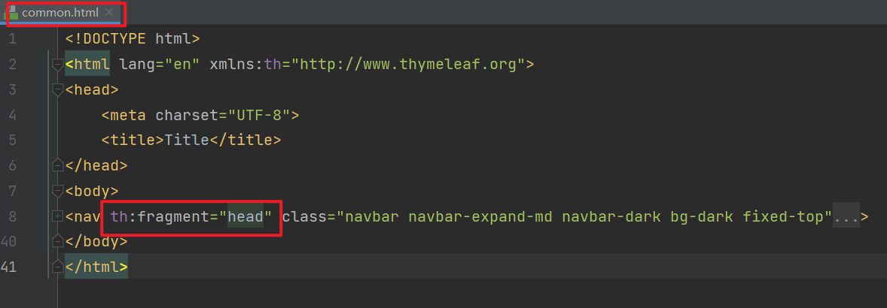
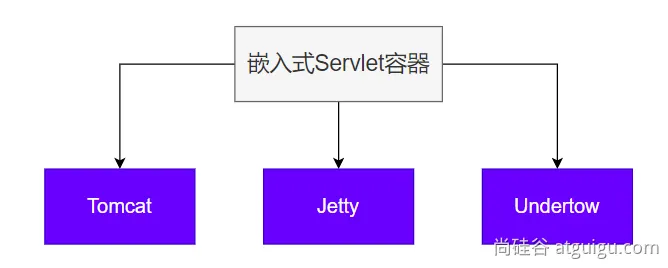

# 快速入门

## 简介

### 环境要求

| 环境&工具          | 版本（or later） |
| ------------------ | ---------------- |
| SpringBoot         | 3.0.5+           |
| IDEA               | 2021.2.1+        |
| Java               | 17+              |
| Maven              | 3.5+             |
| Tomcat             | 10.0+            |
| Servlet            | 5.0+             |
| GraalVM Community  | 22.3+            |
| Native Build Tools | 0.9.19+          |

### SpringBoot是什么

SpringBoot 帮我们简单、快速地创建一个独立的、生产级别的 **Spring 应用（说明：SpringBoot底层是Spring）**

大多数 SpringBoot 应用只需要编写少量配置即可快速整合 Spring 平台以及第三方技术

**特性：**

- 快速创建独立 Spring 应用
  - SSM：导包、写配置、启动运行

- 直接嵌入Tomcat、Jetty or Undertow（无需部署 war 包）【Servlet容器】

  - linux  java tomcat mysql： war 放到 tomcat 的 webapps下

  - jar： java环境；  java -jar

- **重点**：提供可选的starter，简化应用**整合**
  - **场景启动器**（starter）：web、json、邮件、oss（对象存储）、异步、定时任务、缓存...
  - 导包一堆，控制好版本。
  - 为每一种场景准备了一个依赖； **web-starter。mybatis-starter**

- **重点：**按需自动配置 Spring 以及 第三方库

  - 如果这些场景我要使用（生效）。这个场景的所有配置都会自动配置好。

  - **约定大于配置**：每个场景都有很多默认配置。

  - 自定义：配置文件中修改几项就可以

- 提供生产级特性：如 监控指标、健康检查、外部化配置等
  - 监控指标、健康检查（k8s）、外部化配置

- 无代码生成、无xml


总结：简化开发，简化配置，简化整合，简化部署，简化监控，简化运维。

## 快速体验

> 场景：浏览器发送/hello请求，返回"Hello, Spring Boot 3!"

### 开发流程

#### 1.创建项目

maven项目

```xml
<!--所有springboot项目都必须集成spring-boot-starter-parent-->
<parent>
    <groupId>org.springframework.boot</groupId>
    <artifactId>spring-boot-starter-parent</artifactId>
    <version>3.0.5</version>
</parent>
```

#### 2.导入场景

web项目场景启动器

```xml
<!--web开发场景启动器-->
<dependency>
    <groupId>org.springframework.boot</groupId>
    <artifactId>spring-boot-starter-web</artifactId>
</dependency>
```

#### 3.主程序

```java
@SpringBootApplication  //标识这是一个springboot应用
public class MainApplication {
    public static void main(String[] args) {
        SpringApplication.run(MainApplication.class, args);
    }
}
```

#### 4.业务

controller

```java
@RestController
public class HelloController {

    @GetMapping("/hello")
    public String hello(){
        return "hello, Spring Boot 3!";
    }
}
```

#### 5.测试

默认启动访问：http://localhost:8080

#### 6.打包

```xml
<!--springboot应用打包插件-->
<build>
    <plugins>
        <plugin>
            <groupId>org.springframework.boot</groupId>
            <artifactId>spring-boot-maven-plugin</artifactId>
        </plugin>
    </plugins>
</build>
```

`mvn clean package`把项目打成可执行的jar包

`java -jar demo.jar` 启动项目

### 特性小结

#### 1.简化整合

导入相关的场景，拥有相关的功能，场景启动器

默认支持的所有场景：https://docs.spring.io/spring-boot/docs/current/reference/html/using.html#using.build-systems.starters

- 官方提供的场景：命名为：`spring-boot-starter-*`
- 第三方提供场景：命名为：`*-srping-boot-start`

#### 2.简化开发

无需编写任何配置，直接开发业务

#### 3.简化配置

`application.properties` / `application.yml` / `application.yaml`

- 集中式管理配置，只需要修改这个文件就可。
- 配置基本都有默认值
- 能修改的所有配置：https://docs.spring.io/spring-boot/docs/current/reference/html/application-properties.html#appendix.application-properties

#### 4.简化部署

打包为可执行的jar包

linux服务器由java环境即可运行springboot应用

#### 5.简化运维

修改配置（外部放一个application.properties文件）、监控、健康检查。

### Spring initializr创建导向

一键创建好整个项目结构


## 应用分析

### 依赖管理机制

思考：

1、为社么导入`starter-web`所有相关依赖都导入进来？

- 开发什么场景，导入什么场景启动器
- **maven依赖传递原则。A-B-C：A拥有B和C**
- 导入场景启动器，场景启动器自动把这个场景的所有核心依赖全部导入进来

2、为社么版本号都不用写？

- 每个boot项目都有一个父项目`spring-boot-start-parent`
- parent的父项目是`spring-boot-dependencies`
- 父版本相当于**版本仲裁中心**，把所有常见的jar的依赖版本都声明好了

3、自定义版本好

- 利用maven的就近原则
  - 直接在当前项目`properties`标签中声明父项目用的版本属性的key
  - 直接在**导入依赖的时候声明版本**

4、第三方jar包

- boot父项目没有管理的需要自行声明好

```xml
<!-- https://mvnrepository.com/artifact/com.alibaba/druid -->
<dependency>
    <groupId>com.alibaba</groupId>
    <artifactId>druid</artifactId>
    <version>1.2.16</version>
</dependency>
```


### 自动配置机制

#### 1.初步理解

- 自动配置的Tomcat、SpringMVC等

  - 导入场景，容器中就会自动配置好这个场景的核心组件
  - 以前：DispatcherServlet、ViewResolver、CharacterEncodingFilter...
  - 现在：自动配置好的这些主键
  - 验证：**容器中有了什么组件，就具有什么功能**

  ```java
  @SpringBootApplication
  public class Springboot3Demo02Application {
  
      public static void main(String[] args) {
  
          //java10：局部变量类型的自动推断
          var ioc = SpringApplication.run(Springboot3Demo02Application.class, args);
  
          //1、获取容器中所有组件的名字
          String[] names = ioc.getBeanDefinitionNames();
          //2、遍历ioc容器
          for (String name : names) {
              System.out.println(name);
          }
      }
  }
  ```

- **默认包扫描规则**

  - `@SpringBootApplication`标注的类就是主程序类

  - **SpringBoot只会扫描主程序所在的包及其下面的子包，自动的component-scan功能**

  - 自定义扫描路径

    - `SpringBootApplicaton(scanBasePachages="com.my")`

    - `@ComponentScan("com.my")`

    - ```java
      //@SpringBootApplication(scanBasePackages = "com.my")
      @SpringBootApplication
      @ComponentScan("com.my") //扫描com.my包及其子包
      public class Springboot3Demo02Application {
          ...
      }
      ```

- **配置默认值**
  - **配置文件**的所有配置项是和某个**类的对象**值进行一一绑定的。
  - 绑定了配置文件中每一项值的类：**属性类**
  - 比如：
    - `ServerProperties`绑定了所有Tomcat服务器有关的配置
    - `MultipartProperties`绑定了所有文件上传相关的配置
    - 参照[官方文档](https://docs.spring.io/spring-boot/docs/current/reference/html/application-properties.html#appendix.application-properties.server)：或者参照绑定的**属性类**

- 按需加载自动配置
  - 导入场景`spring-boot-starter-web`
  - 场景启动器处理会导入相关功能依赖，导入一个`spring-boot-starter`，它是所有`starter`的`starter`，基础核心`starter`
  - `spring-boot-starter`导入了一个包 `spring-boot-autoconfigure`。包里面都是各种场景的`AutoConfiguration`**自动配置类**
  - 虽然全场景的自动配置都在 `spring-boot-autoconfigure`这个包，但是不是全都开启的。
    - 导入哪个场景就开启哪个自动配置

总结：导入场景启动器，触发`spring-boot-autoconfigure`这个包的自动配置生效，容器中就会具有相关场景的功能

#### 2.完整流程

思考：

**1、SpringBoot怎么实现导一个**`starter`**、写一些简单配置，应用就能跑起来，我们无需关心整合**

2、为什么Tomcat的端口号可以配置在`application.properties`中，并且`Tomcat`能启动成功？

3、导入场景后哪些**自动配置能生效**？


***自动配置流程细节梳理：***

**1、**导入`starter-web`：导入了web开发场景

- 1、场景启动器导入了相关场景的所有依赖：`starter-json`、`starter-tomcat`、`springmvc`
- 2、每个场景启动器都引入了一个`spring-boot-starter`，核心场景启动器。
- 3、**核心场景启动器**引入了`spring-boot-autoconfigure`包。
- 4、`spring-boot-autoconfigure`里面囊括了所有场景的所有配置。
- 5、只要这个包下的所有类都能生效，那么相当于SpringBoot官方写好的整合功能就生效了。
- 6、SpringBoot默认却扫描不到 `spring-boot-autoconfigure`下写好的所有**配置类**。（这些**配置类**给我们做了整合操作），**默认只扫描主程序所在的包**。

**2、**主程序：`@SpringBootApplication`

- 1、`@SpringBootApplication`由三个注解组成`@SpringBootConfiguration`、`@EnableAutoConfiguratio`、`@ComponentScan`
- 2、SpringBoot默认只能扫描自己主程序所在的包及其下面的子包，扫描不到 `spring-boot-autoconfigure`包中官方写好的**配置类**
- 3、`@EnableAutoConfiguration`：SpringBoot **开启自动配置的核心**。

- 1. 是由`@Import(AutoConfigurationImportSelector.class)`提供功能：批量给容器中导入组件。
- 2. SpringBoot启动会默认加载 142个配置类。
- 3. 这**142个配置类**来自于`spring-boot-autoconfigure`下 `META-INF/spring/org.springframework.boot.autoconfigure.AutoConfiguration.imports`文件指定的
- 项目启动的时候利用 @Import 批量导入组件机制把 `autoconfigure` 包下的142 `xxxxAutoConfiguration`类导入进来（**自动配置类**）
- 虽然导入了`142`个自动配置类

- 4、按需生效：

- 并不是这`142`个自动配置类都能生效
- 每一个自动配置类，都有条件注解`@ConditionalOnxxx`，只有条件成立，才能生效 

**3、**`xxxxAutoConfiguration`**自动配置类**

- **1、给容器中使用@Bean 放一堆组件。**
- 2、每个**自动配置类**都可能有这个注解`@EnableConfigurationProperties(**ServerProperties**.class)`，用来把配置文件中配的指定前缀的属性值封装到 `xxxProperties`**属性类**中
- 3、以Tomcat为例：把服务器的所有配置都是以`server`开头的。配置都封装到了属性类中。
- 4、给**容器**中放的所有**组件**的一些**核心参数**，都来自于`**xxxProperties**`**。**`**xxxProperties**`**都是和配置文件绑定。**
- **只需要改配置文件的值，核心组件的底层参数都能修改**

**4、**写业务，全程无需关心各种整合（底层这些整合写好了，而且也生效了）


**核心流程总结：**

1、导入`starter`，就会导入`autoconfigure`包。

2、`autoconfigure` 包里面 有一个文件 `META-INF/spring/**org.springframework.boot.autoconfigure.AutoConfiguration**.imports`,里面指定的所有启动要加载的自动配置类

3、@EnableAutoConfiguration 会自动的把上面文件里面写的所有**自动配置类都导入进来。xxxAutoConfiguration 是有条件注解进行按需加载**

4、`xxxAutoConfiguration`给容器中导入一堆组件，组件都是从 `xxxProperties`中提取属性值

5、`xxxProperties`又是和**配置文件**进行了绑定


**效果：**导入`starter`、修改配置文件，就能修改底层行为。

#### 3.如何学好SpringBoot

框架的框架、底层基于Spring。能调整每一个场景的底层行为。100%项目一定会用到**底层自定义**

摄影：

- 傻瓜：自动配置好。
- **单反**：焦距、光圈、快门、感光度....
- 傻瓜+**单反**：

1. 理解**自动配置原理**

1. **导入starter** **--> 生效xxxxAutoConfiguration -->** **组件** **--> xxxProperties -->** **配置文件**

1. 理解**其他框架底层**

1. 拦截器

1. 可以随时**定制化任何组件**

1. **配置文件**
2. **自定义组件**


普通开发：`导入starter`，Controller、Service、Mapper、偶尔修改配置文件

**高级开发**：自定义组件、自定义配置、自定义starter

核心：

- 这个场景自动配置导入了哪些组件，我们能不能Autowired进来使用
- 能不能通过修改配置改变组件的一些默认参数
- 需不需要自己完全定义这个组件
- 场景定制化


**最佳实战**：

- **选场景**，导入到项目

- 官方：starter
- 第三方：去仓库搜

- **写配置，改配置文件关键项**

- 数据库参数（连接地址、账号密码...）

- 分析这个场景给我们导入了**哪些能用的组件**

- **自动装配**这些组件进行后续使用
- 不满意boot提供的自动配好的默认组件

- **定制化**

- 改配置
- 自定义组件

整合redis：

- [选场景](https://docs.spring.io/spring-boot/docs/current/reference/html/using.html#using.build-systems.starters)：`spring-boot-starter-data-redis `

- 场景AutoConfiguration 就是这个场景的自动配置类

- 写配置：

- 分析到这个场景的自动配置类开启了哪些属性绑定关系
- `@EnableConfigurationProperties(RedisProperties.class)`
- 修改redis相关的配置

- 分析组件：

- 分析到 `RedisAutoConfiguration`  给容器中放了 `StringRedisTemplate`
- 给业务代码中自动装配 `StringRedisTemplate`

- 定制化

- 修改配置文件
- 自定义组件，自己给容器中放一个 `StringRedisTemplate`

## 核心技能

### 常用注解

> SpringBoot摒弃XMl配置方式，改为**全注解驱动**

#### 1.组件注册

@Configuration、@SpringBootConfiguration

@Bean、@Scope

@Controller、@Service、@Repository、@Component

@Import

@ComponentScan

步骤：

1、`@Configuration`编写一个配置类

2、在配置类中，自定义方法给容器中注册组件，配合`@Bean`使用

3、或配合使用`@Import`导入第三组件

```java
@Configuration
public class AppConfig {

    @Scope("prototype") //组件默认是单实例，value = prototype表示为多实例
    @Bean("fast") //替代以前的Bean标签。 组件在容器中的名字默认是方法名，可以直接修改注解的值
    public FastsqlException fastsqlException(){
        return new FastsqlException();
    }
}
```

```java 
@Import(FastsqlException.class)
@Configuration
public class AppConfig {
    
}
```

#### 2.条件注解

> 如果注解指定的**条件成立**，则触发指定行为

***@ConditionalOnXxx***

**@ConditionalOnClass：如果类路径中存在这个类，则触发指定行为**

**@ConditionalOnMissingClass：如果类路径中不存在这个类，则触发指定行为**

**@ConditionalOnBean：如果容器中存在这个Bean（组件），则触发指定行为**

**@ConditionalOnMissingBean：如果容器中不存在这个Bean（组件），则触发指定行为**

> 场景：
>
> - 如果存在`FastsqlException`这个类，给容器中放一个`Cat`组件，名cat01，
> - 否则，就给容器中放一个`Dog`组件，名dog01
> - 如果系统中有`dog01`这个组件，就给容器中放一个 User组件，名zhangsan 
> - 否则，就放一个User，名叫lisi

**@ConditionalOnBean（value=组件类型，name=组件名字）：判断容器中是否有这个类型的组件，并且名字是指定的值**

@ConditionalOnRepositoryType (org.springframework.boot.autoconfigure.data)
@ConditionalOnDefaultWebSecurity (org.springframework.boot.autoconfigure.security)
@ConditionalOnSingleCandidate (org.springframework.boot.autoconfigure.condition)
@ConditionalOnWebApplication (org.springframework.boot.autoconfigure.condition)
@ConditionalOnWarDeployment (org.springframework.boot.autoconfigure.condition)
@ConditionalOnJndi (org.springframework.boot.autoconfigure.condition)
@ConditionalOnResource (org.springframework.boot.autoconfigure.condition)
@ConditionalOnExpression (org.springframework.boot.autoconfigure.condition)
**@ConditionalOnClass** (org.springframework.boot.autoconfigure.condition)
@ConditionalOnEnabledResourceChain (org.springframework.boot.autoconfigure.web)
**@ConditionalOnMissingClass** (org.springframework.boot.autoconfigure.condition)
@ConditionalOnNotWebApplication (org.springframework.boot.autoconfigure.condition)
@ConditionalOnProperty (org.springframework.boot.autoconfigure.condition)
@ConditionalOnCloudPlatform (org.springframework.boot.autoconfigure.condition)
**@ConditionalOnBean** (org.springframework.boot.autoconfigure.condition)
**@ConditionalOnMissingBean** (org.springframework.boot.autoconfigure.condition)
@ConditionalOnMissingFilterBean (org.springframework.boot.autoconfigure.web.servlet)
@Profile (org.springframework.context.annotation)
@ConditionalOnInitializedRestarter (org.springframework.boot.devtools.restart)
@ConditionalOnGraphQlSchema (org.springframework.boot.autoconfigure.graphql)
@ConditionalOnJava (org.springframework.boot.autoconfigure.condition)

#### 3.属性绑定

**@ConfigurationProperties： 声明组件的属性和配置文件哪些前缀开始项进行绑定**

**@EnableConfigurationProperties：快速注册注解：**

- **场景：**SpringBoot默认只扫描自己主程序所在的包。如果导入第三方包，即使组件上标注了 @Component、@ConfigurationProperties 注解，也没用。因为组件都扫描不进来，此时使用这个注解就可以快速进行属性绑定并把组件注册进容器

> 将容器中任意**组件（Bean）的属性值**和**配置文件**的配置项的值**进行绑定**
>
> - **1、给容器中注册组件（`@Component`、`@Bean`）**
> - **2、使用**`@ConfigurationProperties` 声明组件和配置文件的哪些配置项进行绑定

```java
@Configuration
public class AppConfig2 {

    @Bean
    @ConfigurationProperties(prefix = "pig")
    public Pig pig(){
        return new Pig();
    }
}
```

```java
@ConfigurationProperties(prefix = "pig")
@Component
public class Pig {
    private Long id;
    private String name;
    private Integer age;
    ...
}
```

### yaml配置文件

> 痛点：SpringBoot集中化管理配置，`application.properties`
>
> 问题：配置多以后难阅读和修改，**层级结构辨识度不高**

> YAML 是 "YAML Ain't a Markup Language"（YAML 不是一种标记语言）。在开发的这种语言时，YAML 的意思其实是："Yet Another Markup Language"（是另一种标记语言）。
>
> - 设计目标，就是**方便人类读写**
> - **层次分明**，更适合做配置文件
> - 使用`.yaml`或 `.yml`作为文件后缀

#### 1.基本语法

- **大小写敏感**
- 使用缩进表示层级关系，**k: v，使用空格分割k,v**
- 缩进时不允许使用Tab键，只允许**使用空格，换行**。
- 缩进的空格数目不重要，只要**相同层级**的元素**左侧对齐**即可
- **# 表示注释**，从这个字符一直到行尾，都会被解析器忽略

支持的写法：

- 对象：键值对的集合，如：映射（map）/ 哈希（hash）/ 字典（dictionary）
- 数组：一组按次序排列的值，如：序列（sequence）/ 列表（list）
- 纯量：单个的、不可再分的值，如：字符串、数字、bool、日期

#### 2.示例

bean

```java
@Component
@ConfigurationProperties(prefix = "person") //和配置文件person前缀的所有配置进行绑定
@Data //自动生成JavaBean属性的getter/setter
//@NoArgsConstructor //自动生成无参构造器
//@AllArgsConstructor //自动生成全参构造器
public class Person {
    private String name;
    private Integer age;
    private Date birthDay;
    private Boolean like;
    private Child child; //嵌套对象
    private List<Dog> dogs; //数组（里面是对象）
    private Map<String,Cat> cats; //表示Map
}

@Data
public class Dog {
    private String name;
    private Integer age;
}

@Data
public class Child {
    private String name;
    private Integer age;
    private Date birthDay;
    private List<String> text; //数组
}

@Data
public class Cat {
    private String name;
    private Integer age;
}
```

application.properties

```properties
#Person(name=张三, age=22, birthDay=Tue Jan 08 12:12:12 GMT+08:00 2002, like=true, child=Child(name=李四, age=2, birthDay=Thu Nov 21 00:00:00 GMT+08:00 2024, text=[abc, def]), dogs=[Dog(name=小黑, age=1), Dog(name=小红, age=null), Dog(name=小绿, age=3)], cats={c1=Cat(name=小白, age=1), c2=Cat(name=null, age=3)})

person.name=张三
person.age=22
person.birthDay=2002/01/08 12:12:12
person.like=true
#对象格式
person.child.name=李四
person.child.age=2
#Data格式
person.child.birthDay=2024/11/21
#list格式
person.child.text[0]=abc
person.child.text[1]=def
person.dogs[0].name=小黑
person.dogs[0].age=1
person.dogs[1].name=小红
person.dogs[2].name=小绿
person.dogs[2].age=3
#map格式
person.cats.c1.name=小白
person.cats.c1.age=1
person.cats.c2.age=3
```

application.yaml

```yaml
person:
  name: 张三
  age: 20
  # Data格式
  birthDay: 2002/01/08 12:12:12
  like: true
  child:
    name: 李四
    age: 2
    birthDay: 2022/01/01
    # list格式：[]
    text: ["abc", "def"]
  dogs:
    # list格式：-
    - name: 小黑
      age: 11
    - name: 小白
      age: 2
  cats:
    # map格式：层级式或{}
    c1:
      name: 小绿
      age: 3
    c2: {name: 小红, age: 6}
```

#### 3.细节

- `birthDay`推荐写为`birth-day`
- **文本**
  - **单引号**不会转义【\n为普通字符串显示】
  - **双引号**会转义【\n显示为**换行符**】
- **大文本**
  - `|`开头，大文本写在下层，保留文本格式，换行符正确显示
  - `>`开头，大文本写在下层，折叠换行符
- **多文档合并**
  - 使用`---`可以把多个yaml文档合并在一个文档中，每个文档区依然认为内容独立

### 日志配置

> 规范：项目开发不要编写`System.out.println()`，应该用**日志**记录信息


#### 1.简介

1. Spring使用`commons-loggin`作为内部日志，但底层日志实现是开放的，可对接其他日志框架。Spring5及以后`commons-loggin`被Spring直接自己写了。

2. 支持`jul`，`log4j2`，`logback`。SpringBoot提供了默认的控制台输出配置，也可以撇脂输出为文件。
3. `logback`是`SpringBoot`默认使用的。
4. 虽然日志框架很多，但是我们不用担心，使用SpringBoot的默认配置就能很好的工作。

**SpringBoot怎么把日志默认配置好的**

1、每个`starter`场景，都会导入一个核心场景`spring-boot-starter`

2、核心场景引入了日志的所用功能`spring-boot-starter-logging`

3、默认使用了`logback + slf4j` 组合作为默认底层日志

4、`日志是系统一启动就要用`，`xxxAutoConfiguration`是系统启动好了以后放好的组件，后来用的。

5、日志是利用**监听器机制**配置好的。`ApplicationListener`。

6、日志所有的配置都可以通过修改配置文件实现。以`logging`开始的所有配置。

#### 2.日志格式

```shell
2023-03-31T13:56:17.511+08:00  INFO 4944 --- [           main] o.apache.catalina.core.StandardService   : Starting service [Tomcat]
2023-03-31T13:56:17.511+08:00  INFO 4944 --- [           main] o.apache.catalina.core.StandardEngine    : Starting Servlet engine: [Apache Tomcat/10.1.7]
```

默认输出格式：

- 时间和日期：毫秒级精度
- 日志级别：ERROR, WARN, INFO, DEBUG, or TRACE.
- 进程 ID
- ---： 消息分割符
- 线程名： 使用[]包含
- Logger 名： 通常是产生日志的**类名**
- 消息： 日志记录的内容

注意： logback 没有FATAL级别，对应的是ERROR

默认值：参照：`spring-boot`包`additional-spring-configuration-metadata.json`文件

默认输出格式值：`%clr(%d{${LOG_DATEFORMAT_PATTERN:-yyyy-MM-dd'T'HH:mm:ss.SSSXXX}}){faint} %clr(${LOG_LEVEL_PATTERN:-%5p}) %clr(${PID:- }){magenta} %clr(---){faint} %clr([%15.15t]){faint} %clr(%-40.40logger{39}){cyan} %clr(:){faint} %m%n${LOG_EXCEPTION_CONVERSION_WORD:-%wEx}`

可修改为：`'%d{yyyy-MM-dd HH:mm:ss.SSS} %-5level [%thread] %logger{15} ===> %msg%n'`

#### 3.记录日志

```java
Logger logger = LoggerFactory.getLogger(getClass());

或者使用Lombok的@Slf4j注解
```

#### 4.日志级别

- 由低到高：`ALL,TRACE, DEBUG, INFO, WARN, ERROR,FATAL,OFF`；

- **只会打印指定级别及以上级别的日志**
- ALL：打印所有日志
- TRACE：追踪框架详细流程日志，一般不使用
- DEBUG：开发调试细节日志
- INFO：关键、感兴趣信息日志
- WARN：警告但不是错误的信息日志，比如：版本过时
- ERROR：业务错误日志，比如出现各种异常
- FATAL：致命错误日志，比如jvm系统崩溃
- OFF：关闭所有日志记录

- 不指定级别的所有类，都使用root指定的级别作为默认级别
- SpringBoot日志**默认级别是** **INFO**


1. 在application.properties/yaml中配置logging.level.<logger-name>=<level>指定日志级别
2. level可取值范围：`TRACE, DEBUG, INFO, WARN, ERROR, FATAL, or OFF`，定义在 `LogLevel`类中
3. root 的logger-name叫root，可以配置logging.level.root=warn，代表所有未指定日志级别都使用 root 的 warn 级别

```yaml
logging:
  level:
    root: info
    com.my.springboot3demo03.controller: trace # 指定com.my.springboot3demo03.controller中的日志级别为trace

```

#### 5.日志分组

比较有用的技巧是：

将相关的logger分组在一起，统一配置。SpringBoot 也支持。比如：Tomcat 相关的日志统一设置

```yaml
logging:
  level:
    tomcat: info
  group:
    tomcat: com.my.aaa, com.my.bbb, com.my.ccc
```

SpringBoot 预定义两个组

| Name | Loggers                                                      |
| ---- | ------------------------------------------------------------ |
| web  | org.springframework.core.codec, org.springframework.http, org.springframework.web, org.springframework.boot.actuate.endpoint.web, org.springframework.boot.web.servlet.ServletContextInitializerBeans |
| sql  | org.springframework.jdbc.core, org.hibernate.SQL, org.jooq.tools.LoggerListener |

#### 6.文件输出

SpringBoot 默认只把日志写在控制台，如果想额外记录到文件，可以在application.properties中添加logging.file.name or logging.file.path配置项。

| logging.file.name | logging.file.path | 示例     | 效果                                                         |
| ----------------- | ----------------- | -------- | ------------------------------------------------------------ |
| 未指定            | 未指定            |          | 仅控制台输出                                                 |
| **指定**          | 未指定            | my.log   | 写入指定文件。可以加路径。未加路径则log文件位于项目的同级目录中。 |
| 未指定            | **指定**          | /var/log | 写入指定目录，文件名为spring.log                             |
| **指定**          | **指定**          |          | 以logging.file.name为准                                      |

```yaml
logging:
  level:
    root: info
    com.my.springboot3demo03.controller: trace
  file:
    name: F://my.log
```

#### 7.文件归档与滚动切割

> 归档：每天的日志单独存到一个文档中。
>
> 切割：每个文件10MB，超过大小切割成另外一个文件。

1. 每天的日志应该独立分割出来存档。如果使用logback（SpringBoot 默认整合），可以通过application.properties/yaml文件指定日志滚动规则。
2. 如果是其他日志系统，需要自行配置（添加log4j2.xml或log4j2-spring.xml）
3. 支持的滚动规则设置如下

| 配置项                                               | 描述                                                         |
| ---------------------------------------------------- | ------------------------------------------------------------ |
| logging.logback.rollingpolicy.file-name-pattern      | 日志存档的文件名格式（默认值：${LOG_FILE}.%d{yyyy-MM-dd}.%i.gz） |
| logging.logback.rollingpolicy.clean-history-on-start | 应用启动时是否清除以前存档（默认值：false）                  |
| logging.logback.rollingpolicy.max-file-size          | 存档前，每个日志文件的最大大小（默认值：10MB）               |
| logging.logback.rollingpolicy.total-size-cap         | 日志文件被删除之前，可以容纳的最大大小（默认值：0B）。设置1GB则磁盘存储超过 1GB 日志后就会删除旧日志文件 |
| logging.logback.rollingpolicy.max-history            | 日志文件保存的最大天数(默认值：7).                           |

#### 8.自定义配置

通常我们配置 application.properties 就够了。当然也可以自定义。比如：

| 日志系统                | 自定义                                                       |
| ----------------------- | ------------------------------------------------------------ |
| Logback                 | logback-spring.xml, logback-spring.groovy, logback.xml, or logback.groovy |
| Log4j2                  | log4j2-spring.xml or log4j2.xml                              |
| JDK (Java Util Logging) | logging.properties                                           |

如果可能，我们建议您在日志配置中使用`-spring` 变量（例如，`logback-spring.xml` 而不是 `logback.xml`）。如果您使用标准配置文件，spring 无法完全控制日志初始化。

最佳实战：自己要写配置，配置文件名加上 `xx-spring.xml`

#### 9.切换日志组合

```xml
<dependency>
    <groupId>org.springframework.boot</groupId>
    <artifactId>spring-boot-starter-web</artifactId>
</dependency>
<dependency>
    <groupId>org.springframework.boot</groupId>
    <artifactId>spring-boot-starter</artifactId>
    <exclusions>
        <exclusion>
            <groupId>org.springframework.boot</groupId>
            <artifactId>spring-boot-starter-logging</artifactId>
        </exclusion>
    </exclusions>
</dependency>
<dependency>
    <groupId>org.springframework.boot</groupId>
    <artifactId>spring-boot-starter-log4j2</artifactId>
</dependency>
```

log4j2支持yaml和json格式的配置文件

| 格式 | 依赖                                                         | 文件名                   |
| ---- | ------------------------------------------------------------ | ------------------------ |
| YAML | com.fasterxml.jackson.core:jackson-databind + com.fasterxml.jackson.dataformat:jackson-dataformat-yaml | log4j2.yaml + log4j2.yml |
| JSON | com.fasterxml.jackson.core:jackson-databind                  | log4j2.json + log4j2.jsn |

#### 10.最佳实战

1. 导入任何第三方框架，先排除它的日志包，因为Boot底层控制好了日志
2. 修改 `application.properties` 配置文件，就可以调整日志的所有行为。如果不够，可以编写日志框架自己的配置文件放在类路径下就行，比如`logback-spring.xml`，`log4j2-spring.xml`
3. 如需对接**专业日志系统**，也只需要把 logback 记录的**日志**灌倒 **kafka**之类的中间件，这和SpringBoot没关系，都是日志框架自己的配置，**修改配置文件即可**
4. **业务中使用slf4j-api记录日志。不要再 sout 了**

# Web开发

> SpringBoot的Web开发能力，由SpringMVC提供

## 0. WebMvcAutoConfiguration原理

### 1. 生效条件

```java
@AutoConfiguration(after = { DispatcherServletAutoConfiguration.class, TaskExecutionAutoConfiguration.class,
		ValidationAutoConfiguration.class }) //在这些自动配置之后
@ConditionalOnWebApplication(type = Type.SERVLET) //如果是web应用就生效，类型SERVLET、REACTIVE 响应式web
@ConditionalOnClass({ Servlet.class, DispatcherServlet.class, WebMvcConfigurer.class })
@ConditionalOnMissingBean(WebMvcConfigurationSupport.class) //容器中没有这个Bean，才生效。默认就是没有
@AutoConfigureOrder(Ordered.HIGHEST_PRECEDENCE + 10)//优先级
@ImportRuntimeHints(WebResourcesRuntimeHints.class)
public class WebMvcAutoConfiguration { 
}
```

### 2. 效果

1. 放了两个Filter：

   a. `HiddenHttpMethodFilter`：页面表单提交Rest请求（GET、POST、PUT、DELETE）。

   b. `FormContentFilter`：表单内容Filter，GET（数据放URL后面），POST（数据放请求体）请求可以携带数据，PUT、DELETE的请求体数据会被忽略

2. 给容器中放了`WeebMvcConfigurer`组件：给SpringMVC添加各种定制功能

   a. 所有的功能最终会和配置文件进行绑定

   b. `WebMvcProperties`：spring.mvc配置文件

   c. `WebProperties`：spring.web配置文件

```java
	@Configuration(proxyBeanMethods = false)
	@Import(EnableWebMvcConfiguration.class) //额外导入了其他配置
	@EnableConfigurationProperties({ WebMvcProperties.class, WebProperties.class })
	@Order(0)
	public static class WebMvcAutoConfigurationAdapter implements WebMvcConfigurer, ServletContextAware{
        
    }
```

### 3. WebMvcConfigurer接口



### 4. 静态资源规则源码

```java
@Override
public void addResourceHandlers(ResourceHandlerRegistry registry) {
    if (!this.resourceProperties.isAddMappings()) {
        logger.debug("Default resource handling disabled");
        return;
    }
    //1、
    addResourceHandler(registry, this.mvcProperties.getWebjarsPathPattern(),
            "classpath:/META-INF/resources/webjars/");
    addResourceHandler(registry, this.mvcProperties.getStaticPathPattern(), (registration) -> {
        registration.addResourceLocations(this.resourceProperties.getStaticLocations());
        if (this.servletContext != null) {
            ServletContextResource resource = new ServletContextResource(this.servletContext, SERVLET_LOCATION);
            registration.addResourceLocations(resource);
        }
    });
}
```

1. 规则一：访问： `/webjars/**`路径就去 `classpath:/META-INF/resources/webjars/`下找资源.

2. 规则二：访问： `/**`路径就去 `静态资源默认的四个位置找资源`

   1. `classpath:/META-INF/resources/`

   2. `classpath:/resources/`

   3. classpath:/static/

   4. `classpath:/public/`

3. 规则三：**静态资源默认都有缓存规则的设置**

   1. 所有缓存的设置，直接通过**配置文件**： `spring.web`
   2. cachePeriod： 缓存周期； 多久不用找服务器要新的。 默认没有，以s为单位
   3. cacheControl： **HTTP缓存**控制；[https://developer.mozilla.org/zh-CN/docs/Web/HTTP/Caching](https://developer.mozilla.org/zh-CN/docs/Web/HTTP/Caching#概览)
   4. **useLastModified**：是否使用最后一次修改。配合HTTP Cache规则

> 如果浏览器访问了一个静态资源 `index.js`，如果服务这个资源没有发生变化，下次访问的时候就可以直接让浏览器用自己缓存中的东西，而不用给服务器发请求。

```java
registration.setCachePeriod(getSeconds(this.resourceProperties.getCache().getPeriod()));
registration.setCacheControl(this.resourceProperties.getCache().getCachecontrol().toHttpCacheControl());
registration.setUseLastModified(this.resourceProperties.getCache().isUseLastModified());
```

### 5. EnableWebMvcConfigurtion源码

```java
//SpringBoot 给容器中放 WebMvcConfigurationSupport 组件。
//我们如果自己放了 WebMvcConfigurationSupport 组件，Boot的WebMvcAutoConfiguration都会失效。
@Configuration(proxyBeanMethods = false)
@EnableConfigurationProperties(WebProperties.class)
public static class EnableWebMvcConfiguration extends DelegatingWebMvcConfiguration implements ResourceLoaderAware 
{

    
}
```

1. `HandlerMapping`： 根据请求路径 ` /a` 找那个handler能处理请求

   1. `WelcomePageHandlerMapping`： 

      1. 访问 `/**`路径下的所有请求，都在以前四个静态资源路径下找，欢迎页也一样

      2. 找`index.html`：只要静态资源的位置有一个 `index.html`页面，项目启动默认访问

### 6. 为社么容器中放一个WebMvcConfiguration就能配置底层行为

1. WebMvcAutoConfiguration 是一个自动配置类，它里面有一个 `EnableWebMvcConfiguration`
2. `EnableWebMvcConfiguration`继承与 `DelegatingWebMvcConfiguration`，这两个都生效
3. `DelegatingWebMvcConfiguration`利用 DI 把容器中 所有 `WebMvcConfigurer `注入进来
4. 别人调用 ``DelegatingWebMvcConfiguration`` 的方法配置底层规则，而它调用所有 `WebMvcConfigurer`的配置底层方法。

### 7. WebMvcConfigurationSupport

提供了很多的默认设置。

判断系统中是否有相应的类：如果有，就加入相应的`HttpMessageConverter`

```java
jackson2Present = ClassUtils.isPresent("com.fasterxml.jackson.databind.ObjectMapper", classLoader) &&
				ClassUtils.isPresent("com.fasterxml.jackson.core.JsonGenerator", classLoader);
jackson2XmlPresent = ClassUtils.isPresent("com.fasterxml.jackson.dataformat.xml.XmlMapper", classLoader);
jackson2SmilePresent = ClassUtils.isPresent("com.fasterxml.jackson.dataformat.smile.SmileFactory", classLoader);
```

## 1. Web场景

### 1. 自动配置

1、整合web场景

```xml
<dependency>
    <groupId>org.springframework.boot</groupId>
    <artifactId>spring-boot-starter-web</artifactId>
</dependency>
```

2、引入`autoconfigure`功能

3、`@EnableAutoConfiguration`注解使用`@Import(AutoConfigurationImportSelector.class)`批量导入组件

4、加载`META-INF/spring/org.springframework.boot.autoconfigure.AutoConfiguration.imports` 文件中配置的所有组件

5、所有自动配置类如

```text
org.springframework.boot.autoconfigure.web.client.RestTemplateAutoConfiguration
org.springframework.boot.autoconfigure.web.embedded.EmbeddedWebServerFactoryCustomizerAutoConfiguration
====以下是响应式web场景和现在的没关系======
org.springframework.boot.autoconfigure.web.reactive.HttpHandlerAutoConfiguration
org.springframework.boot.autoconfigure.web.reactive.ReactiveMultipartAutoConfiguration
org.springframework.boot.autoconfigure.web.reactive.ReactiveWebServerFactoryAutoConfiguration
org.springframework.boot.autoconfigure.web.reactive.WebFluxAutoConfiguration
org.springframework.boot.autoconfigure.web.reactive.WebSessionIdResolverAutoConfiguration
org.springframework.boot.autoconfigure.web.reactive.error.ErrorWebFluxAutoConfiguration
org.springframework.boot.autoconfigure.web.reactive.function.client.ClientHttpConnectorAutoConfiguration
org.springframework.boot.autoconfigure.web.reactive.function.client.WebClientAutoConfiguration
================以上没关系=================
org.springframework.boot.autoconfigure.web.servlet.DispatcherServletAutoConfiguration
org.springframework.boot.autoconfigure.web.servlet.ServletWebServerFactoryAutoConfiguration
org.springframework.boot.autoconfigure.web.servlet.error.ErrorMvcAutoConfiguration
org.springframework.boot.autoconfigure.web.servlet.HttpEncodingAutoConfiguration
org.springframework.boot.autoconfigure.web.servlet.MultipartAutoConfiguration
org.springframework.boot.autoconfigure.web.servlet.WebMvcAutoConfiguration
```

6、绑定了配置文件的一堆配置项

- SpringMVC的所有配欸孩子`spring.mvc`
- Web场景通用配置`spring.web`
- 文件上传配置`spring.seervlet.multipart`
- 服务器的配置`server`

### 2. 默认效果

默认配置：

1. 包含了 ContentNegotiatingViewResolver 和 BeanNameViewResolver 组件，**方便视图解析**
2. **默认的静态资源处理机制**： 静态资源放在 static 文件夹下即可直接访问
3. **自动注册**了 **Converter**,GenericConverter,**Formatter**组件，适配常见**数据类型转换**和**格式化需求**
4. **支持** **HttpMessageConverters**，可以**方便返回**json等**数据类型**
5. **注册** MessageCodesResolver，方便**国际化**及错误消息处理
6. **支持 静态** index.html
7. **自动使用**ConfigurableWebBindingInitializer，实现消息处理、数据绑定、类型转化、数据校验等功能

> **重要：**
>
> - *如果想保持* ***boot mvc 的默认配置，并且自定义更多的 mvc 配置，如：interceptors*,*formatters, **view controllers *等。可以使用**@Configuration**注解添加一个* *WebMvcConfigurer* *类型的配置类，并不要标注* *@EnableWebMvc*
> - *如果想保持 boot mvc 的默认配置，但要自定义核心组件实例，比如：**RequestMappingHandlerMapping**,* RequestMappingHandlerAdapter, 或ExceptionHandlerExceptionResolver，给容器中放一个* *WebMvcRegistrations* *组件即可*
> - *如果想全面接管 Spring MVC，**@Configuration* *标注一个配置类，并加上* *@EnableWebMvc**注解，实现* *WebMvcConfigurer* *接口*

## 2. 静态资源

### 1. 默认规则

#### 1. 静态资源映射

静态资源映射规则在weebMvcConfiguration中进行了定义：

1. `/webjars/**`的所有路径资源都在`classpath:/META-INF/resources/webjars/`
2. /**的所有路径资源都在`classpath:/META-INF/resource`、`classpath:/resources/`、classpath:/static/、`classpath:/public/`
3. 所有静态资源都定义了缓存规则。【浏览器访问过一次、就会缓存一段时间】，但此功能参数无默认值
   1. `period`：缓存间隔，默认0s
   2. `cacheControl`：缓存控制，默认无
   3. `useLastModified`：是否使用lastModified头，默认false

#### 2. 欢迎页

欢迎页规则而在`WebMvcAutoConfiguration`中进行了定义：

1. 在静态资源目录下找`index.html`
2. 没有就在`templates`下找`index`模板页

#### 3. Favicon

在静态资源目录下找`favicon.ico`

#### 4. 缓存配置

```properties
#开启静态资源映射规则
spring.web.resources.add-mappings=true

#设置缓存
#spring.web.resources.cache.period=3600
##缓存详细合并项控制，覆盖period配置：
## 浏览器第一次请求服务器，服务器告诉浏览器此资源缓存7200秒，7200秒以内的所有此资源访问不用发给服务器请求，7200秒以后发请求给服务器
spring.web.resources.cache.cachecontrol.max-age=7200
#使用资源 last-modified 时间，来对比服务器和浏览器的资源是否相同没有变化。相同返回 304
spring.web.resources.cache.use-last-modified=true
```

### 2. 自定义资源规则

> 自定义静态资源路径、自定义缓存规则

#### 1. 配置方式

`spring.mvc`： 静态资源访问前缀路径

`spring.web`：

- 静态资源目录
- 静态资源缓存策略

```properties
#1、spring.web：
# 1.配置国际化的区域信息
# 2.静态资源策略(开启、处理链、缓存)

#开启静态资源映射规则
spring.web.resources.add-mappings=true

#设置缓存
spring.web.resources.cache.period=3600
##缓存详细合并项控制，覆盖period配置：
## 浏览器第一次请求服务器，服务器告诉浏览器此资源缓存7200秒，7200秒以内的所有此资源访问不用发给服务器请求，7200秒以后发请求给服务器
spring.web.resources.cache.cachecontrol.max-age=7200
## 共享缓存
spring.web.resources.cache.cachecontrol.cache-public=true
#使用资源 last-modified 时间，来对比服务器和浏览器的资源是否相同没有变化。相同返回 304
spring.web.resources.cache.use-last-modified=true

#自定义静态资源文件夹位置
spring.web.resources.static-locations=classpath:/a/,classpath:/b/,classpath:/static/

#2、 spring.mvc
## 2.1. 自定义webjars路径前缀
spring.mvc.webjars-path-pattern=/wj/**
## 2.2. 静态资源访问路径前缀
spring.mvc.static-path-pattern=/static/**
```

#### 2. 代码方式

> - 容器中只要有一个 WebMvcConfigurer 组件。配置的底层行为都会生效
> - @EnableWebMvc //禁用boot的默认配置

```java
@Configuration //这是一个配置类
public class MyConfig implements WebMvcConfigurer {


    @Override
    public void addResourceHandlers(ResourceHandlerRegistry registry) {
        //保留以前规则
        //自己写新的规则。
        registry.addResourceHandler("/static/**")
                .addResourceLocations("classpath:/a/","classpath:/b/")
                .setCacheControl(CacheControl.maxAge(1180, TimeUnit.SECONDS));
    }
}
```

```java
@Configuration //这是一个配置类,给容器中放一个 WebMvcConfigurer 组件，就能自定义底层
public class MyConfig  /*implements WebMvcConfigurer*/ {


    @Bean
    public WebMvcConfigurer webMvcConfigurer(){
        return new WebMvcConfigurer() {
            @Override
            public void addResourceHandlers(ResourceHandlerRegistry registry) {
                registry.addResourceHandler("/static/**")
                        .addResourceLocations("classpath:/a/", "classpath:/b/")
                        .setCacheControl(CacheControl.maxAge(1180, TimeUnit.SECONDS));
            }
        };
    }

}
```

## 3. 路径匹配

>**Spring5.3** 之后加入了更多的请求路径匹配的实现策略；
>
>以前只支持 AntPathMatcher 策略, 现在提供了 **PathPatternParser** 策略。并且可以让我们指定到底使用那种策略。

### 1. Ant风格

Ant 风格的路径模式语法具有以下规则：

- *：表示**任意数量**的字符。
- ?：表示任意**一个字符**。
- \**：表示任意数量的**目录**。
- {}：表示一个命名的模式**占位符**。
- []：表示**字符集合**，例如[a-z]表示小写字母。

例如：

- *.html 匹配任意名称，扩展名为.html的文件。
- /folder1/*/*.java 匹配在folder1目录下的任意两级目录下的.java文件。
- /folder2/**/*.jsp 匹配在folder2目录下任意目录深度的.jsp文件。
- /{type}/{id}.html 匹配任意文件名为{id}.html，在任意命名的{type}目录下的文件。

注意：Ant 风格的路径模式语法中的特殊字符需要转义，如：

- 要匹配文件路径中的星号，则需要转义为\\*。
- 要匹配文件路径中的问号，则需要转义为\\?。

### 2. 模式切换

**AntPathMatcher 与 `PathPatternParser`**

- PathPatternParser 在 jmh 基准测试下，有 6~8 倍吞吐量提升，降低 30%~40%空间分配率
- PathPatternParser 兼容 AntPathMatcher语法，并支持更多类型的路径模式
- PathPatternParser  "\**" **多段匹配**的支持**仅允许在模式末尾使用**

```java
    @GetMapping("/a*/b?/{p1:[a-f]+}")
    public String hello(HttpServletRequest request, 
                        @PathVariable("p1") String path) {

        log.info("路径变量p1： {}", path);
        //获取请求路径
        String uri = request.getRequestURI();
        return uri;
    }
```

总结： 

- 使用默认的路径匹配规则，是由 PathPatternParser  提供的
- 如果路径中间需要有 **，替换成ant风格路径

```properties
# 改变路径匹配策略：
# ant_path_matcher 老版策略；
# path_pattern_parser 新版策略；
spring.mvc.pathmatch.matching-strategy=ant_path_matcher
```

## 4. 内容协商

> 一套系统多端数据适配


### 1. 多端内容适配

#### 1. 默认规则

1. SpringBoot 多端内容适配
   1. 基于请求头内容协商：（默认开启）
      - 客户端向服务器发送请求，携带HTTP标准的Accept请求头
      - Accept：`application/json`、`text/xml`、`text/yaml`
      - 服务器根据客户端请求头期望的数据类型进行动态返回
   2. 基于请求参数内容协商：（手动开启）
      - 发送`GET/projects/spring-boot?format=json`
      - 匹配到@GetMapping("/projects/spring-boot")
      - 根据参数协商，优先返回json数据类型数据【需要开启参数匹配设置】
      - 发送请求`GET/projects/spring-boot?format=xml`，优先返回xml数据类型

#### 2. 效果演示

> 请求同一个接口，可以返回json和xml不同格式数据

1.引入支持写出xml内容依赖

```xml
<dependency>
    <groupId>com.fasterxml.jackson.dataformat</groupId>
    <artifactId>jackson-dataformat-xml</artifactId>
</dependency>
```

2.标注注解

```java
@JacksonXmlRootElement  // 可以写出为xml文档
@Data
public class Person {
    private Long id;
    private String userName;
    private String email;
    private Integer age;
}

```

3.开启基于请求参数的内容协商

```properties
# 开启基于请求参数的内容协商功能。 默认参数名：format。 默认此功能不开启
spring.mvc.contentnegotiation.favor-parameter=true
# 指定内容协商时使用的参数名。默认是 format
spring.mvc.contentnegotiation.parameter-name=type
```

4.效果



#### 3. 配置协商规则与支持类型

1.修改内容协商方式

```properties
#使用参数进行内容协商
spring.mvc.contentnegotiation.favor-parameter=true  
#自定义参数名，默认为format
spring.mvc.contentnegotiation.parameter-name=myparam 
```

2.大多数MediaType都是开箱即用，也可以自定义内容类型，如：

```properties
spring.mvc.contentnegotiation.media-types.yaml=text/yaml
```

### 2. 自定义内容返回

#### 1. 增加yaml返回支持

导入依赖

```xml
<dependency>
    <groupId>com.fasterxml.jackson.dataformat</groupId>
    <artifactId>jackson-dataformat-yaml</artifactId>
</dependency>
```

把对象写成yaml格式

```java
    public static void main(String[] args) throws JsonProcessingException {
        Person person = new Person();
        person.setId(1L);
        person.setUserName("张三");
        person.setEmail("aaa@qq.com");
        person.setAge(18);

        YAMLFactory factory = new YAMLFactory().disable(YAMLGenerator.Feature.WRITE_DOC_START_MARKER);
        ObjectMapper mapper = new ObjectMapper(factory);

        String s = mapper.writeValueAsString(person);
        System.out.println(s);
    }
```

编写配置

```properties
#新增一种媒体类型
spring.mvc.contentnegotiation.media-types.yaml=text/yaml
```

增加HttpMessageConverter组件，专门负责把对象写为yaml格式

```java
/**
 * @author hxm
 * @date 2024/3/19 10:43
 * @description
 */
@Configuration
public class MyConfig implements WebMvcConfigurer {
    @Override
    public void configureMessageConverters(List<HttpMessageConverter<?>> converters) {
        WebMvcConfigurer.super.configureMessageConverters(converters);
        converters.add(new MyYamlHttpMessageConverter());
    }
}
```

#### 2. 思考：如何增加其他

- 配置媒体类型支持：
  - `spring.mvc.contentnegotiation.media-types.yaml=text/yaml`
- 编写对应的`HTTPMessageConverter`，告诉Boot这个支持的媒体类型
  - 按照3的示例
- 把`MessageConverter`组件加入到底层
  - 容器中放一个`WebMvcConfigurer`组件，并配置底层的`MessageConverter`

#### 3. HttpMessageConvert的示例写法

```java
/**
 * @author hxm
 * @date 2024/3/19 10:45
 * @description
 */
public class MyYamlHttpMessageConverter extends AbstractHttpMessageConverter {
    ObjectMapper objectMapper = null;
    public MyYamlHttpMessageConverter(){
        //告诉SpringBoot这个MessageConverter支持哪种媒体类型  //媒体类型
        super(new MediaType("text", "yaml", Charset.forName("UTF-8")));
        YAMLFactory yamlFactory = YAMLFactory.builder().disable(YAMLGenerator.Feature.WRITE_DOC_START_MARKER).build();

        this.objectMapper = new ObjectMapper(yamlFactory);
    }
    @Override
    protected boolean supports(Class clazz) {
        //只要是对象类型，不是基本类型
        if (clazz.equals(Byte.class)
                || clazz.equals(Short.class)
                || clazz.equals(Integer.class)
                || clazz.equals(Long.class)
                || clazz.equals(Float.class)
                || clazz.equals(Double.class)
                || clazz.equals(Character.class)
                || clazz.equals(Boolean.class)){
            return false;
        }
        return true;
    }

    @Override
    protected Object readInternal(Class clazz, HttpInputMessage inputMessage) throws IOException, HttpMessageNotReadableException {
        return null;
    }

    @Override  //@ResponseBody 把对象怎么写出去
    protected void writeInternal(Object o, HttpOutputMessage outputMessage) throws IOException, HttpMessageNotWritableException {
        try(OutputStream body = outputMessage.getBody()){
            this.objectMapper.writeValue(body, o);
        }
    }
}

```


### 3. 内容协商原理-HttpMessageConvert

#### 1. `@ResponseBody`由`HttpMessageConverter`处理

> 标注了`@ResponseBody`的返回值将会由支持它的`HttpMessageConverter`写给浏览器

1. 如果controller方法的返回值标注了`@ResponseBody`注解
   1. 请求进来先到`DispatcherServlet的doDispatch（）`进行处理
   2. 找到一个`HandlerAdapter`适配器，利用适配器执行目标方法
   3. `RequestMappingHandlerAdapter`来执行，调用`invokeHandlerMethod()`来执行目标方法
   4. 目标方法执行前，准备好两个东西
      1. `HandlerMethodArgumentResoluver`：参数解析器，去欸的那个目标方法每个参数值
      2. `HandlerMethodReturnValueHandler`：返回值处理器，确定目标方法的返回值怎么处理
   5. `RequestMappingHandlerAdapter`里面的`invokeAndHandle()`真正执行目标方法
   6. 目标方法执行完成，会返回返回值对象
   7. 找个一个合适的返回值处理器，`HandlerMethodReturnValueHandler`
   8. 最终找到`RequestResponseBodyMethodProcessor`能处理标注了`@ResponseBody`注解的方法
   9. `RequestResponseBodyMethodProcessor`调用`writeWithMessageConverters `,利用`MessageConverter`把返回值写出去
2. `HttpMessageConverter` 会**先进行内容协商**
   1. 遍历所有的`MessageConverter`看谁支持这种**内容类型的数据**
   2. 默认`MessageConverter`有以下


	3. 最终因为要`json`所以`MappingJackson2HttpMessageConverter`支持写出json
	3. jackson用`ObjectMapper`把对象写出去

#### 2. `WebMvcAutoConfiguration`提供几种默认`HttpMessageConverters`

- `EnableWebMvcConfiguration`通过 `addDefaultHttpMessageConverters`添加了默认的`MessageConverter`；如下：

- `ByteArrayHttpMessageConverter`： 支持字节数据读写
- `StringHttpMessageConverter`： 支持字符串读写
- `ResourceHttpMessageConverter`：支持资源读写
- `ResourceRegionHttpMessageConverter`: 支持分区资源写出
- `AllEncompassingFormHttpMessageConverter`：支持表单xml/json读写
- `MappingJackson2HttpMessageConverter`： 支持请求响应体Json读写



> 系统提供默认的MessageConverter 功能有限，仅用于json或者普通返回数据。额外增加新的内容协商功能，必须增加新的`HttpMessageConverter`

## 5. 模板引擎

- 由于 **SpringBoot** 使用了**嵌入式 Servlet 容器**。所以 **JSP** 默认是**不能使用**的。
- 如果需要**服务端页面渲染**，优先考虑使用 模板引擎。


模板引擎页面默认放在`src/main/resources/templates`

**SpringBoot**包含以下模板引擎的自动配置

- FreeMarker
- Groovy
- **Thymeleaf**
- Mustache

**Thymeleaf官网**：https://www.thymeleaf.org/ 

```html
<!DOCTYPE html>
<html xmlns:th="http://www.thymeleaf.org">
<head>
	<title>Good Thymes Virtual Grocery</title>
	<meta http-equiv="Content-Type" content="text/html; charset=UTF-8" />
	<link rel="stylesheet" type="text/css" media="all" th:href="@{/css/gtvg.css}" />
</head>
<body>
	<p th:text="#{home.welcome}">Welcome to our grocery store!</p>
</body
</html>
```

### 1. Thymeleaf整合

```xml
<dependency>
    <groupId>org.springframework.boot</groupId>
    <artifactId>spring-boot-starter-thymeleaf</artifactId>
</dependency>
```

自动配置原理

1. 开启了`org.springframework.boot.autoconfigure.thymeleaf.ThymeleafAutoConfiguration`自动配置
2. 属性绑定在 ThymeleafProperties 中，对应配置文件 spring.thymeleaf 内容
3. 所有的模板页面默认在 `classpath:/templates`文件夹下
4. 默认效果
   1. 所有的模板页面在 `classpath:/templates/`下面找
   2. 找后缀名为`.html`的页面

手动配置

```properties
# 指定静态页面前缀
spring.thymeleaf.prefix=classpath:/templates/
# 指定静态页面后最
spring.thymeleaf.suffix=.html
# 开发期间关闭缓存，项目上线后在开启
spring.thymeleaf.cache=false
```

### 2. 基础语法

#### 1. 核心用法

`th:xxx`：动态渲染指定的 html 标签属性值、或者th指令（遍历、判断）等

- `th:text`：标签内文本值渲染
  - `th:utext`：不会转义，显示为html原本的样子
- `th:属性`：标签指定属性渲染
- `th:attr`：标签任意属性渲染
- `th:if`  `th:each` ... ：其他th指令

```html
<p th:text="${content}">原内容</p>
<a th:href="${url}">登录</a>

```

`表达式`**：用来动态取值**

- `${}`**：变量取值；使用model共享给页面的值都直接用${}**
- `@{}`**：url路径；**
- `#{}`：国际化消息
- `~{}`：片段引用
- `*{}`：变量选择：需要配合th:object绑定对象

**系统工具&内置对象：**[**详细文档**](https://www.thymeleaf.org/doc/tutorials/3.1/usingthymeleaf.html#appendix-a-expression-basic-objects)

- param：请求参数对象
- session：session对象
- application：application对象
- \#execInfo：模板执行信息
- \#messages：国际化消息
- \#uris：uri / url工具
- \#conversions：类型转换工具
- \#dates：日期工具，是java.util.Date对象的工具类
- \#calendars：类似#dates，只不过是java.util.Calendar对象的工具类
- \#temporals：JDK8+ `java.time` API工具类
- \#numbers：数字操作工具
- \#strings：字符串操作工具
- \#objects：字符串操作
- \#bools：bool操作
- \#arrays：array工具
- \#lists：list工具
- \#sets：set工具
- \#maps：map工具
- \#aggregates：集合聚合工具（sum、avg）
- \#ids：id生成工具

#### 2. 语法示例

表达式：

- 变量取值：${...}
- url取值：@{...}
- 国际化消息：#{...}
- 变量选择：*{...}
- 片段引用：~{...}

常见：

- 文本：'one text'，'another one!'，...
- 数字：0，34，12.3， ...
- 布尔：true、false
- null：null
- 变量名：one，sometext，main...

文本操作：

- 拼串： + 
- 文本拼接： | The name is ${name} |

布尔操作：

- 二进制运算：and，or
- 取反：!，not

比较运算：

- 比较：>, <, <=, >=, （gt， lt， ge， le）
- 等值运算：==, != （eq， ne）

条件运算：

- if-then：(if)?(then)
- if-then-else : (if)?(then):(else)
- default : (value)?:(defaultValue)

特殊语法：

- 无操作： _

所有以上操作都可以嵌套组合

```text
'User is of type ' + (${user.isAdmin()} ? 'Administrator' : (${user.type} ?: 'Unknown'))
```

### 3. 属性设置

1. th:href="@{/product/list}"
2. th:attr="class=${active}"
3. th:attr="src=@{/images/gtvglogo.png},title=${logo},alt=#{logo}"
4. th:checked="${user.active}"

```html
<p th:text="${content}">原内容</p>
<a th:href="${url}">登录</a>

```

### 4. 遍历

> 语法：th:each="元素名，迭代状态 ： \${集合}"

```html
<tr th:each="prod : ${prods}">
  <td th:text="${prod.name}">Onions</td>
  <td th:text="${prod.price}">2.41</td>
  <td th:text="${prod.inStock}? #{true} : #{false}">yes</td>
</tr>

<tr th:each="prod,iterStat : ${prods}" th:class="${iterStat.odd}? 'odd'">
  <td th:text="${prod.name}">Onions</td>
  <td th:text="${prod.price}">2.41</td>
  <td th:text="${prod.inStock}? #{true} : #{false}">yes</td>
</tr>
```

iterStat有以下属性：

- index：当前遍历元素的索引，从0开始
- count：当前遍历元素的索引，从1开始
- size：需要遍历元素的总数量
- current：当前正在遍历的元素对象
- even / odd：是否是偶数 / 奇数行
- first：是否是第一个元素
- last：是否是最后一个元素

### 5. 判断

**th:if**

```html
<a
  href="comments.html"
  th:href="@{/product/comments(prodId=${prod.id})}"
  th:if="${not #lists.isEmpty(prod.comments)}"
  >view</a
```

**th:switch**

```html
<div th:switch="${user.role}">
  <p th:case="'admin'">User is an administrator</p>
  <p th:case="#{roles.manager}">User is a manager</p>
  <p th:case="*">User is some other thing</p>
</div>
```

### 6. 属性优先级

| Order | Feature          | Attributes                           |
| ----- | ---------------- | ------------------------------------ |
| 1     | 片段包含         | th:insert th:replace                 |
| 2     | 遍历             | th:each                              |
| 3     | 判断             | th:if th:unless th:switch th:case    |
| 4     | 定义本地变量     | th:object th:with                    |
| 5     | 通用方式属性修改 | th:attr th:attrprepend th:attrappend |
| 6     | 指定属性修改     | th:value th:href th:src ...          |
| 7     | 文本值           | th:text th:utext                     |
| 8     | 片段指定         | th:fragment                          |
| 9     | 片段移除         | th:remove                            |

### 7. 行内写法

[[...]] or [(...)]

```html
<p>Hello, [[${session.user.name}]]!</p>
```

### 8. 变量选择

```html
<div th:object="${session.user}">
  <p>Name: <span th:text="*{firstName}">Sebastian</span>.</p>
  <p>Surname: <span th:text="*{lastName}">Pepper</span>.</p>
  <p>Nationality: <span th:text="*{nationality}">Saturn</span>.</p>
</div>
```

等同于

```html
<div>
  <p>Name: <span th:text="${session.user.firstName}">Sebastian</span>.</p>
  <p>Surname: <span th:text="${session.user.lastName}">Pepper</span>.</p>
  <p>Nationality: <span th:text="${session.user.nationality}">Saturn</span>.</p>
</div
```

### 9. 模板布局

定义模板： th:fragment

●引用模板：~{templatename::selector}

●插入模板：th:insert、th:replace

```html
<footer th:fragment="copy">&copy; 2011 The Good Thymes Virtual Grocery</footer>

<body>
  <div th:insert="~{footer :: copy}"></div>
  <div th:replace="~{footer :: copy}"></div>
</body>
<body>
  结果：
  <body>
    <div>
      <footer>&copy; 2011 The Good Thymes Virtual Grocery</footer>
    </div>

    <footer>&copy; 2011 The Good Thymes Virtual Grocery</footer>
  </body>
</body>
```




### 10. devtools

```xml
  <dependency>
    <groupId>org.springframework.boot</groupId>
    <artifactId>spring-boot-devtools</artifactId>
  </dependency> 
```

修改页面后；`ctrl+F9`刷新效果；

java代码的修改，如果`devtools`热启动了，可能会引起一些bug，难以排查

## 6. 国际化

国际化的自动配置参照`MessageSourceAutoConfiguration`

实现步骤：

1. Spring Boot 在类路径根下查找`messages`资源绑定文件，文件名为：`messages.properties`
2. 多语言可以定义多个消息文件，命名为`messages_区域代码.properties`。如：
   1. `messages.properties`：默认
   2. `messages_zh_CN.properties`：中文环境
   3. `messages_en_US.properties`：英文环境
3. 在**程序中**可以自动注入 `MessageSource`组件，获取国际化的配置项值
4. 在**页面中**可以使用表达式 ` #{}`获取国际化的配置项值

```java
    @Autowired  //国际化取消息用的组件
    MessageSource messageSource;
    @GetMapping("/haha")
    public String haha(HttpServletRequest request){

        Locale locale = request.getLocale();
        //利用代码的方式获取国际化配置文件中指定的配置项的值
        String login = messageSource.getMessage("login", null, locale);
        return login;
    }
```

## 7. 错误处理

### 1. 默认机制

> 错误处理的自动配置都在`ErrorMvcAutoConfiguration`中，两大核心机制：
>
> - SpringBoot 会自适应处理错误，响应页面或JSON数据
> - SpringMVC的错误处理机制依然保留，MVC处理不了，才会交给boot进行处理


- 发生错误以后，转发给`/error`路径，SpringBoot在底层写好一个BasicErrorController的组件，专门处理这个请求

```java
// 处理页面错误，响应错误页面
@RequestMapping(
        produces = {"text/html"}
    )
    public ModelAndView errorHtml(HttpServletRequest request, HttpServletResponse response) {
        HttpStatus status = this.getStatus(request);
        Map<String, Object> model = Collections.unmodifiableMap(this.getErrorAttributes(request, this.getErrorAttributeOptions(request, MediaType.TEXT_HTML)));
        response.setStatus(status.value());
        ModelAndView modelAndView = this.resolveErrorView(request, response, status, model);
        return modelAndView != null ? modelAndView : new ModelAndView("error", model);
    }
//处理移动端错误，响应错误json
    @RequestMapping
    public ResponseEntity<Map<String, Object>> error(HttpServletRequest request) {
        HttpStatus status = this.getStatus(request);
        if (status == HttpStatus.NO_CONTENT) {
            return new ResponseEntity(status);
        } else {
            Map<String, Object> body = this.getErrorAttributes(request, this.getErrorAttributeOptions(request, MediaType.ALL));
            return new ResponseEntity(body, status);
        }
    }
```

- 错误页面是这么解析到的

```java
//1、解析错误的自定义视图地址
ModelAndView modelAndView = resolveErrorView(request, response, status, model);
//2、如果解析不到错误页面的地址，默认的错误页就是 error
return (modelAndView != null) ? modelAndView : new ModelAndView("error", model);
```

容器中专门有一个错误视图解析器

```java
@Bean
@ConditionalOnBean(DispatcherServlet.class)
@ConditionalOnMissingBean(ErrorViewResolver.class)
DefaultErrorViewResolver conventionErrorViewResolver() {
    return new DefaultErrorViewResolver(this.applicationContext, this.resources);
}
```

SpringBoot解析自定义错误页的默认规则

```java
	@Override
	public ModelAndView resolveErrorView(HttpServletRequest request, HttpStatus status, Map<String, Object> model) {
		ModelAndView modelAndView = resolve(String.valueOf(status.value()), model);
		if (modelAndView == null && SERIES_VIEWS.containsKey(status.series())) {
			modelAndView = resolve(SERIES_VIEWS.get(status.series()), model);
		}
		return modelAndView;
	}

	private ModelAndView resolve(String viewName, Map<String, Object> model) {
		String errorViewName = "error/" + viewName;
		TemplateAvailabilityProvider provider = this.templateAvailabilityProviders.getProvider(errorViewName,
				this.applicationContext);
		if (provider != null) {
			return new ModelAndView(errorViewName, model);
		}
		return resolveResource(errorViewName, model);
	}

	private ModelAndView resolveResource(String viewName, Map<String, Object> model) {
		for (String location : this.resources.getStaticLocations()) {
			try {
				Resource resource = this.applicationContext.getResource(location);
				resource = resource.createRelative(viewName + ".html");
				if (resource.exists()) {
					return new ModelAndView(new HtmlResourceView(resource), model);
				}
			}
			catch (Exception ex) {
			}
		}
		return null;
	}
```

容器中有一个默认的名为 error 的 view； 提供了默认白页功能

```java
@Bean(name = "error")
@ConditionalOnMissingBean(name = "error")
public View defaultErrorView() {
    return this.defaultErrorView;
}
```

封装了JSON格式的错误信息

```java
	@Bean
	@ConditionalOnMissingBean(value = ErrorAttributes.class, search = SearchStrategy.CURRENT)
	public DefaultErrorAttributes errorAttributes() {
		return new DefaultErrorAttributes();
	}
```

规则：

1. 解析一个错误页
   1. 如果发生了500、404、503、403这些错误
      1. 如果有模板引擎，默认在`classpath:/templates/error/精确码.html`
      2. 如果没有模板引擎，在静态资源文件夹下找 `精确码.html`
   2. 如果匹配不到 精确码.html 这些精确的错误页，就去找 4xx.html、5xx.html 模糊匹配
      1. 如果有模板引擎，默认在 `classpath:/templates/error/5xx.html`
      2. 如果没有模板引擎，在静态资源文件夹下找 `5xx.html`
2. 如果模板引擎路径 templates 下有 `error.html` 页面，就直接渲染

### 2. 自定义错误响应

#### 1. 自定义json响应

使用@ControllerAdvice + @ExceptionHandler 进行统一异常处理

#### 2. 自定义页面响应

根据boot的错误页面规则，自定义页面模板

### 3.最佳实战

- **前后分离**

- 后台发生的所有错误，`@ControllerAdvice + @ExceptionHandler`进行统一异常处理。

- **服务端页面渲染**

- **不可预知的一些，HTTP码表示的服务器或客户端错误**

- 给`classpath:/templates/error/`下面，放常用精确的错误码页面。`500.html`，`404.html`
- 给`classpath:/templates/error/`下面，放通用模糊匹配的错误码页面。 `5xx.html`，`4xx.html`

- **发生业务错误**

- **核心业务**，每一种错误，都应该代码控制，**跳转到自己定制的错误页**。
- **通用业务**，`classpath:/templates/error.html`页面，**显示错误信息**。

页面，JSON，可用的Model数据如下


## 8. 嵌入式容器

> Servlet容器：管理、运行Servlet组件（Servlet、Filter、Listener）的环境，一般指服务器

### 1. 自动配置原理

> - SpringBoot默认嵌入Tomcat作为Servlet容器
> - 自动配置类是`ServletWebServerFactoryAutoConfiguration`，`EmbeddedWebServerFactoryCustomizerAutoConfiguration`
> - 自动配置类开始分析功能。`xxxAutoConfiguration`

```java
@AutoConfiguration
@AutoConfigureOrder(Ordered.HIGHEST_PRECEDENCE)
@ConditionalOnClass(ServletRequest.class)
@ConditionalOnWebApplication(type = Type.SERVLET)
@EnableConfigurationProperties(ServerProperties.class)
@Import({ ServletWebServerFactoryAutoConfiguration.BeanPostProcessorsRegistrar.class,
		ServletWebServerFactoryConfiguration.EmbeddedTomcat.class,
		ServletWebServerFactoryConfiguration.EmbeddedJetty.class,
		ServletWebServerFactoryConfiguration.EmbeddedUndertow.class })
public class ServletWebServerFactoryAutoConfiguration {
    
}
```

1. `ServletWebServerFactoryAutoConfiguration`自动配置了嵌入式容器场景
2. 绑定了`ServerProperties`配置类，所有和服务器有关的配置`server`
3. `ServletWebServerFactoryAutoConfiguration`导入了嵌入式的三大服务器`Tomcat`、`Jetty`、`Undertow`
   1. 导入`Tomcat`、`Jetty`、`Undertow` 都有条件注解，系统中有这个类才行（也就是导包了）
   2. 默认Tomcat配置生效，给容器中放`TomcatServletWebServerFactory`
   3. 都给容器中`ServeltWebServerFactory`放了一个web服务器工厂（造web服务用的）
   4. `web`服务器工厂都有一个功能，`getWebServer`获取`web`服务器
   5. `TomcatServletWebServerFactory`创建了`Tomcat`
4. `ServletWebServerFactory`什么时候会创建`webServer`出来
5. `ServletWebServerApplicationContext` ioc容器，启动的时候会调用创建web服务器
6. `Spring`容器刷新（启动）的时候，会预留一个时机，刷新子容器。`onRefresh()`
7. `refresh()`容器刷新 十二大步的刷新子容器会调用`onRefresh()`

```java
	@Override
	protected void onRefresh() {
		super.onRefresh();
		try {
			createWebServer();
		}
		catch (Throwable ex) {
			throw new ApplicationContextException("Unable to start web server", ex);
		}
	}
```

> Web场景的Spring容器启动，在onRefresh的时候，会调用创建web服务器的方法
>
> Web服务器的创建是通过WebServerFactory搞定的，容器中会根据导入了什么包的条件注解，启动相关的服务器配置，默认`EmbeddedTomcat`会给容器中放一个`TomcatServletWebServerFactory`，导致项目启动，自动创建出Tomcat。

### 2. 自定义



> 切换服务器

```xml
<properties>
    <servlet-api.version>3.1.0</servlet-api.version>
</properties>
<dependency>
    <groupId>org.springframework.boot</groupId>
    <artifactId>spring-boot-starter-web</artifactId>
    <exclusions>
        <!-- Exclude the Tomcat dependency -->
        <exclusion>
            <groupId>org.springframework.boot</groupId>
            <artifactId>spring-boot-starter-tomcat</artifactId>
        </exclusion>
    </exclusions>
</dependency>
<!-- Use Jetty instead -->
<dependency>
    <groupId>org.springframework.boot</groupId>
    <artifactId>spring-boot-starter-jetty</artifactId>
</dependency>
```

### 3. 最佳实战

- 修改`server`下的相关配置就可以修改服务器参数
- 通过给容器中放一个`ServletWebServerFactory`，来禁用掉SpringBoot默认放的服务器工厂，实现自定义嵌入任意服务器

## 9. 全面接管

- `SpringBoot`默认配置好了`SpringMVC`的所有常用特性
- 如果我们需要全面接管`SpringWebMvc`的所有配置并禁用默认配置，仅需要编写一个`WebMvcConfigurer`配置类，并标注`@EnableWebMvc`即可
- 全手动模式：
  - `@EnableWebMvc`：禁用默认配置
  - `WebMvcConfigurer`组件：定义`MVC`的底层行为

### 1. WebMvcAutoConfiguration 到底自动配置了哪些规则

> SpringMVC自动配置场景给我们配置了如下所有默认行为

1. WebMvcAutoConfiguration web场景的自动配置类
   1. 支持RESTful的filter：HiddenHttpMethodFilter
   2. 支持非POST请求，请求体携带数据：FormContentFilter
   3. 导入`EnableWebMvcConfiguration`：
      1. `RequestMappingHandlerAdapter`
      2. `WelcomePageHandlerMapping`：欢迎页功能支持（模板引擎目录、静态资源目录放index.html），项目访问 / 默认展示这个页面
      3. `RequestMappingHandlerMapping`：找每个请求由谁处理的映射关系
      4. `ExceptionHandlerExceptionResolver`：默认的异常解析器
      5. `LocaleResolver`：国际化解析器
      6. `ThemeResolver`：主题解析器
      7. `FlashMapManager`：临时数据共享
      8. `FormattingConversionService`：数据格式化、类型转换
      9. `Validator`：数据校验`JSR303`提供的数据校验功能
      10. `WebBindingInitializer`：请求参数的封装与绑定
      11. `ContenNegotiationManager`：内容协商管理器
   4. `WebMvcAutoConfigurationAdapter`配置生效，它是一个`WebMvcConfigurer`、定义mvc底层组件
      1. 定义好 `WebMvcConfigurer` **底层组件默认功能；所有功能详见列表**
      2. 视图解析器：`InternalResourceViewResolver`
      3. 视图解析器：`BeanNameViewResolver`,**视图名（controller方法的返回值字符串）**就是组件名
      4. 内容协商解析器：`ContentNegotiatingViewResolver`
      5. 请求上下文过滤器：`RequestContextFilter`: 任意位置直接获取当前请求
      6. 静态资源链规则
      7. `ProblemDetailsExceptionHandler`：错误详情
   5. 定义了MVC默认的底层行为: `WebMvcConfigurer`

### 2. @EnableWebMvc禁用默认行为

1. `@EnableWebMvc`给容器中导入 `DelegatingWebMvcConfiguration`组件，他是 `WebMvcConfigurationSupport``
2. ``WebMvcAutoConfiguration`有一个核心的条件注解, `@ConditionalOnMissingBean(WebMvcConfigurationSupport.class)`，容器中没有`WebMvcConfigurationSupport`，`WebMvcAutoConfiguration`才生效.
3. @EnableWebMvc 导入 `WebMvcConfigurationSupport` 导致 `WebMvcAutoConfiguration` 失效。导致禁用了默认行为

- @EnableWebMVC 禁用了 Mvc的自动配置
- WebMvcConfigurer 定义SpringMVC底层组件的功能类

### 3. WebMvcConfigurer功能

| 提供方法                           | 核心参数                              | 功能                                                         | 默认                                                         |
| ---------------------------------- | ------------------------------------- | ------------------------------------------------------------ | ------------------------------------------------------------ |
| addFormatters                      | FormatterRegistry                     | **格式化器**：支持属性上@NumberFormat和@DatetimeFormat的数据类型转换 | GenericConversionService                                     |
| getValidator                       | 无                                    | **数据校验**：校验 Controller 上使用@Valid标注的参数合法性。需要导入starter-validator | 无                                                           |
| addInterceptors                    | InterceptorRegistry                   | **拦截器**：拦截收到的所有请求                               | 无                                                           |
| configureContentNegotiation        | ContentNegotiationConfigurer          | **内容协商**：支持多种数据格式返回。需要配合支持这种类型的HttpMessageConverter | 支持 json                                                    |
| configureMessageConverters         | List<HttpMessageConverter<?>>         | **消息转换器**：标注@ResponseBody的返回值会利用MessageConverter直接写出去 | 8 个，支持byte，string,multipart,resource，json              |
| addViewControllers                 | ViewControllerRegistry                | **视图映射**：直接将请求路径与物理视图映射。用于无 java 业务逻辑的直接视图页渲染 | 无 <mvc:view-controller>                                     |
| configureViewResolvers             | ViewResolverRegistry                  | **视图解析器**：逻辑视图转为物理视图                         | ViewResolverComposite                                        |
| addResourceHandlers                | ResourceHandlerRegistry               | **静态资源处理**：静态资源路径映射、缓存控制                 | ResourceHandlerRegistry                                      |
| configureDefaultServletHandling    | DefaultServletHandlerConfigurer       | **默认 Servlet**：可以覆盖 Tomcat 的DefaultServlet。让DispatcherServlet拦截/ | 无                                                           |
| configurePathMatch                 | PathMatchConfigurer                   | **路径匹配**：自定义 URL 路径匹配。可以自动为所有路径加上指定前缀，比如 /api | 无                                                           |
| configureAsyncSupport              | AsyncSupportConfigurer                | **异步支持**：                                               | TaskExecutionAutoConfiguration                               |
| addCorsMappings                    | CorsRegistry                          | **跨域**：                                                   | 无                                                           |
| addArgumentResolvers               | List<HandlerMethodArgumentResolver>   | **参数解析器**：                                             | mvc 默认提供                                                 |
| addReturnValueHandlers             | List<HandlerMethodReturnValueHandler> | **返回值解析器**：                                           | mvc 默认提供                                                 |
| configureHandlerExceptionResolvers | List<HandlerExceptionResolver>        | **异常处理器**：                                             | 默认 3 个 ExceptionHandlerExceptionResolver ResponseStatusExceptionResolver DefaultHandlerExceptionResolver |
| getMessageCodesResolver            | 无                                    | **消息码解析器**：国际化使用                                 | 无                                                           |

## 10. 最佳实战

> SpringBoot 已经默认配置好了**Web开发**场景常用功能。我们直接使用即可。

### 三种方式

| 方式         | 用法                                                         | 效果                             |                                                           |
| ------------ | ------------------------------------------------------------ | -------------------------------- | --------------------------------------------------------- |
| **全自动**   | 直接编写控制器逻辑                                           |                                  | 全部使用**自动配置默认效果**                              |
| **手自一体** | `@Configuration` +   配置`**WebMvcConfigurer**`+ *配置 WebMvcRegistrations* | **不要标注** `@**EnableWebMvc**` | **保留自动配置效果** **手动设置部分功能** 定义MVC底层组件 |
| **全手动**   | `@Configuration` +   配置`**WebMvcConfigurer**`              | **标注** `@**EnableWebMvc**`     | **禁用自动配置效果** **全手动设置**                       |

总结：给容器中写一个配置类@Configuration实现WebMvcConfigurer，但是不要标注@EnableWebMvc注解，实现手自一体的效果

### 两种模式

1、`前后分离模式`： `@RestController `响应JSON数据

2、`前后不分离模式`：@Controller + Thymeleaf模板引擎

## 11. Web新特性

### 1. Problemdetails

> RFC 7807：https://www.rfc-editor.org/rfc/rfc7807
>
> 错误信息返回新格式

原理

```java
@Configuration(proxyBeanMethods = false)
//配置过一个属性 spring.mvc.problemdetails.enabled=true
@ConditionalOnProperty(prefix = "spring.mvc.problemdetails", name = "enabled", havingValue = "true")
static class ProblemDetailsErrorHandlingConfiguration {

    @Bean
    @ConditionalOnMissingBean(ResponseEntityExceptionHandler.class)
    ProblemDetailsExceptionHandler problemDetailsExceptionHandler() {
        return new ProblemDetailsExceptionHandler();
    }

}
```

1. `ProblemDetailsExceptionHandler`是一个`@ControllerAdvice`集中处理系统异常
2. 处理以下异常，如果系统出现以下异常，会被`SpringBoot`支持以`RFC 7807`规范返回错误数据

```java
	@ExceptionHandler({
			HttpRequestMethodNotSupportedException.class, //请求方式不支持
			HttpMediaTypeNotSupportedException.class,
			HttpMediaTypeNotAcceptableException.class,
			MissingPathVariableException.class,
			MissingServletRequestParameterException.class,
			MissingServletRequestPartException.class,
			ServletRequestBindingException.class,
			MethodArgumentNotValidException.class,
			NoHandlerFoundException.class,
			AsyncRequestTimeoutException.class,
			ErrorResponseException.class,
			ConversionNotSupportedException.class,
			TypeMismatchException.class,
			HttpMessageNotReadableException.class,
			HttpMessageNotWritableException.class,
			BindException.class
		})
```

> 效果：

默认响应错误的json，状态码405

```json
{
    "timestamp": "2023-04-18T11:13:05.515+00:00",
    "status": 405,
    "error": "Method Not Allowed",
    "trace": "org.springframework.web.HttpRequestMethodNotSupportedException: Request method 'POST' is not supported\r\n\tat org.springframework.web.servlet.mvc.method.RequestMappingInfoHandlerMapping.handleNoMatch...
    "message": "Method 'POST' is not supported.",
    "path": "/list"
}
```

开启ProblemDetails返回，使用新的MediaType

Content-Type：application/problem+json + 额外扩展返回

```json
{
    "type": "about:blank",
    "title": "Method Not Allowed",
    "status": 405,
    "detail": "Method 'POST' is not supported.",
    "instance": "/list"
}
```

### 2. 函数式Web

> SpringMVC5.2以后允许我们使用函数式的方式，定义Web的请求处理流程
>
> 函数式接口
>
> web请求处理的方式
>
> 1. @Controller + @RequestMapping：耦合式（路由，业务耦合）
> 2. 函数式Web：分离式（路由，业务分离）

#### 1. 场景

场景：User RESTful - CRUD

- GET /user/1  获取1号用户
- GET /users   获取所有用户
- POST /user  **请求体**携带JSON，新增一个用户
- PUT /user/1 **请求体**携带JSON，修改1号用户
- DELETE /user/1 **删除**1号用户 

#### 2. 核心类

- **RouterFunction**
- **RequestPredicate**
- **ServerRequest**
- **ServerResponse**

#### 3. 示例

```java
@Configuration(proxyBeanMethods = false)
public class MyRoutingConfiguration {

    private static final RequestPredicate ACCEPT_JSON = accept(MediaType.APPLICATION_JSON);

    @Bean
    public RouterFunction<ServerResponse> routerFunction(MyUserHandler userHandler/*在Spring的IOC容器中获取，会自动注入*/) {
        return route()
                .GET("/{user}", ACCEPT_JSON, userHandler::getUser)
                .GET("/{user}/customers", ACCEPT_JSON, userHandler::getUserCustomers)
                .DELETE("/{user}", ACCEPT_JSON, userHandler::deleteUser)
                .build();
    }

}
```

```java
@Component
public class MyUserHandler {

    public ServerResponse getUser(ServerRequest request) {
        ...
        return ServerResponse.ok().build();
    }

    public ServerResponse getUserCustomers(ServerRequest request) {
        ...
        return ServerResponse.ok().build();
    }

    public ServerResponse deleteUser(ServerRequest request) {
        ...
        return ServerResponse.ok().build();
    }

}
```

# 数据访问

## 整合SSM场景

> SpringBoot整合Spring、SpringMVC、MyBatis，进行数据访问场景开发

### 1. 创建SSM整合项目

```xml
<dependency>
    <groupId>org.mybatis.spring.boot</groupId>
    <artifactId>mybatis-spring-boot-starter</artifactId>
    <version>3.0.3</version>
</dependency>

<dependency>
    <groupId>com.mysql</groupId>
    <artifactId>mysql-connector-j</artifactId>
    <scope>runtime</scope>
</dependency>
```

### 2. 配置数据源

```properties
spring.datasource.url=jdbc:mysql://192.168.200.100:3306/demo
spring.datasource.driver-class-name=com.mysql.cj.jdbc.Driver
spring.datasource.username=root
spring.datasource.password=123456
spring.datasource.type=com.zaxxer.hikari.HikariDataSource
```

### 3. 配置MyBatis

```properties
#指定mapper映射文件位置
mybatis.mapper-locations=classpath:/mapper/*.xml
#参数项调整
mybatis.configuration.map-underscore-to-camel-case=true
```

### 4. CRUD编写

- 编写Bean
- 编写Mapper
- 使用`mybatisx`插件，快速生成MapperXML
- 测试CRUD

### 5. 自动配置原理

SSM整合总结：

- 导入`mybatis-spring-boot-starter`
- 配置数据源信息
- 配置`mybatis`的`mapper`接口扫描与xml映射文件扫描
- 编写`bean`、`mapper`，生成`xml`，编写`sql`进行`crud`。事务等操作依然和`Spring`中用法一样
- 效果：
  - 所有`sql`写在`xml`中
  - 所有`mybatis`配置写在`application.properties`下面

jdbc场景的几个自动配置

- `mybatis-spring-boot-starter`导入`spring-boot-starter-jdbc`，jdbc是操作数据库的场景
- Jdbc场景的几个自动配置
  - org.springframework.boot.autoconfigure.jdbc.**DataSourceAutoConfiguration**
    - 数据源的自动配置
    - 所有和数据源有关的配置都绑定在DataSourceProperties
    - 默认使用hikariDataSource
  - org.springframework.boot.autoconfigure.jdbc.**JdbcTemplateAutoConfiguration**
    - 给容器中放了JdbcTemplate操作数据库
  - org.springframework.boot.autoconfigure.jdbc.**XADataSourceAutoConfiguration**
    - 基于XA二阶提交协议的分布式事务数据源
  - org.springframework.boot.autoconfigure.jdbc.**DataSourceTransactionManagerAutoConfiguration**
    - 支持事务
- 具有的底层能力：数据源、JdbcTemplate、事务


`MyBatisAutoConfiguration`：配置了MyBatis的整合流程

- `mybatis-spring-boot-starter`导入`mybatis-spring-boot-autoconfigure`（mybatis的自动配置包）
- 默认加载两个自动配置类
  - org.mybatis.spring.boot.autoconfigure.MybatisLanguageDriverAutoConfiguration
  - org.mybatis.spring.boot.autoconfigure.**MybatisAutoConfiguration**
    - 必须在数据源配置好后才能配置
    - 给容器中`SqlSessionFactory`组件，创建和数据库的一次会话
    - 给容器中`SqlSessionTemplate`组件，操作数据库
- MyBatis的所有配置都绑定在`MybatisProperties`
- 每个Mapper接口的代理对象是怎么创建放到容器中，详情见@MapperScan原理

### 6. 快速定位生效的配置

```properties
#开启调试模式，详细打印开启了哪些自动配置
debug=true
# Positive（生效的自动配置）  Negative（不生效的自动配置）
```

### 7. 扩展：整合其他数据源

#### 1. Druid 数据源

暂不支持 `SpringBoot3`

- 导入`druid-starter`
- 写配置
- 分析自动配置了哪些东西，怎么用

Druid官网：https://github.com/alibaba/druid

```properties
#数据源基本配置
spring.datasource.url=jdbc:mysql://192.168.200.100:3306/demo
spring.datasource.driver-class-name=com.mysql.cj.jdbc.Driver
spring.datasource.username=root
spring.datasource.password=123456
spring.datasource.type=com.alibaba.druid.pool.DruidDataSource

# 配置StatFilter监控
spring.datasource.druid.filter.stat.enabled=true
spring.datasource.druid.filter.stat.db-type=mysql
spring.datasource.druid.filter.stat.log-slow-sql=true
spring.datasource.druid.filter.stat.slow-sql-millis=2000
# 配置WallFilter防火墙
spring.datasource.druid.filter.wall.enabled=true
spring.datasource.druid.filter.wall.db-type=mysql
spring.datasource.druid.filter.wall.config.delete-allow=false
spring.datasource.druid.filter.wall.config.drop-table-allow=false
# 配置监控页，内置监控页面的首页是 /druid/index.html
spring.datasource.druid.stat-view-servlet.enabled=true
spring.datasource.druid.stat-view-servlet.login-username=admin
spring.datasource.druid.stat-view-servlet.login-password=admin
spring.datasource.druid.stat-view-servlet.allow=*

# 其他 Filter 配置不再演示
# 目前为以下 Filter 提供了配置支持，请参考文档或者根据IDE提示（spring.datasource.druid.filter.*）进行配置。
# StatFilter
# WallFilter
# ConfigFilter
# EncodingConvertFilter
# Slf4jLogFilter
# Log4jFilter
# Log4j2Filter
# CommonsLogFilter

```

### 附录：示例数据库

```sql
CREATE TABLE `t_user`
(
    `id`         BIGINT(20)   NOT NULL AUTO_INCREMENT COMMENT '编号',
    `login_name` VARCHAR(200) NULL DEFAULT NULL COMMENT '用户名称' COLLATE 'utf8_general_ci',
    `nick_name`  VARCHAR(200) NULL DEFAULT NULL COMMENT '用户昵称' COLLATE 'utf8_general_ci',
    `passwd`     VARCHAR(200) NULL DEFAULT NULL COMMENT '用户密码' COLLATE 'utf8_general_ci',
    PRIMARY KEY (`id`)
);
insert into t_user(login_name, nick_name, passwd) VALUES ('zhangsan','张三','123456');
```

# 基础特性

## 1. SpringAppliation

### 1. 自定义banner


### 2. 自定义SpringApplication


### 3 .FluentBuilder API


## 2. Profiles

### 1. 使用

#### 1. 指定环境


#### 2.环境激活


#### 3. 环境包含


### 2. Profile分组


### 3. Profile配置文件


## 3. 外部化配置

### 1. 配置优先级


### 2. 导入配置


### 3. 属性占位符


## 4. 单元测试-JUnit5

### 1. 整合


### 2. 测试

#### 1.组件测试


#### 2. 注解


#### 3. 断言


#### 4. 嵌套测试


#### 5. 参数化测试


# 核心原理


