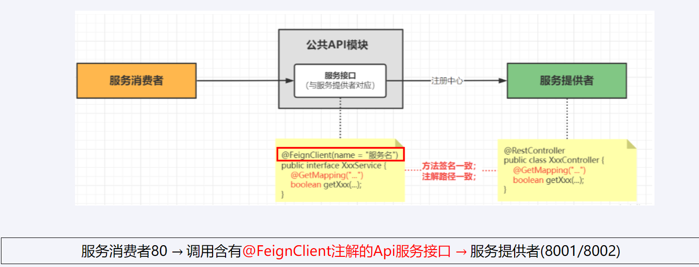
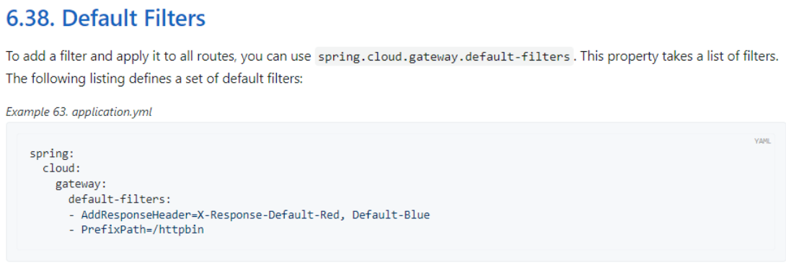
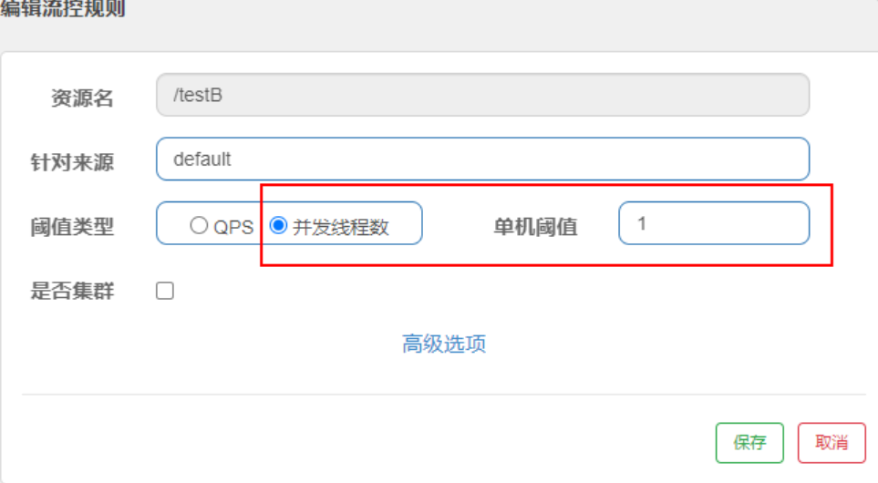
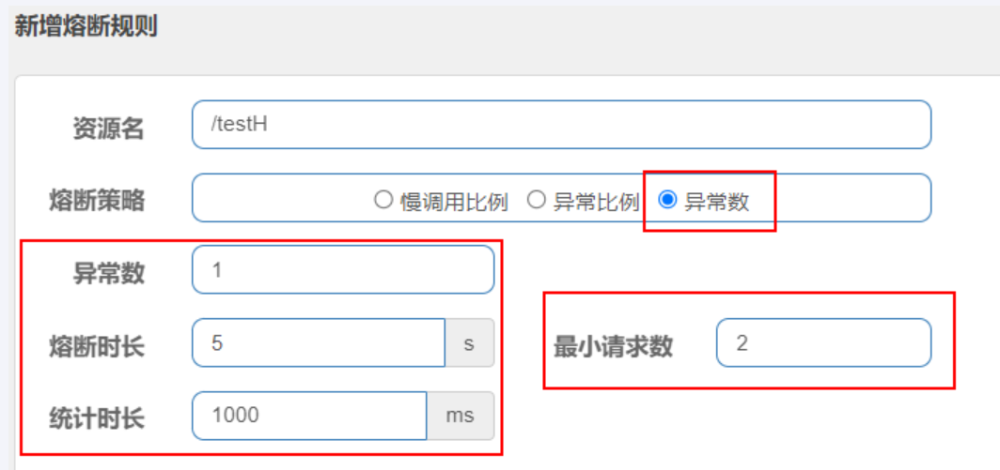

# SpringCloud + SpringCloudAlibaba

## 1.版本选型

### Springboot版本选择

[git源码地址](https://github.com/spring-projects/spring-boot/releases/)

[Springboot3 Release-Notes](https://github.com/spring-projects/spring-boot/wiki/Spring-Boot-3.0-Release-Notes)

### Springcloud版本选择

[git源码地址](https://github.com/spring-cloud)

Cloud命名规则：Spring Cloud 采用了英国伦敦地铁站的名称来命名，并由地铁站名称字母A-Z依次类推的形式来发布迭代版本（已被废弃）。

[SpringCloud官网](https://spring.io/projects/spring-cloud#overview)

### Springcloud Alibaba版本选择

[github版本说明](https://github.com/alibaba/spring-cloud-alibaba/wiki/%E7%89%88%E6%9C%AC%E8%AF%B4%E6%98%8E)

[Springcloud Alibaba参考手册](https://spring-cloud-alibaba-group.github.io/github-pages/2022/zh-cn/2022.0.0.0-RC2.html)

## 2.Cloud各种组件的停更/升级/替换

SpringCloud的作用：让程序员专注于业务逻辑，其他的交给第三方。


## 3.微服务架构编码Base工程模块构建

使用框架进行java开发，一定是**约定 > 配置 > 编码**。

### 1. idea新建Project和Maven父工程

#### 创建maven父工程步骤

1. New Project


2.聚合总父工程名字


3.字符编码


4.注解生效激活


5.java编译版本选择


6.FileType过滤


#### 父工程pom文件内容

```xml
 搜索

便笺
<?xml version="1.0" encoding="UTF-8"?>
<project xmlns="http://maven.apache.org/POM/4.0.0"
         xmlns:xsi="http://www.w3.org/2001/XMLSchema-instance"
         xsi:schemaLocation="http://maven.apache.org/POM/4.0.0 http://maven.apache.org/xsd/maven-4.0.0.xsd">
    <modelVersion>4.0.0</modelVersion>

    <groupId>com.atguigu.cloud</groupId>
    <artifactId>mscloudV5</artifactId>
    <version>1.0-SNAPSHOT</version>
    <packaging>pom</packaging>

    <properties>
        <maven.compiler.source>17</maven.compiler.source>
        <maven.compiler.target>17</maven.compiler.target>
        <project.build.sourceEncoding>UTF-8</project.build.sourceEncoding>
        <hutool.version>5.8.22</hutool.version>
        <lombok.version>1.18.26</lombok.version>
        <druid.version>1.1.20</druid.version>
        <mybatis.springboot.version>3.0.2</mybatis.springboot.version>
        <mysql.version>8.0.11</mysql.version>
        <swagger3.version>2.2.0</swagger3.version>
        <mapper.version>4.2.3</mapper.version>
        <fastjson2.version>2.0.40</fastjson2.version>
        <persistence-api.version>1.0.2</persistence-api.version>
        <spring.boot.test.version>3.1.5</spring.boot.test.version>
        <spring.boot.version>3.2.0</spring.boot.version>
        <spring.cloud.version>2023.0.0</spring.cloud.version>
        <spring.cloud.alibaba.version>2022.0.0.0-RC2</spring.cloud.alibaba.version>
    </properties>

    <dependencyManagement>
        <dependencies>
            <!--springboot 3.2.0-->
            <dependency>
                <groupId>org.springframework.boot</groupId>
                <artifactId>spring-boot-starter-parent</artifactId>
                <version>${spring.boot.version}</version>
                <type>pom</type>
                <scope>import</scope>
            </dependency>
            <!--springcloud 2023.0.0-->
            <dependency>
                <groupId>org.springframework.cloud</groupId>
                <artifactId>spring-cloud-dependencies</artifactId>
                <version>${spring.cloud.version}</version>
                <type>pom</type>
                <scope>import</scope>
            </dependency>
            <!--springcloud alibaba 2022.0.0.0-RC2-->
            <dependency>
                <groupId>com.alibaba.cloud</groupId>
                <artifactId>spring-cloud-alibaba-dependencies</artifactId>
                <version>${spring.cloud.alibaba.version}</version>
                <type>pom</type>
                <scope>import</scope>
            </dependency>
            <!--SpringBoot集成mybatis-->
            <dependency>
                <groupId>org.mybatis.spring.boot</groupId>
                <artifactId>mybatis-spring-boot-starter</artifactId>
                <version>${mybatis.springboot.version}</version>
            </dependency>
            <!--Mysql数据库驱动8 -->
            <dependency>
                <groupId>mysql</groupId>
                <artifactId>mysql-connector-java</artifactId>
                <version>${mysql.version}</version>
            </dependency>
            <!--SpringBoot集成druid连接池-->
            <dependency>
                <groupId>com.alibaba</groupId>
                <artifactId>druid-spring-boot-starter</artifactId>
                <version>${druid.version}</version>
            </dependency>
            <!--通用Mapper4之tk.mybatis-->
            <dependency>
                <groupId>tk.mybatis</groupId>
                <artifactId>mapper</artifactId>
                <version>${mapper.version}</version>
            </dependency>
            <!--persistence-->
            <dependency>
                <groupId>javax.persistence</groupId>
                <artifactId>persistence-api</artifactId>
                <version>${persistence-api.version}</version>
            </dependency>
            <!-- fastjson2 -->
            <dependency>
                <groupId>com.alibaba.fastjson2</groupId>
                <artifactId>fastjson2</artifactId>
                <version>${fastjson2.version}</version>
            </dependency>
            <!-- swagger3 调用方式 http://你的主机IP地址:5555/swagger-ui/index.html -->
            <dependency>
                <groupId>org.springdoc</groupId>
                <artifactId>springdoc-openapi-starter-webmvc-ui</artifactId>
                <version>${swagger3.version}</version>
            </dependency>
            <!--hutool-->
            <dependency>
                <groupId>cn.hutool</groupId>
                <artifactId>hutool-all</artifactId>
                <version>${hutool.version}</version>
            </dependency>
            <!--lombok-->
            <dependency>
                <groupId>org.projectlombok</groupId>
                <artifactId>lombok</artifactId>
                <version>${lombok.version}</version>
                <optional>true</optional>
            </dependency>
            <!-- spring-boot-starter-test -->
            <dependency>
                <groupId>org.springframework.boot</groupId>
                <artifactId>spring-boot-starter-test</artifactId>
                <version>${spring.boot.test.version}</version>
                <scope>test</scope>
            </dependency>
        </dependencies>
    </dependencyManagement>
</project>
```

### 2. Mapper4一键生成

mybatis-generator

>http://mybatis.org/generator

Mapper4

> https://github.com/abel533/Mapper

Mapper5

> https://github.com/mybatis-mapper/mapper

一键生成步骤

- 建好SQL数据库及表

```mysql
DROP TABLE IF EXISTS `t_pay`;

 

CREATE TABLE `t_pay` (

  `id` INT(10) UNSIGNED NOT NULL AUTO_INCREMENT,

  `pay_no` VARCHAR(50) NOT NULL COMMENT '支付流水号',

  `order_no` VARCHAR(50) NOT NULL COMMENT '订单流水号',

  `user_id` INT(10) DEFAULT '1' COMMENT '用户账号ID',

  `amount` DECIMAL(8,2) NOT NULL DEFAULT '9.9' COMMENT '交易金额',

  `deleted` TINYINT(4) UNSIGNED NOT NULL DEFAULT '0' COMMENT '删除标志，默认0不删除，1删除',

  `create_time` TIMESTAMP NOT NULL DEFAULT CURRENT_TIMESTAMP COMMENT '创建时间',

  `update_time` TIMESTAMP NOT NULL DEFAULT CURRENT_TIMESTAMP ON UPDATE CURRENT_TIMESTAMP COMMENT '更新时间',

  PRIMARY KEY (`id`)

) ENGINE=INNODB AUTO_INCREMENT=1 DEFAULT CHARSET=utf8mb4 COMMENT='支付交易表';

 

INSERT INTO t_pay(pay_no,order_no) VALUES('pay17203699','6544bafb424a');

 

SELECT * FROM t_pay;
```

- 创建Module


- 写POM文件

```xml
<?xml version="1.0" encoding="UTF-8"?>
<project xmlns="http://maven.apache.org/POM/4.0.0"
         xmlns:xsi="http://www.w3.org/2001/XMLSchema-instance"
         xsi:schemaLocation="http://maven.apache.org/POM/4.0.0 http://maven.apache.org/xsd/maven-4.0.0.xsd">
    <modelVersion>4.0.0</modelVersion>

    <parent>
        <groupId>com.atguigu.cloud</groupId>
        <artifactId>mscloudV5</artifactId>
        <version>1.0-SNAPSHOT</version>
    </parent>

    <!--我自己独一份，只是一个普通Maven工程，与boot和cloud无关-->
    <artifactId>mybatis_generator2024</artifactId>

    <properties>
        <maven.compiler.source>17</maven.compiler.source>
        <maven.compiler.target>17</maven.compiler.target>
        <project.build.sourceEncoding>UTF-8</project.build.sourceEncoding>
    </properties>

    <dependencies>
        <!--Mybatis 通用mapper tk单独使用，自己独有+自带版本号-->
        <dependency>
            <groupId>org.mybatis</groupId>
            <artifactId>mybatis</artifactId>
            <version>3.5.13</version>
        </dependency>
        <!-- Mybatis Generator 自己独有+自带版本号-->
        <dependency>
            <groupId>org.mybatis.generator</groupId>
            <artifactId>mybatis-generator-core</artifactId>
            <version>1.4.2</version>
        </dependency>
        <!--通用Mapper-->
        <dependency>
            <groupId>tk.mybatis</groupId>
            <artifactId>mapper</artifactId>
        </dependency>
        <!--mysql8.0-->
        <dependency>
            <groupId>mysql</groupId>
            <artifactId>mysql-connector-java</artifactId>
        </dependency>
        <!--persistence-->
        <dependency>
            <groupId>javax.persistence</groupId>
            <artifactId>persistence-api</artifactId>
        </dependency>
        <!--hutool-->
        <dependency>
            <groupId>cn.hutool</groupId>
            <artifactId>hutool-all</artifactId>
        </dependency>
        <!--lombok-->
        <dependency>
            <groupId>org.projectlombok</groupId>
            <artifactId>lombok</artifactId>
            <optional>true</optional>
        </dependency>
        <dependency>
            <groupId>org.springframework.boot</groupId>
            <artifactId>spring-boot-starter-test</artifactId>
            <scope>test</scope>
            <exclusions>
                <exclusion>
                    <groupId>org.junit.vintage</groupId>
                    <artifactId>junit-vintage-engine</artifactId>
                </exclusion>
            </exclusions>
        </dependency>
    </dependencies>

    <build>
        <resources>
            <resource>
                <directory>${basedir}/src/main/java</directory>
                <includes>
                    <include>**/*.xml</include>
                </includes>
            </resource>
            <resource>
                <directory>${basedir}/src/main/resources</directory>
            </resource>
        </resources>
        <plugins>
            <plugin>
                <groupId>org.springframework.boot</groupId>
                <artifactId>spring-boot-maven-plugin</artifactId>
                <configuration>
                    <excludes>
                        <exclude>
                            <groupId>org.projectlombok</groupId>
                            <artifactId>lombok</artifactId>
                        </exclude>
                    </excludes>
                </configuration>
            </plugin>
            <plugin>
                <groupId>org.mybatis.generator</groupId>
                <artifactId>mybatis-generator-maven-plugin</artifactId>
                <version>1.4.2</version>
                <configuration>
                    <configurationFile>${basedir}/src/main/resources/generatorConfig.xml</configurationFile>
                    <overwrite>true</overwrite>
                    <verbose>true</verbose>
                </configuration>
                <dependencies>
                    <dependency>
                        <groupId>mysql</groupId>
                        <artifactId>mysql-connector-java</artifactId>
                        <version>8.0.33</version>
                    </dependency>
                    <dependency>
                        <groupId>tk.mybatis</groupId>
                        <artifactId>mapper</artifactId>
                        <version>4.2.3</version>
                    </dependency>
                </dependencies>
            </plugin>
        </plugins>
    </build>
</project>
```

- 写配置文件

  - src\main\resources路径下新建

    - config.properties

    - ```properties
      #User表包名
      package.name=com.atguigu.cloud
      # mysql5.7
      jdbc.driverClass = com.mysql.jdbc.Driver
      jdbc.url= jdbc:mysql://localhost:3306/db2024?useUnicode=true&characterEncoding=UTF-8&useSSL=false
      jdbc.user = root
      jdbc.password =123456
      
      
      
      #t_pay表包名
      package.name=com.atguigu.cloud
      # mysql8.0
      jdbc.driverClass = com.mysql.cj.jdbc.Driver
      jdbc.url= jdbc:mysql://localhost:3306/db2024?characterEncoding=utf8&useSSL=false&serverTimezone=GMT%2B8&rewriteBatchedStatements=true&allowPublicKeyRetrieval=true
      jdbc.user = root
      jdbc.password =123456
      ```

    - generatorConfig.xml

    - ```xml
      <?xml version="1.0" encoding="UTF-8"?>
      <!DOCTYPE generatorConfiguration
              PUBLIC "-//mybatis.org//DTD MyBatis Generator Configuration 1.0//EN"
              "http://mybatis.org/dtd/mybatis-generator-config_1_0.dtd">
      
      <generatorConfiguration>
          <properties resource="config.properties"/>
      
          <context id="Mysql" targetRuntime="MyBatis3Simple" defaultModelType="flat">
              <property name="beginningDelimiter" value="`"/>
              <property name="endingDelimiter" value="`"/>
      
              <plugin type="tk.mybatis.mapper.generator.MapperPlugin">
                  <property name="mappers" value="tk.mybatis.mapper.common.Mapper"/>
                  <property name="caseSensitive" value="true"/>
              </plugin>
      
              <jdbcConnection driverClass="${jdbc.driverClass}"
                              connectionURL="${jdbc.url}"
                              userId="${jdbc.user}"
                              password="${jdbc.password}">
              </jdbcConnection>
      
              <javaModelGenerator targetPackage="${package.name}.entities" targetProject="src/main/java"/>
      
              <sqlMapGenerator targetPackage="${package.name}.mapper" targetProject="src/main/java"/>
      
              <javaClientGenerator targetPackage="${package.name}.mapper" targetProject="src/main/java" type="XMLMAPPER"/>
      
              <table tableName="t_pay" domainObjectName="Pay">
                  <generatedKey column="id" sqlStatement="JDBC"/>
              </table>
          </context>
      </generatorConfiguration>
      ```

- 双击插件mybatis-generator:generate


### 3. Rest通用Base工程构建

创建微服务的小口诀（步骤）

>1.建module
>
>2.改POM
>
>3.写YML
>
>4.主启动类
>
>5.业务类


### 4. 创建微服务项目

#### RestTemplate

> RestTemplate提供了多种便捷访问远程Http服务的方法， 是一种简单便捷的访问restful服务模板类，是Spring提供的用于访问Rest服务的客户端模板工具集

官网地址

> https://docs.spring.io/spring-framework/docs/6.0.11/javadoc-api/org/springframework/web/client/RestTemplate.html

RestTemplateConfig

```java
@Configuration
public class RestTemplateConfig
{
    @Bean
    public RestTemplate restTemplate()
    {
        return new RestTemplate();
    }
}
```

最终项目结构


## 4.Consul服务注册与发现

### 1.为什么要引入服务注册中心

微服务所在的IP地址和端口号硬编码到订单微服务中，会存在非常多的问题

（1）如果订单微服务和支付微服务的IP地址或者端口号发生了变化，则支付微服务将变得不可用，需要同步修改订单微服务中调用支付微服务的IP地址和端口号。

（2）如果系统中提供了多个订单微服务和支付微服务，则无法实现微服务的负载均衡功能。

（3）如果系统需要支持更高的并发，需要部署更多的订单微服务和支付微服务，硬编码订单微服务则后续的维护会变得异常复杂。

所以，在微服务开发的过程中，需要引入服务治理功能，实现微服务之间的动态注册与发现。

### 2.Consul简介

consul官网地址：https://www.consul.io/

consul简介：https://developer.hashicorp.com/consul/docs/intro

spring consul：https://docs.spring.io/spring-cloud-consul/docs/current/reference/html

#### consul作用

- 服务发现：提供HTTP和DNS两种发现方式
- 健康监测：支持多种方式，HTTP、TCP、Docker、Shell脚本定制化监控
- KV存储：Key、Value的存储方式
- 多数据中心：Consul支持多数据中心
- 可视化Web界面

Consul下载：https://developer.hashicorp.com/consul/downloads

### 3.安装并运行consul

下载完成后解压，在包含consul.exe文件的文件夹下使用命令行窗口


```shell
consul --version
```


```shell
consul agent -dev
```


访问Consul首页：http://localhost:8500

### 4.服务注册与发现

#### 服务提供者8001

- 建module：cloud-provider-payment8001

- 改POM，配置来源：https://docs.spring.io/spring-cloud-consul/reference/quickstart.html

```xml
<?xml version="1.0" encoding="UTF-8"?>
<project xmlns="http://maven.apache.org/POM/4.0.0"
         xmlns:xsi="http://www.w3.org/2001/XMLSchema-instance"
         xsi:schemaLocation="http://maven.apache.org/POM/4.0.0 http://maven.apache.org/xsd/maven-4.0.0.xsd">
    <modelVersion>4.0.0</modelVersion>
    <parent>
        <groupId>com.atguigu.cloud</groupId>
        <artifactId>mscloudV5</artifactId>
        <version>1.0-SNAPSHOT</version>
    </parent>

    <artifactId>cloud-provider-payment8001</artifactId>

    <properties>
        <maven.compiler.source>17</maven.compiler.source>
        <maven.compiler.target>17</maven.compiler.target>
        <project.build.sourceEncoding>UTF-8</project.build.sourceEncoding>
    </properties>


    <dependencies>
        <!--SpringCloud consul discovery -->
        <dependency>
            <groupId>org.springframework.cloud</groupId>
            <artifactId>spring-cloud-starter-consul-discovery</artifactId>
        </dependency>
        <!-- 引入自己定义的api通用包 -->
        <dependency>
            <groupId>com.atguigu.cloud</groupId>
            <artifactId>cloud-api-commons</artifactId>
            <version>1.0-SNAPSHOT</version>
        </dependency>
        <!--SpringBoot通用依赖模块-->
        <dependency>
            <groupId>org.springframework.boot</groupId>
            <artifactId>spring-boot-starter-web</artifactId>
        </dependency>
        <dependency>
            <groupId>org.springframework.boot</groupId>
            <artifactId>spring-boot-starter-actuator</artifactId>
        </dependency>
        <!--SpringBoot集成druid连接池-->
        <dependency>
            <groupId>com.alibaba</groupId>
            <artifactId>druid-spring-boot-starter</artifactId>
        </dependency>
        <!-- Swagger3 调用方式 http://你的主机IP地址:5555/swagger-ui/index.html -->
        <dependency>
            <groupId>org.springdoc</groupId>
            <artifactId>springdoc-openapi-starter-webmvc-ui</artifactId>
        </dependency>
        <!--mybatis和springboot整合-->
        <dependency>
            <groupId>org.mybatis.spring.boot</groupId>
            <artifactId>mybatis-spring-boot-starter</artifactId>
        </dependency>
        <!--Mysql数据库驱动8 -->
        <dependency>
            <groupId>mysql</groupId>
            <artifactId>mysql-connector-java</artifactId>
        </dependency>
        <!--persistence-->
        <dependency>
            <groupId>javax.persistence</groupId>
            <artifactId>persistence-api</artifactId>
        </dependency>
        <!--通用Mapper4-->
        <dependency>
            <groupId>tk.mybatis</groupId>
            <artifactId>mapper</artifactId>
        </dependency>
        <!--hutool-->
        <dependency>
            <groupId>cn.hutool</groupId>
            <artifactId>hutool-all</artifactId>
        </dependency>
        <!-- fastjson2 -->
        <dependency>
            <groupId>com.alibaba.fastjson2</groupId>
            <artifactId>fastjson2</artifactId>
        </dependency>
        <!--lombok-->
        <dependency>
            <groupId>org.projectlombok</groupId>
            <artifactId>lombok</artifactId>
            <version>1.18.28</version>
            <scope>provided</scope>
        </dependency>
        <!--test-->
        <dependency>
            <groupId>org.springframework.boot</groupId>
            <artifactId>spring-boot-starter-test</artifactId>
            <scope>test</scope>
        </dependency>
    </dependencies>

    <build>
        <plugins>
            <plugin>
                <groupId>org.springframework.boot</groupId>
                <artifactId>spring-boot-maven-plugin</artifactId>
            </plugin>
        </plugins>
    </build>

</project>
```

- 写yml

```yaml
server:
  port: 8001

# ==========applicationName + druid-mysql8 driver===================
spring:
  application:
    name: cloud-payment-service

  datasource:
    type: com.alibaba.druid.pool.DruidDataSource
    driver-class-name: com.mysql.cj.jdbc.Driver
    url: jdbc:mysql://localhost:3306/db2024?characterEncoding=utf8&useSSL=false&serverTimezone=GMT%2B8&rewriteBatchedStatements=true&allowPublicKeyRetrieval=true
    username: root
    password: 123456
  ####Spring Cloud Consul for Service Discovery
  cloud:
    consul:
      host: localhost
      port: 8500
      discovery:
        service-name: ${spring.application.name}

# ========================mybatis===================
mybatis:
  mapper-locations: classpath:mapper/*.xml
  type-aliases-package: com.atguigu.cloud.entities
  configuration:
    map-underscore-to-camel-case: true
```

- 主启动类，`@EnableDiscoveryClient`开启服务注册发现

```java
@SpringBootApplication
@MapperScan("com.atguigu.cloud.mapper") //import tk.mybatis.spring.annotation.MapperScan;
@EnableDiscoveryClient
public class Main8001
{
    public static void main(String[] args)
    {
        SpringApplication.run(Main8001.class,args);
    }
}
```

#### 服务消费者80

- 将controller中的硬编码换掉

```java
//public static final String PaymentSrv_URL = "http://localhost:8001";//先写死，硬编码

public static final String PaymentSrv_URL = "http://cloud-payment-service";//服务注册中心上的微服务名称
```

- 修改RestTemplateConfig类，否则会报错：java.net.UnknownHostException:cloud-payment-service

```java
@Configuration
public class RestTemplateConfig
{
    @Bean
    @LoadBalanced
    public RestTemplate restTemplate()
    {
        return new RestTemplate();
    }
}
```

#### 三个注册中心的异同点


>CAP:
>
>C：Consistency（强一致性）
>
>A：Availability（可用性）
>
>P：Partition tolerance（分区容错性）

**经典CAP图**

最多只能同时较好的满足两个。

 CAP理论的核心是：一个分布式系统不可能同时很好的满足一致性，可用性和分区容错性这三个需求，

因此，根据 CAP 原理将 NoSQL 数据库分成了满足 CA 原则、满足 CP 原则和满足 AP 原则三 大类：

CA - 单点集群，满足一致性，可用性的系统，通常在可扩展性上不太强大。

CP - 满足一致性，分区容忍必的系统，通常性能不是特别高。

AP - 满足可用性，分区容忍性的系统，通常可能对一致性要求低一些。


AP架构（Eureka）


CP架构（Zookeeper/Consul）


### 5.服务配置与刷新

#### 服务配置案例步骤

**修改cloud-provider-payment8001**

- 改POM

```xml
<!--SpringCloud consul config-->
<dependency>
    <groupId>org.springframework.cloud</groupId>
    <artifactId>spring-cloud-starter-consul-config</artifactId>
</dependency>
<dependency>
    <groupId>org.springframework.cloud</groupId>
    <artifactId>spring-cloud-starter-bootstrap</artifactId>
</dependency>
```

- 改YML

applicaiton.yml是用户级的资源配置项

bootstrap.yml是系统级的，优先级更加高

Spring Cloud会创建一个“Bootstrap Context”，作为Spring应用的`Application Context`的父上下文。初始化的时候，`Bootstrap Context`负责从外部源加载配置属性并解析配置。这两个上下文共享一个从外部获取的`Environment`。

`Bootstrap`属性有高优先级，默认情况下，它们不会被本地配置覆盖。 `Bootstrap context`和`Application Context`有着不同的约定，所以新增了一个`bootstrap.yml`文件，保证`Bootstrap Context`和`Application Context`配置的分离。

 application.yml文件改为bootstrap.yml,这是很关键的或者两者共存

因为bootstrap.yml是比application.yml先加载的。bootstrap.yml优先级高于application.yml

bootstrap.yml

```yaml
spring:
  application:
    name: cloud-payment-service
    ####Spring Cloud Consul for Service Discovery
  cloud:
    consul:
      host: localhost
      port: 8500
      discovery:
        service-name: ${spring.application.name}
      config:
        profile-separator: '-' # default value is ","，we update '-'
        format: YAML
```

application.yml

```yaml
server:
  port: 8001

# ==========applicationName + druid-mysql8 driver===================
spring:
  datasource:
    type: com.alibaba.druid.pool.DruidDataSource
    driver-class-name: com.mysql.cj.jdbc.Driver
    url: jdbc:mysql://localhost:3306/db2024?characterEncoding=utf8&useSSL=false&serverTimezone=GMT%2B8&rewriteBatchedStatements=true&allowPublicKeyRetrieval=true
    username: root
    password: 123456
  profiles:
    active: dev # 多环境配置加载内容dev/prod,不写就是默认default配置

# ========================mybatis===================
mybatis:
  mapper-locations: classpath:mapper/*.xml
  type-aliases-package: com.atguigu.cloud.entities
  configuration:
    map-underscore-to-camel-case: true
```

- consul服务器key/value配置填写

  - 1.参考规则

  - >config/cloud-payment-service/data
    >    /cloud-payment-service-dev/data
    >
    >   /cloud-payment-service-prod/data

  - 2.创建config文件夹,以 / 结尾

  - 3.创建3个文件夹以 / 结尾

  - >cloud-payment-service/
    >
    >cloud-payment-service-dev/
    >
    >cloud-payment-service-prod/

  - 4.在创建data文件,填写需要存储的数据,以yaml格式存储.


取出数据：使用`@Value`注解取出数据

```java
@GetMapping(value = "/pay/get/info")
private String getInfoByConsul(@Value("${atguigu.info}") String atguiguInfo)
{
    return "atguiguInfo: "+atguiguInfo+"\t"+"port: "+port;
}
```

#### 动态刷新案例步骤

在主启动类上添加`@RefreshScope`注解

```java
@SpringBootApplication
@MapperScan("com.atguigu.cloud.mapper") //import tk.mybatis.spring.annotation.MapperScan;
@EnableDiscoveryClient //服务注册和发现
@RefreshScope // 动态刷新
public class Main8001
{
    public static void main(String[] args)
    {
        SpringApplication.run(Main8001.class,args);
    }
}
```

修改刷新时间(实际生产中不要修改)

```yaml
spring:
  cloud:
    consul:
      config:
        watch:
          wait-time: 1
```

## 5. LoadBalancer负载均衡服务调用

官网：https://docs.spring.io/spring-cloud-commons/reference/spring-cloud-commons/loadbalancer.html

**loadbalancer本地负载均衡客户端 VS Nginx服务端负载均衡区别**

> Nginx是服务器负载均衡，客户端所有请求都会交给nginx，然后由nginx实现转发请求，即负载均衡是由服务端实现的。
>
> loadbalancer本地负载均衡，在调用微服务接口时候，会在注册中心上获取注册信息服务列表之后缓存到JVM本地，从而在本地实现RPC远程服务调用技术。


#### 负载均衡案例

- 仿照8001微服务创建新的8002微服务

- 启动Consul，将8001/8002启动后注册进微服务

  - Consul数据持久化配置并且注册为Windows服务

    1. D:\devSoft\consul_1.17.0_windows_386目录下新建，空文件夹mydata，新建文件consul_start.bat
    2. consul_start.bat文件信息

    ```bat
    @echo.服务启动......  
    @echo off  
    @sc create Consul binpath= "D:\devSoft\consul_1.17.0_windows_386\consul.exe agent -server -ui -bind=127.0.0.1 -client=0.0.0.0 -bootstrap-expect  1  -data-dir D:\devSoft\consul_1.17.0_windows_386\mydata   "
    @net start Consul
    @sc config Consul start= AUTO  
    @echo.Consul start is OK......success
    @pause
    ```

    3. 右键管理员权限打开consul_start.bat脚本文件

    

    

    4. 后续consul的配置数据会保存进mydata文件夹，重启电脑后也会存在

- 订单80模块修改POM并注册进consul，新增LoadBalancer组件

```xml
<!--loadbalancer-->
<dependency>
    <groupId>org.springframework.cloud</groupId>
    <artifactId>spring-cloud-starter-loadbalancer</artifactId>
</dependency>
```

- 订单80模块修改Controller并启动80

```java
@GetMapping(value = "/consumer/pay/get/info")
private String getInfoByConsul()
{
    return restTemplate.getForObject(PaymentSrv_URL + "/pay/get/info", String.class);
}
```

- 测试，客户端会交替访问8001/8002，应为LB的模式默认为轮询

#### 负载均衡案例小总结

在80微服务层添加以下代码，可以获取所有/特定服务列表

```java
@Resource
private DiscoveryClient discoveryClient;
@GetMapping("/consumer/discovery")
public String discovery()
{
    List<String> services = discoveryClient.getServices();
    for (String element : services) {
        System.out.println(element);
    }

    System.out.println("===================================");

    List<ServiceInstance> instances = discoveryClient.getInstances("cloud-payment-service");
    for (ServiceInstance element : instances) {
        System.out.println(element.getServiceId()+"\t"+element.getHost()+"\t"+element.getPort()+"\t"+element.getUri());
    }

    return instances.get(0).getServiceId()+":"+instances.get(0).getPort();
}
```

轮询原理


#### 负载均衡算法原理

官方提供有两种，轮询和随机，默认使用轮询。

从默认的轮询切换为随机算法，修改RestTemplateConfig

```java
@Configuration
@LoadBalancerClient(
        //下面的value值大小写一定要和consul里面的名字一样，必须一样
        value = "cloud-payment-service",configuration = RestTemplateConfig.class)
public class RestTemplateConfig
{
    @Bean
    @LoadBalanced //使用@LoadBalanced注解赋予RestTemplate负载均衡的能力
    public RestTemplate restTemplate(){
        return new RestTemplate();
    }

    @Bean
    ReactorLoadBalancer<ServiceInstance> randomLoadBalancer(Environment environment,
                                                            LoadBalancerClientFactory loadBalancerClientFactory) {
        String name = environment.getProperty(LoadBalancerClientFactory.PROPERTY_NAME);

        return new RandomLoadBalancer(loadBalancerClientFactory.getLazyProvider(name, ServiceInstanceListSupplier.class), name);
    }
}
```

## 6. OpenFeign服务接口调用

OpenFeign内部已经实现了LoadBalance，因此在实际应用中，我们只使用OpenFeign即可。

### 简介

Feign是一个**声明性web服务客户端**。它使编写web服务客户端变得更容易。使用Feign创建一个接口并对其进行注释。它具有可插入的注释支持，包括Feign注释和JAX-RS注释。Feign还支持可插拔编码器和解码器。Spring Cloud添加了对Spring MVC注释的支持，以及对使用Spring Web中默认使用的HttpMessageConverter的支持。Spring Cloud集成了Eureka、Spring Cloud CircuitBreaker以及Spring Cloud LoadBalancer，以便在使用Feign时提供负载平衡的http客户端。

一句话：只需创建一个Rest接口并在该接口上添加注解@FeignClient即可

**官网**

https://docs.spring.io/spring-cloud-openfeign/docs/current/reference/html/#spring-cloud-feign

**GitHub**

https://github.com/spring-cloud/spring-cloud-openfeign

### OpenFeign能干什么

前面在使用**SpringCloud LoadBalancer**+RestTemplate时，利用RestTemplate对http请求的封装处理形成了一套模版化的调用方法。***但是在实际开发中，\***

由于对服务依赖的调用可能不止一处，往往一个接口会被多处调用，所以通常都会针对每个微服务自行封装一些客户端类来包装这些依赖服务的调用。所以，OpenFeign在此基础上做了进一步封装，由他来帮助我们定义和实现依赖服务接口的定义。在OpenFeign的实现下，我们只需创建一个接口并使用注解的方式来配置它(在一个微服务接口上面标注一个***@FeignClient\***注解即可)，即可完成对服务提供方的接口绑定，统一对外暴露可以被调用的接口方法，大大简化和降低了调用客户端的开发量，也即由服务提供者给出调用接口清单，消费者直接通过OpenFeign调用即可，O(∩_∩)O。

OpenFeign同时还集成SpringCloud LoadBalancer

可以在使用OpenFeign时提供Http客户端的负载均衡，也可以集成阿里巴巴Sentinel来提供熔断、降级等功能。而与SpringCloud LoadBalancer不同的是，通过OpenFeign只需要定义服务绑定接口且以声明式的方法，优雅而简单的实现了服务调用。

### OpenFeign通用使用步骤

微服务Api接口+@FeignClient注解标签



**流程步骤**

- 建Mould：cloud-consumer-feign-order80

- 改POM

- ```xml
  <!--多引入一个openfeign模块-->
  <!--openfeign-->
  <dependency>
      <groupId>org.springframework.cloud</groupId>
      <artifactId>spring-cloud-starter-openfeign</artifactId>
  </dependency>
  ```

- 写YML

- ```yaml
  server:
    port: 80
  
  spring:
    application:
      name: cloud-consumer-openfeign-order
    ####Spring Cloud Consul for Service Discovery
    cloud:
      consul:
        host: localhost
        port: 8500
        discovery:
          prefer-ip-address: true #优先使用服务ip进行注册
          service-name: ${spring.application.name}
  ```

- 主启动类

- ```java
  @SpringBootApplication
  @EnableDiscoveryClient //该注解用于向使用consul为注册中心时注册服务
  @EnableFeignClients//启用feign客户端,定义服务+绑定接口，以声明式的方法优雅而简单的实现服务调用
  public class MainOpenFeign80
  {
      public static void main(String[] args)
      {
          SpringApplication.run(MainOpenFeign80.class,args);
      }
  }
  ```

- 业务类

  - 业务类架构图

  - 

  - 修改cloud-api-commons通用模块

    - 引入openfeign依赖

    - ```xml
      <!--openfeign-->
      <dependency>
          <groupId>org.springframework.cloud</groupId>
          <artifactId>spring-cloud-starter-openfeign</artifactId>
      </dependency>
      ```

    - 新建服务接口PayFeignApi，并标注`@FeignClient`注解

    - ```java
      @FeignClient(value = "cloud-payment-service")
      public interface PayFeignApi
      {
          /**
           * 新增一条支付相关流水记录
           * @param payDTO
           * @return
           */
          @PostMapping("/pay/add")
          public ResultData addPay(@RequestBody PayDTO payDTO);
      
          /**
           * 按照主键记录查询支付流水信息
           * @param id
           * @return
           */
          @GetMapping("/pay/get/{id}")
          public ResultData getPayInfo(@PathVariable("id") Integer id);
      
          /**
           * openfeign天然支持负载均衡演示
           * @return
           */
          @GetMapping(value = "/pay/get/info")
          public String mylb();
      }
      ```

    - Controller层调用，即cloud-consumer-feign-order模块调用payment模块的openfeign接口

    - ```java
      @RestController
      @Slf4j
      public class OrderController
      {
          @Resource
          private PayFeignApi payFeignApi;
      
          @PostMapping("/feign/pay/add")
          public ResultData addOrder(@RequestBody PayDTO payDTO)
          {
              System.out.println("第一步：模拟本地addOrder新增订单成功(省略sql操作)，第二步：再开启addPay支付微服务远程调用");
              ResultData resultData = payFeignApi.addPay(payDTO);
              return resultData;
          }
      
          @GetMapping("/feign/pay/get/{id}")
          public ResultData getPayInfo(@PathVariable("id") Integer id)
          {
              System.out.println("-------支付微服务远程调用，按照id查询订单支付流水信息");
              ResultData resultData = payFeignApi.getPayInfo(id);
              return resultData;
          }
      
          /**
           * openfeign天然支持负载均衡演示
           *
           * @return
           */
          @GetMapping(value = "/feign/pay/mylb")
          public String mylb()
          {
              return payFeignApi.mylb();
          }
      }
      ```

### OpenFeign高级特性

#### 1. 超时控制

OpenFeign默认等待60s，超时后报错。

修改客户端的YML文件来调整超时控制，官网：[Spring Cloud OpenFeign](https://docs.spring.io/spring-cloud-openfeign/docs/current/reference/html/#spring-cloud-feign-overriding-defaults)

全局配置

```yaml
spring:
  cloud:
    openfeign:
      client:
        config:
          default:
            #连接超时时间
                      connectTimeout: 3000
            #读取超时时间
                     readTimeout: 3000
```

指定配置

```yaml
spring:
  cloud:
    openfeign:
      client:
        config:
          your-service-name:
            #连接超时时间
                      connectTimeout: 5000
            #读取超时时间
                      readTimeout: 5000
```

OpenFeign允许全局配置和指定配置同时存在，当同时存在时，指定配置的优先级高于全局配置

#### 2. 重试机制

重试机制默认是关闭的。

**开启Retryer功能**

- 新增配置类FeignConfig并修改Retryer配置

- ```java
  @Configuration
  public class FeignConfig
  {
      @Bean
      public Retryer myRetryer()
      {
          //return Retryer.NEVER_RETRY; //Feign默认配置是不走重试策略的
  
          //最大请求次数为3(1+2)，初始间隔时间为100ms，重试间最大间隔时间为1s
          return new Retryer.Default(100,1,3);
      }
  }
  ```

#### 3. 默认HttpClient修改

OpenFeign中http client

如果不做特殊配置，OpenFeign默认使用JDK自带的HttpURLConnection发送HTTP请求， 

由于默认HttpURLConnection没有连接池、性能和效率比较低，如果采用默认，性能上不是最牛B的，所以加到最大。

**改用Apache HttpClient5发送HTTP请求：**

在POM文件中导入依赖

```xml
<!-- httpclient5-->
<dependency>
    <groupId>org.apache.httpcomponents.client5</groupId>
    <artifactId>httpclient5</artifactId>
    <version>5.3</version>
</dependency>
<!-- feign-hc5-->
<dependency>
    <groupId>io.github.openfeign</groupId>
    <artifactId>feign-hc5</artifactId>
    <version>13.1</version>
</dependency>
```

在YML配置开启

```yml
#  Apache HttpClient5 配置开启
spring:
  cloud:
    openfeign:
      httpclient:
        hc5:
          enabled: true
```

#### 4. 请求 / 响应压缩

**对请求和响应进行GZIP压缩**

Spring Cloud OpenFeign支持对请求和响应进行GZIP压缩，以减少通信过程中的性能损耗。

通过下面的两个参数设置，就能开启请求与相应的压缩功能：

spring.cloud.openfeign.compression.request.enabled=true

spring.cloud.openfeign.compression.response.enabled=true

**细粒度化设置**

对请求压缩做一些更细致的设置，比如下面的配置内容指定压缩的请求数据类型并设置了请求压缩的大小下限，

只有超过这个大小的请求才会进行压缩：

spring.cloud.openfeign.compression.request.enabled=true

spring.cloud.openfeign.compression.request.mime-types=text/xml,application/xml,application/json #触发压缩数据类型

spring.cloud.openfeign.compression.request.min-request-size=2048 #最小触发压缩的大小

**YML配置**

```yml
spring:
  cloud:
    openfeign:
      compression:
        request:
          enabled: true
          min-request-size: 2048 #最小触发压缩的大小
          mime-types: text/xml,application/xml,application/json #触发压缩数据类型
        response:
          enabled: true
```

#### 5. 日志打印功能

Feign 提供了日志打印功能，我们可以通过配置来调整日志级别，从而了解 Feign 中 Http 请求的细节，说白了就是对Feign接口的调用情况进行监控和输出.

日志级别

> NONE：默认的，不显示任何日志；
>
> BASIC：仅记录请求方法、URL、响应状态码及执行时间；
>
> HEADERS：除了 BASIC 中定义的信息之外，还有请求和响应的头信息；
>
> FULL：除了 HEADERS 中定义的信息之外，还有请求和响应的正文及元数据。

在FeignConfig配置类中配置bean，修改日志级别

```java
@Configuration
public class FeignConfig
{
    @Bean
    public Retryer myRetryer()
    {
        return Retryer.NEVER_RETRY; //默认
    }

    @Bean
    Logger.Level feignLoggerLevel() {
        return Logger.Level.FULL;
    }
}
```

在YML文件中开启日志功能


公式(三段)：**logging.level** + 含有@FeignClient注解的完整带包名的接口名+debug

```yml
# feign日志以什么级别监控哪个接口
logging:
  level:
    com:
      atguigu:
        cloud:
          apis:
            PayFeignApi: debug 
```

## 7. CircuitBreaker断路器

### 分布式系统面临的问题

复杂分布式体系结构中的应用程序有数十个依赖关系，每个依赖关系在某些时候将不可避免地失败。


**服务雪崩**

多个微服务之间调用的时候，假设微服务A调用微服务B和微服务C，微服务B和微服务C又调用其它的微服务，这就是所谓的“扇出”。如果扇出的链路上某个微服务的调用响应时间过长或者不可用，对微服务A的调用就会占用越来越多的系统资源，进而引起系统崩溃，所谓的“雪崩效应”.

对于高流量的应用来说，单一的后端依赖可能会导致所有服务器上的所有资源都在几秒钟内饱和。比失败更糟糕的是，这些应用程序还可能导致服务之间的延迟增加，备份队列，线程和其他系统资源紧张，导致整个系统发生更多的级联故障。这些都表示需要对故障和延迟进行隔离和管理，以便单个依赖关系的失败，不能取消整个应用程序或系统。

所以，通常当你发现一个模块下的某个实例失败后，这时候这个模块依然还会接收流量，然后这个有问题的模块还调用了其他的模块，这样就会发生级联故障，或者叫雪崩。

**问题：**

禁止服务雪崩故障 

**解决： **

\- 有问题的节点，快速熔断（快速返回失败处理或者返回默认兜底数据【服务降级】）。 

“断路器”本身是一种开关装置，当某个服务单元发生故障之后，通过断路器的故障监控（类似熔断保险丝），向调用方返回一个符合预期的、可处理的备选响应(FallBack)，而不是长时间的等待或者抛出调用方无法处理的异常，这样就保证了服务调用方的线程不会被长时间、不必要地占用，从而避免了故障在分布式系统中的蔓延，乃至雪崩。

### Circuit Breaker

**官网：**https://spring.io/projects/spring-cloud-circuitbreaker#overview

*Circuit Breaker只是一套规范和接口，落地实现者时Resilience4J*

**原理**

CircuitBreaker的目的是保护分布式系统免受故障和异常，提高系统的可用性和健壮性。

当一个组件或服务出现故障时，CircuitBreaker会迅速切换到开放OPEN状态(保险丝跳闸断电)，阻止请求发送到该组件或服务从而避免更多的请求发送到该组件或服务。这可以减少对该组件或服务的负载，防止该组件或服务进一步崩溃，并使整个系统能够继续正常运行。同时，CircuitBreaker还可以提高系统的可用性和健壮性，因为它可以在分布式系统的各个组件之间自动切换，从而避免单点故障的问题。


### Resilience4J

**官网：**https://resilience4j.readme.io/docs/circuitbreaker

**github：**https://github.com/resilience4j/resilience4j#

**中文手册：**[Resilience4j-Guides-Chinese/index.md at main · lmhmhl/Resilience4j-Guides-Chinese (github.com)](https://github.com/lmhmhl/Resilience4j-Guides-Chinese/blob/main/index.md)

### 熔断（CircuitBreaker）（服务熔断+服务降级）

#### 断路器3大状态及状态之间的转换


#### 断路器所有配置参数参考

**英文：**https://resilience4j.readme.io/docs/circuitbreaker#create-and-configure-a-circuitbreaker

**中文：**https://github.com/lmhmhl/Resilience4j-Guides-Chinese/blob/main/core-modules/CircuitBreaker.md

**默认CircuitBreaker.java配置类**：io.github.resilience4J.cicuitbreaker.CicuitBreakerConfig

**中文手册精简版**

| **failure-rate-threshold**                       | **以百分比配置失败率峰值**                                   |
| ------------------------------------------------ | ------------------------------------------------------------ |
| **sliding-window-type**                          | **断路器的滑动窗口期类型 可以基于“次数”（COUNT_BASED）或者“时间”（TIME_BASED）进行熔断，默认是COUNT_BASED。** |
| **sliding-window-size**                          | **若COUNT_BASED，则10次调用中有50%失败（即5次）打开熔断断路器；****若为TIME_BASED则，此时还有额外的两个设置属性，含义为：在N秒内（sliding-window-size）100%（slow-call-rate-threshold）的请求超过N秒（slow-call-duration-threshold）打开断路器。** |
| **slowCallRateThreshold**                        | **以百分比的方式配置，断路器把调用时间大于slowCallDurationThreshold的调用视为慢调用，当慢调用比例大于等于峰值时，断路器开启，并进入服务降级。** |
| **slowCallDurationThreshold**                    | **配置调用时间的峰值，高于该峰值的视为慢调用。**             |
| **permitted-number-of-calls-in-half-open-state** | **运行断路器在HALF_OPEN状态下时进行N次调用，如果故障或慢速调用仍然高于阈值，断路器再次进入打开状态。** |
| **minimum-number-of-calls**                      | **在每个滑动窗口期样本数，配置断路器计算错误率或者慢调用率的最小调用数。比如设置为5意味着，在计算故障率之前，必须至少调用5次。如果只记录了4次，即使4次都失败了，断路器也不会进入到打开状态。** |
| **wait-duration-in-open-state**                  | **从OPEN到HALF_OPEN状态需要等待的时间**                      |

#### 断路器开启或关闭的条件


#### 按照COUNT_BASED（计数的滑动窗口）

修改`cloud-privider-payment8001`，新建`PayCircuitController`

```java
@RestController
public class PayCircuitController
{
    //=========Resilience4j CircuitBreaker 的例子
    @GetMapping(value = "/pay/circuit/{id}")
    public String myCircuit(@PathVariable("id") Integer id)
    {
        if(id == -4) throw new RuntimeException("----circuit id 不能负数");
        if(id == 9999){
            try { TimeUnit.SECONDS.sleep(5); } catch (InterruptedException e) { e.printStackTrace(); }
        }
        return "Hello, circuit! inputId:  "+id+" \t " + IdUtil.simpleUUID();
    }
}
```

修改`PayFeignApi`接口

```java
/**
* Resilience4j CircuitBreaker 的例子
* @param id
* @return
*/
@GetMapping(value = "/pay/circuit/{id}")
public String myCircuit(@PathVariable("id") Integer id);
```

修改`cloud-consumer-feign-order80`

改POM

```xml
<!--resilience4j-circuitbreaker-->
<dependency>
    <groupId>org.springframework.cloud</groupId>
    <artifactId>spring-cloud-starter-circuitbreaker-resilience4j</artifactId>
</dependency>
<!-- 由于断路保护等需要AOP实现，所以必须导入AOP包 -->
<dependency>
    <groupId>org.springframework.boot</groupId>
    <artifactId>spring-boot-starter-aop</artifactId>
</dependency>
```

写YML

```yaml
server:
  port: 80

spring:
  application:
    name: cloud-consumer-openfeign-order
  ####Spring Cloud Consul for Service Discovery
  cloud:
    consul:
      host: localhost
      port: 8500
      discovery:
        prefer-ip-address: true #优先使用服务ip进行注册
        service-name: ${spring.application.name}
    openfeign:
      client:
        config:
          default:
            #cloud-payment-service:
            #连接超时时间，为避免演示出错，讲解完本次内容后设置为20秒
            connectTimeout: 20000
            #读取超时时间，为避免演示出错，讲解完本次内容后设置为20秒
            readTimeout: 20000
            #开启httpclient5
      httpclient:
        hc5:
          enabled: true
            #开启压缩特性
      compression:
        request:
          enabled: true
          min-request-size: 2048
          mime-types: text/xml,application/xml,application/json
        response:
          enabled: true
            # 开启circuitbreaker和分组激活 spring.cloud.openfeign.circuitbreaker.enabled
      circuitbreaker:
        enabled: true
        group:
          enabled: true #没开分组永远不用分组的配置。精确优先、分组次之(开了分组)、默认最后


# feign日志以什么级别监控哪个接口
logging:
  level:
    com:
      atguigu:
        cloud:
          apis:
            PayFeignApi: debug

# Resilience4j CircuitBreaker 按照次数：COUNT_BASED 的例子
#  6次访问中当执行方法的失败率达到50%时CircuitBreaker将进入开启OPEN状态(保险丝跳闸断电)拒绝所有请求。
#  等待5秒后，CircuitBreaker 将自动从开启OPEN状态过渡到半开HALF_OPEN状态，允许一些请求通过以测试服务是否恢复正常。
#  如还是异常CircuitBreaker 将重新进入开启OPEN状态；如正常将进入关闭CLOSE闭合状态恢复正常处理请求。
resilience4j:
  circuitbreaker:
    configs:
      default:
        failureRateThreshold: 50 #设置50%的调用失败时打开断路器，超过失败请求百分⽐CircuitBreaker变为OPEN状态。
        slidingWindowType: COUNT_BASED # 滑动窗口的类型
        slidingWindowSize: 6 #滑动窗⼝的⼤⼩配置COUNT_BASED表示6个请求，配置TIME_BASED表示6秒
        minimumNumberOfCalls: 6 #断路器计算失败率或慢调用率之前所需的最小样本(每个滑动窗口周期)。如果minimumNumberOfCalls为10，则必须最少记录10个样本，然后才能计算失败率。如果只记录了9次调用，即使所有9次调用都失败，断路器也不会开启。
        automaticTransitionFromOpenToHalfOpenEnabled: true # 是否启用自动从开启状态过渡到半开状态，默认值为true。如果启用，CircuitBreaker将自动从开启状态过渡到半开状态，并允许一些请求通过以测试服务是否恢复正常
        waitDurationInOpenState: 5s #从OPEN到HALF_OPEN状态需要等待的时间
        permittedNumberOfCallsInHalfOpenState: 2 #半开状态允许的最大请求数，默认值为10。在半开状态下，CircuitBreaker将允许最多permittedNumberOfCallsInHalfOpenState个请求通过，如果其中有任何一个请求失败，CircuitBreaker将重新进入开启状态。
        recordExceptions:
          - java.lang.Exception
    instances:
      cloud-payment-service:
        baseConfig: default
```

新建`OrderCircuitController`

```java
@RestController
public class OrderCircuitController
{
    @Resource
    private PayFeignApi payFeignApi;

    @GetMapping(value = "/feign/pay/circuit/{id}")
    @CircuitBreaker(name = "cloud-payment-service", fallbackMethod = "myCircuitFallback")
    public String myCircuitBreaker(@PathVariable("id") Integer id)
    {
        return payFeignApi.myCircuit(id);
    }
    //myCircuitFallback就是服务降级后的兜底处理方法
        public String myCircuitFallback(Integer id,Throwable t) {
        // 这里是容错处理逻辑，返回备用结果
        return "myCircuitFallback，系统繁忙，请稍后再试-----/(ㄒoㄒ)/~~";
    }
}
```

测试

#### 按照TIME_BASED（时间的滑动窗口）

写YML

```yml
server:
  port: 80

spring:
  application:
    name: cloud-consumer-openfeign-order
  ####Spring Cloud Consul for Service Discovery
  cloud:
    consul:
      host: localhost
      port: 8500
      discovery:
        prefer-ip-address: true #优先使用服务ip进行注册
        service-name: ${spring.application.name}
    openfeign:
      client:
        config:
          default:
            #cloud-payment-service:
            #连接超时时间，为避免演示出错，讲解完本次内容后设置为20秒
            connectTimeout: 20000
            #读取超时时间，为避免演示出错，讲解完本次内容后设置为20秒
            readTimeout: 20000
            #开启httpclient5
      httpclient:
        hc5:
          enabled: true
          #开启压缩特性
      compression:
        request:
          enabled: true
          min-request-size: 2048
          mime-types: text/xml,application/xml,application/json
        response:
          enabled: true
      #开启circuitbreaker和分组激活
      circuitbreaker:
        enabled: true
        group:
          enabled: true #没开分组永远不用分组的配置。精确优先、分组次之(开了分组)、默认最后


# feign日志以什么级别监控哪个接口
logging:
  level:
    com:
      atguigu:
        cloud:
          apis:
            PayFeignApi: debug

# Resilience4j CircuitBreaker 按照时间：TIME_BASED 的例子
resilience4j:
  timelimiter:
    configs:
      default:
        timeout-duration: 10s #神坑的位置，timelimiter 默认限制远程1s，超于1s就超时异常，配置了降级，就走降级逻辑
  circuitbreaker:
    configs:
      default:
        failureRateThreshold: 50 #设置50%的调用失败时打开断路器，超过失败请求百分⽐CircuitBreaker变为OPEN状态。
        slowCallDurationThreshold: 2s #慢调用时间阈值，高于这个阈值的视为慢调用并增加慢调用比例。
        slowCallRateThreshold: 30 #慢调用百分比峰值，断路器把调用时间⼤于slowCallDurationThreshold，视为慢调用，当慢调用比例高于阈值，断路器打开，并开启服务降级
        slidingWindowType: TIME_BASED # 滑动窗口的类型
        slidingWindowSize: 2 #滑动窗口的大小配置，配置TIME_BASED表示2秒
        minimumNumberOfCalls: 2 #断路器计算失败率或慢调用率之前所需的最小样本(每个滑动窗口周期)。
        permittedNumberOfCallsInHalfOpenState: 2 #半开状态允许的最大请求数，默认值为10。
        waitDurationInOpenState: 5s #从OPEN到HALF_OPEN状态需要等待的时间
        recordExceptions:
          - java.lang.Exception
    instances:
      cloud-payment-service:
        baseConfig: default
```

测试

### 隔离（BulkHead）

**英文：**https://resilience4j.readme.io/docs/bulkhead

**中文：**https://github.com/lmhmhl/Resilience4j-Guides-Chinese/blob/main/core-modules/bulkhead.md

隔离的作用：依赖隔离&负载保护，用来限制对于下游服务的最大并发数量的限制。

#### SemaphoreBulkhead（信号量舱壁）

信号量舱壁（SemaphoreBulkhead）原理：

> 当信号量有空闲时，进入系统的请求会直接获取信号量并开始业务处理。
>
> 当信号量全被占用时，接下来的请求将会进入阻塞状态，SemaphoreBulkhead提供了一个阻塞计时器，
>
> 如果阻塞状态的请求在阻塞计时内无法获取到信号量则系统会拒绝这些请求。
>
> 若请求在阻塞计时内获取到了信号量，那将直接获取信号量并执行相应的业务处理

源码：io.github.resilience4J.bulkheead.internal.SemaphoreBullkhead

**案例**

cloud-provider-payment8001支付微服务修改PayCircuitController

```java
//=========Resilience4j bulkhead 的例子
@GetMapping(value = "/pay/bulkhead/{id}")
public String myBulkhead(@PathVariable("id") Integer id)
{
    if(id == -4) throw new RuntimeException("----bulkhead id 不能-4");

    if(id == 9999)
    {
        try { TimeUnit.SECONDS.sleep(5); } catch (InterruptedException e) { e.printStackTrace(); }
    }

    return "Hello, bulkhead! inputId:  "+id+" \t " + IdUtil.simpleUUID();
}
```

PayFeignApi接口新增舱壁api方法

```java
/**
 * Resilience4j Bulkhead 的例子
 * @param id
 * @return
 */
@GetMapping(value = "/pay/bulkhead/{id}")
public String myBulkhead(@PathVariable("id") Integer id);
```

修改cloud-consumer-feign-order80

POM

```xml
<!--resilience4j-bulkhead-->
<dependency>
    <groupId>io.github.resilience4j</groupId>
    <artifactId>resilience4j-bulkhead</artifactId>
</dependency>
```

YML

```yml
spring:
  cloud:
  	circuitbreaker:
        enabled: true
        group:
          enabled: true #没开分组永远不用分组的配置。精确优先、分组次之(开了分组)、默认最后

####resilience4j bulkhead 的例子
resilience4j:
  bulkhead:
    configs:
      default:
        maxConcurrentCalls: 2 # 隔离允许并发线程执行的最大数量
                maxWaitDuration: 1s # 当达到并发调用数量时，新的线程的阻塞时间，我只愿意等待1秒，过时不候进舱壁兜底fallback
    instances:
      cloud-payment-service:
        baseConfig: default
  timelimiter:
    configs:
      default:
        timeout-duration: 20s
```

业务类

```java
/**
 *(船的)舱壁,隔离
 * @param id
 * @return
 */
@GetMapping(value = "/feign/pay/bulkhead/{id}")
@Bulkhead(name = "cloud-payment-service",fallbackMethod = "myBulkheadFallback",type = Bulkhead.Type.SEMAPHORE)
public String myBulkhead(@PathVariable("id") Integer id)
{
    return payFeignApi.myBulkhead(id);
}
public String myBulkheadFallback(Throwable t)
{
    return "myBulkheadFallback，隔板超出最大数量限制，系统繁忙，请稍后再试-----/(ㄒoㄒ)/~~";
}
```

#### FixeedThreadPoolBulkhead（固定线程池舱壁）

固定线程池舱壁（FixedThreadPoolBulkhead）

> FixedThreadPoolBulkhead的功能与SemaphoreBulkhead一样也是**用于限制并发执行的次数**的，但是二者的实现原理存在差别而且表现效果也存在细微的差别。FixedThreadPoolBulkhead使用一个固定线程池和一个等待队列来实现舱壁。
>
> 当线程池中存在空闲时，则此时进入系统的请求将直接进入线程池开启新线程或使用空闲线程来处理请求。
>
> 当线程池中无空闲时时，接下来的请求将进入等待队列，
>
>   若等待队列仍然无剩余空间时接下来的请求将直接被拒绝，
>
>   在队列中的请求等待线程池出现空闲时，将进入线程池进行业务处理。
>
> 另外：ThreadPoolBulkhead只对CompletableFuture方法有效，所以我们必创建返回CompletableFuture类型的方法

源码：io.github.resilience4J.bulkheead.internal.FixedThreadPoolBulkhead

修改cloud-consumer-feign-order80

POM

```xml
<!--resilience4j-bulkhead-->
<dependency>
    <groupId>io.github.resilience4j</groupId>
    <artifactId>resilience4j-bulkhead</artifactId>
</dependency>
```

YML

```yml
spring:
  cloud:
  	circuitbreaker:
        enabled: true
#        group:
#          enabled: true #没开分组永远不用分组的配置。精确优先、分组次之(开了分组)、默认最后
####resilience4j bulkhead -THREADPOOL的例子
resilience4j:
  timelimiter:
    configs:
      default:
        timeout-duration: 10s #timelimiter默认限制远程1s，超过报错不好演示效果所以加上10秒
  thread-pool-bulkhead:
    configs:
      default:
        core-thread-pool-size: 1
        max-thread-pool-size: 1
        queue-capacity: 1
    instances:
      cloud-payment-service:
        baseConfig: default
# spring.cloud.openfeign.circuitbreaker.group.enabled 请设置为false 新启线程和原来主线程脱离
```

业务类

```java
/**
 * (船的)舱壁,隔离,THREADPOOL
 * @param id
 * @return
 */
@GetMapping(value = "/feign/pay/bulkhead/{id}")
@Bulkhead(name = "cloud-payment-service",fallbackMethod = "myBulkheadPoolFallback",type = Bulkhead.Type.THREADPOOL)
public CompletableFuture<String> myBulkheadTHREADPOOL(@PathVariable("id") Integer id)
{
    System.out.println(Thread.currentThread().getName()+"\t"+"enter the method!!!");
    try { TimeUnit.SECONDS.sleep(3); } catch (InterruptedException e) { e.printStackTrace(); }
    System.out.println(Thread.currentThread().getName()+"\t"+"exist the method!!!");

    return CompletableFuture.supplyAsync(() -> payFeignApi.myBulkhead(id) + "\t" + " Bulkhead.Type.THREADPOOL");
}
public CompletableFuture<String> myBulkheadPoolFallback(Integer id,Throwable t)
{
    return CompletableFuture.supplyAsync(() -> "Bulkhead.Type.THREADPOOL，系统繁忙，请稍后再试-----/(ㄒoㄒ)/~~");
}
```

### 限流（RateLimiter）

**英文：**https://resilience4j.readme.io/docs/ratelimiter

**中文：**https://github.com/lmhmhl/Resilience4j-Guides-Chinese/blob/main/core-modules/ratelimiter.md

所谓限流，就是通过对并发访问/请求进行限速，或者对一个时间窗口内的请求进行限速，以保护应用系统，一旦达到限制速率则可以拒绝服务、排队或等待、降级等处理。

#### 常见的限流算法

**1.漏斗算法（Leaky Bucket）**

原理


缺点


**2.令牌桶算法（Token Bucket）**

原理，Springcloud默认使用该算法


**3.滚动时间窗口算法（tumbling time window）**

原理


缺点


**4.滑动时间窗口算法（sliding time window）**

原理


#### 案例

cloud-provider-payment8001支付微服务修改PayCircuitController

```java
//=========Resilience4j ratelimit 的例子
@GetMapping(value = "/pay/ratelimit/{id}")
public String myRatelimit(@PathVariable("id") Integer id)
{
    return "Hello, myRatelimit欢迎到来 inputId:  "+id+" \t " + IdUtil.simpleUUID();
}
```

PayFeignApi接口新增限流api方法

```java
/**
 * Resilience4j Ratelimit 的例子
 * @param id
 * @return
 */
@GetMapping(value = "/pay/ratelimit/{id}")
public String myRatelimit(@PathVariable("id") Integer id);
```

修改cloud-consumer-feign-order80

POM

```xml
<!--resilience4j-ratelimiter-->
<dependency>
    <groupId>io.github.resilience4j</groupId>
    <artifactId>resilience4j-ratelimiter</artifactId>
</dependency>
```

YML

```yml
####resilience4j ratelimiter 限流的例子
resilience4j:
  ratelimiter:
    configs:
      default:
        limitForPeriod: 2 #在一次刷新周期内，允许执行的最大请求数
        limitRefreshPeriod: 1s # 限流器每隔limitRefreshPeriod刷新一次，将允许处理的最大请求数量重置为limitForPeriod
        timeout-duration: 1 # 线程等待权限的默认等待时间
    instances:
        cloud-payment-service:
          baseConfig: default
```

业务类

```java
@GetMapping(value = "/feign/pay/ratelimit/{id}")
@RateLimiter(name = "cloud-payment-service",fallbackMethod = "myRatelimitFallback")
public String myBulkhead(@PathVariable("id") Integer id)
{
    return payFeignApi.myRatelimit(id);
}
public String myRatelimitFallback(Integer id,Throwable t)
{
    return "你被限流了，禁止访问/(ㄒoㄒ)/~~";
}
```

## 8. Sleuth（Micrometer）+ Zipkin分布式链路追踪

### 分布式链路追踪

在微服务框架中，一个由客户端发起的请求在后端系统中会经过多个不同的的服务节点调用来协同产生最后的请求结果，每一个前段请求都会形成一条复杂的分布式服务调用链路，链路中的任何一环出现高延时或错误都会引起整个请求最后的失败。

在分布式与微服务场景下，我们需要解决如下问题：

>  在大规模分布式与微服务集群下，如何实时观测系统的整体调用链路情况。
>
> 在大规模分布式与微服务集群下，如何快速发现并定位到问题。
>
> 在大规模分布式与微服务集群下，如何尽可能精确的判断故障对系统的影响范围与影响程度。
>
> 在大规模分布式与微服务集群下，如何尽可能精确的梳理出服务之间的依赖关系，并判断出服务之间的依赖关系是否合理。
>
> 在大规模分布式与微服务集群下，如何尽可能精确的分析整个系统调用链路的性能与瓶颈点。
>
> 在大规模分布式与微服务集群下，如何尽可能精确的分析系统的存储瓶颈与容量规划。

 上述问题就是我们的落地议题答案：

> 分布式链路追踪技术要解决的问题，分布式链路追踪（Distributed Tracing），就是将一次分布式请求还原成调用链路，进行日志记录，性能监控并将一次分布式请求的调用情况集中展示。比如各个服务节点上的耗时、请求具体到达哪台机器上、每个服务节点的请求状态等等。

### 新一代Spring Cloud Sleuth：Micrometer

**官网：**https://micrometer.io/docs/tracing

**Spring官网：**https://spring.io/projects/spring-cloud-sleuth#overview

**github：**https://github.com/spring-cloud/spring-cloud-sleuth

作用：将一次分布式请求还原成调用链路，进行日志记录和性能监控，并将一次分布式请求的调用情况通过zipkin集中web展示。

#### 行业内其他成熟的分布式链路追踪技术


### 分布式链路追踪原理

一条链路追踪会在每个服务调用的时候加上Trace ID 和 Span ID

链路通过TraceId唯一标识，

Span标识发起的请求信息，各span通过parent id 关联起来 (Span:表示调用链路来源，通俗的理解span就是一次请求信息)


简化版

一条链路通过Trace Id唯一标识，Span标识发起的请求信息，各span通过parent id 关联起来


| 1    | 第一个节点：Span ID = A，Parent ID = null，Service 1 接收到请求。 |
| ---- | ------------------------------------------------------------ |
| 2    | 第二个节点：Span ID = B，Parent ID= A，Service 1 发送请求到 Service 2 返回响应给Service 1 的过程。 |
| 3    | 第三个节点：Span ID = C，Parent ID= B，Service 2 的 中间解决过程。 |
| 4    | 第四个节点：Span ID = D，Parent ID= C，Service 2 发送请求到 Service 3 返回响应给Service 2 的过程。 |
| 5    | 第五个节点：Span ID = E，Parent ID= D，Service 3 的中间解决过程。 |
| 6    | 第六个节点：Span ID = F，Parent ID= C，Service 3 发送请求到 Service 4 返回响应给 Service 3 的过程。 |
| 7    | 第七个节点：Span ID = G，Parent ID= F，Service 4 的中间解决过程。 |
| 8    | 通过 Parent ID 就可找到父节点，整个链路即可以进行跟踪追溯了。 |

### Zipkin

**官网：**https://zipkin.io/

**下载地址：**https://zipkin.io/pages/quickstart

**ZipKin概述**

Zipkin是一种分布式链路跟踪系统图形化的工具，Zipkin 是 Twitter 开源的分布式跟踪系统，能够收集微服务运行过程中的实时调用链路信息，并能够将这些调用链路信息展示到Web图形化界面上供开发人员分析，开发人员能够从ZipKin中分析出调用链路中的性能瓶颈，识别出存在问题的应用程序，进而定位问题和解决问题。

**只有Sleuth（Micrometer），不使用Zipkin行不行？**

说明：

当没有配置 Sleuth 链路追踪的时候，INFO 信息里面是 [passjava-question,,,]，后面跟着三个空字符串。

 当配置了 Sleuth 链路追踪的时候，追踪到的信息是 [passjava-question,504a5360ca906016,e55ff064b3941956,false] ，第一个是 Trace ID，第二个是 Span ID。**只有日志没有图，观看不方便，不美观，so，**引入图形化Zipkin链路监控让你好看。

**运行jar包**

```sh
java -jar zipkin-server-3.0.0-rc0-exec.jar
```

**运行控制台**

```
http://localhost:9411/
```

### 案例

Micrometer：负责数据采样

Zipkin：负责图形化展示

#### 总体父工程POM

由于Micrometer Tracing是一个门面工具自身并没有实现完整的链路追踪系统，具体的链路追踪另外需要引入的是第三方链路追踪系统的依赖：

| 1    | micrometer-tracing-bom          | 导入链路追踪版本中心，体系化说明                             |
| ---- | ------------------------------- | ------------------------------------------------------------ |
| 2    | micrometer-tracing              | 指标追踪                                                     |
| 3    | micrometer-tracing-bridge-brave | 一个Micrometer模块，用于与分布式跟踪工具 Brave 集成，以收集应用程序的分布式跟踪数据。Brave是一个开源的分布式跟踪工具，它可以帮助用户在分布式系统中跟踪请求的流转，它使用一种称为"跟踪上下文"的机制，将请求的跟踪信息存储在请求的头部，然后将请求传递给下一个服务。在整个请求链中，Brave会将每个服务处理请求的时间和其他信息存储到跟踪数据中，以便用户可以了解整个请求的路径和性能。 |
| 4    | micrometer-observation          | 一个基于度量库 Micrometer的观测模块，用于收集应用程序的度量数据。 |
| 5    | feign-micrometer                | 一个Feign HTTP客户端的Micrometer模块，用于收集客户端请求的度量数据。 |
| 6    | zipkin-reporter-brave           | 一个用于将 Brave 跟踪数据报告到Zipkin 跟踪系统的库。         |

 补充包：spring-boot-starter-actuator  SpringBoot框架的一个模块用于监视和管理应用程序

```xml

<!--micrometer-tracing-bom导入链路追踪版本中心  1-->
<dependency>
    <groupId>io.micrometer</groupId>
    <artifactId>micrometer-tracing-bom</artifactId>
    <version>${micrometer-tracing.version}</version>
    <type>pom</type>
    <scope>import</scope>
</dependency>
<!--micrometer-tracing指标追踪  2-->
<dependency>
    <groupId>io.micrometer</groupId>
    <artifactId>micrometer-tracing</artifactId>
    <version>${micrometer-tracing.version}</version>
</dependency>
<!--micrometer-tracing-bridge-brave适配zipkin的桥接包 3-->
<dependency>
    <groupId>io.micrometer</groupId>
    <artifactId>micrometer-tracing-bridge-brave</artifactId>
    <version>${micrometer-tracing.version}</version>
</dependency>
<!--micrometer-observation 4-->
<dependency>
    <groupId>io.micrometer</groupId>
    <artifactId>micrometer-observation</artifactId>
    <version>${micrometer-observation.version}</version>
</dependency>
<!--feign-micrometer 5-->
<dependency>
    <groupId>io.github.openfeign</groupId>
    <artifactId>feign-micrometer</artifactId>
    <version>${feign-micrometer.version}</version>
</dependency>
<!--zipkin-reporter-brave 6-->
<dependency>
    <groupId>io.zipkin.reporter2</groupId>
    <artifactId>zipkin-reporter-brave</artifactId>
    <version>${zipkin-reporter-brave.version}</version>
</dependency>
```

#### 服务提供者8001

POM

```xml
<!--micrometer-tracing指标追踪  1-->
<dependency>
    <groupId>io.micrometer</groupId>
    <artifactId>micrometer-tracing</artifactId>
</dependency>
<!--micrometer-tracing-bridge-brave适配zipkin的桥接包 2-->
<dependency>
    <groupId>io.micrometer</groupId>
    <artifactId>micrometer-tracing-bridge-brave</artifactId>
</dependency>
<!--micrometer-observation 3-->
<dependency>
    <groupId>io.micrometer</groupId>
    <artifactId>micrometer-observation</artifactId>
</dependency>
<!--feign-micrometer 4-->
<dependency>
    <groupId>io.github.openfeign</groupId>
    <artifactId>feign-micrometer</artifactId>
</dependency>
<!--zipkin-reporter-brave 5-->
<dependency>
    <groupId>io.zipkin.reporter2</groupId>
    <artifactId>zipkin-reporter-brave</artifactId>
</dependency>
```

YML

```yml
# ========================zipkin===================
management:
  zipkin:
    tracing:
      endpoint: http://localhost:9411/api/v2/spans
  tracing:
    sampling:
      probability: 1.0 #采样率默认为0.1(0.1就是10次只能有一次被记录下来)，值越大收集越及时。
```

新建业务类PayMicrometerController

```java
@RestController
public class PayMicrometerController
{
    /**
     * Micrometer(Sleuth)进行链路监控的例子
     * @param id
     * @return
     */
    @GetMapping(value = "/pay/micrometer/{id}")
    public String myMicrometer(@PathVariable("id") Integer id)
    {
        return "Hello, 欢迎到来myMicrometer inputId:  "+id+" \t    服务返回:" + IdUtil.simpleUUID();
    }
}
```

#### Api接口

```java
@GetMapping(value = "/pay/micrometer/{id}")
public String myMicrometer(@PathVariable("id") Integer id);
```

#### 服务调用者80

POM

```xml
<!--micrometer-tracing指标追踪  1-->
<dependency>
    <groupId>io.micrometer</groupId>
    <artifactId>micrometer-tracing</artifactId>
</dependency>
<!--micrometer-tracing-bridge-brave适配zipkin的桥接包 2-->
<dependency>
    <groupId>io.micrometer</groupId>
    <artifactId>micrometer-tracing-bridge-brave</artifactId>
</dependency>
<!--micrometer-observation 3-->
<dependency>
    <groupId>io.micrometer</groupId>
    <artifactId>micrometer-observation</artifactId>
</dependency>
<!--feign-micrometer 4-->
<dependency>
    <groupId>io.github.openfeign</groupId>
    <artifactId>feign-micrometer</artifactId>
</dependency>
<!--zipkin-reporter-brave 5-->
<dependency>
    <groupId>io.zipkin.reporter2</groupId>
    <artifactId>zipkin-reporter-brave</artifactId>
</dependency>
```

YML

```yml
# zipkin图形展现地址和采样率设置
management:
  zipkin:
    tracing:
      endpoint: http://localhost:9411/api/v2/spans
  tracing:
    sampling:
      probability: 1.0 #采样率默认为0.1(0.1就是10次只能有一次被记录下来)，值越大收集越及时。
```

新建业务类OrderMicrometerController

```java
@RestController
@Slf4j
public class OrderMicrometerController
{
    @Resource
    private PayFeignApi payFeignApi;

    @GetMapping(value = "/feign/micrometer/{id}")
    public String myMicrometer(@PathVariable("id") Integer id)
    {
        return payFeignApi.myMicrometer(id);
    }
}
```

测试

## 9. Gateway新一代网关

**spring官网：**https://docs.spring.io/spring-cloud-gateway/docs/4.0.4/reference/html/

### 概述

**简介**

> Gateway是在Spring生态系统之上构建的API网关服务，基于Spring6，Spring Boot 3和Project Reactor等技术。它旨在为微服务架构提供一种简单有效的统一的 API 路由管理方式，并为它们提供跨领域的关注点，例如：安全性、监控/度量和恢复能力。

**体系定位**


**作用**

- 反向代理
- 鉴权
- 流量控制
- 熔断
- 日志监控

Spring Cloud Gateway组件的核心是一系列的过滤器，通过这些过滤器可以将客户端发送的请求转发(路由)到对应的微服务。 Spring Cloud Gateway是加在整个微服务最前沿的防火墙和代理器，隐藏微服务结点IP端口信息，从而加强安全保护。Spring Cloud Gateway本身也是一个微服务，需要注册进服务注册中心。


### Gateway三大核心


#### Route（路由）

路由时构建网关的基本模块，它由ID，目标URI，一系列的断言和过滤器组成，如果断言（Predicate）为true则匹配该路由

#### Predicate（断言）

参考的是Java8的java.util.function.Predicate，开发人员可以匹配HTTP请求中的所有内容（例如请求头或请求参数），如果请求与断言相匹配则进行路由。

#### Filter（过滤）

指的是Spring框架中GatewayFilter的示例，使用过滤器，可以在请求被路由前或者之后对请求进行修改。

### Gateway工作流程


客户端向 Spring Cloud Gateway 发出请求。然后在 Gateway Handler Mapping 中找到与请求相匹配的路由，将其发送到 Gateway Web Handler。Handler 再通过指定的过滤器链来将请求发送到我们实际的服务执行业务逻辑，然后返回。

过滤器之间用虚线分开是因为过滤器可能会在发送代理请求之前(Pre)或之后(Post)执行业务逻辑。

在“pre”类型的过滤器可以做参数校验、权限校验、流量监控、日志输出、协议转换等;

在“post”类型的过滤器中可以做响应内容、响应头的修改，日志的输出，流量监控等有着非常重要的作用。

### 入门配置

建Module：cloud-gateway9527

POM

```xml
<?xml version="1.0" encoding="UTF-8"?>
<project xmlns="http://maven.apache.org/POM/4.0.0"
         xmlns:xsi="http://www.w3.org/2001/XMLSchema-instance"
         xsi:schemaLocation="http://maven.apache.org/POM/4.0.0 http://maven.apache.org/xsd/maven-4.0.0.xsd">
    <modelVersion>4.0.0</modelVersion>
    <parent>
        <groupId>com.atguigu.cloud</groupId>
        <artifactId>mscloudV5</artifactId>
        <version>1.0-SNAPSHOT</version>
    </parent>

    <artifactId>cloud-gateway9527</artifactId>

    <properties>
        <maven.compiler.source>17</maven.compiler.source>
        <maven.compiler.target>17</maven.compiler.target>
        <project.build.sourceEncoding>UTF-8</project.build.sourceEncoding>
    </properties>


    <dependencies>
        <!--gateway-->
        <dependency>
            <groupId>org.springframework.cloud</groupId>
            <artifactId>spring-cloud-starter-gateway</artifactId>
        </dependency>
        <!--服务注册发现consul discovery,网关也要注册进服务注册中心统一管控-->
        <dependency>
            <groupId>org.springframework.cloud</groupId>
            <artifactId>spring-cloud-starter-consul-discovery</artifactId>
        </dependency>
        <!-- 指标监控健康检查的actuator,网关是响应式编程删除掉spring-boot-starter-web dependency-->
        <dependency>
            <groupId>org.springframework.boot</groupId>
            <artifactId>spring-boot-starter-actuator</artifactId>
        </dependency>
    </dependencies>

    <build>
        <plugins>
            <plugin>
                <groupId>org.springframework.boot</groupId>
                <artifactId>spring-boot-maven-plugin</artifactId>
            </plugin>
        </plugins>
    </build>
</project>
```

YML

```yml
server:
  port: 9527

spring:
  application:
    name: cloud-gateway #以微服务注册进consul或nacos服务列表内
  cloud:
    consul: #配置consul地址
      host: localhost
      port: 8500
      discovery:
        prefer-ip-address: true
        service-name: ${spring.application.name}
```

主启动

```java
@SpringBootApplication
@EnableDiscoveryClient //服务注册和发现
public class Main9527
{
    public static void main(String[] args)
    {
        SpringApplication.run(Main9527.class,args);
    }
}
```

不用写任何业务代码，网关与业务无关。

### 9527网关做路由映射

8001新建PayGateWayController

```java
@RestController
public class PayGateWayController
{
    @Resource
    PayService payService;

    @GetMapping(value = "/pay/gateway/get/{id}")
    public ResultData<Pay> getById(@PathVariable("id") Integer id)
    {
        Pay pay = payService.getById(id);
        return ResultData.success(pay);
    }

    @GetMapping(value = "/pay/gateway/info")
    public ResultData<String> getGatewayInfo()
    {
        return ResultData.success("gateway info test："+ IdUtil.simpleUUID());
    }
}
```

9527网关YML新配置

```yml
server:
  port: 9527

spring:
  application:
    name: cloud-gateway #以微服务注册进consul或nacos服务列表内
  cloud:
    consul: #配置consul地址
      host: localhost
      port: 8500
      discovery:
        prefer-ip-address: true
        service-name: ${spring.application.name}
    gateway:
      routes:
        - id: pay_routh1 #pay_routh1                #路由的ID(类似mysql主键ID)，没有固定规则但要求唯一，建议配合服务名
          uri: http://localhost:8001                #匹配后提供服务的路由地址
          predicates:
            - Path=/pay/gateway/get/**              # 断言，路径相匹配的进行路由


        - id: pay_routh2 #pay_routh2                #路由的ID(类似mysql主键ID)，没有固定规则但要求唯一，建议配合服务名
          uri: http://localhost:8001                #匹配后提供服务的路由地址
          predicates:
            - Path=/pay/gateway/info/**              # 断言，路径相匹配的进行路由
```

修改OpenFeign接口

```java
/**
     * GateWay进行网关测试案例01
     * @param id
     * @return
     */
@GetMapping(value = "/pay/gateway/get/{id}")
public ResultData getById(@PathVariable("id") Integer id);

/**
     * GateWay进行网关测试案例02
     * @return
     */
@GetMapping(value = "/pay/gateway/info")
public ResultData<String> getGatewayInfo();
```

feign-order80新建OrderGatewayController

```java
@RestController
public class OrderGateWayController
{
    @Resource
    private PayFeignApi payFeignApi;

    @GetMapping(value = "/feign/pay/gateway/get/{id}")
    public ResultData getById(@PathVariable("id") Integer id)
    {
        return payFeignApi.getById(id);
    }

    @GetMapping(value = "/feign/pay/gateway/info")
    public ResultData<String> getGatewayInfo()
    {
        return payFeignApi.getGatewayInfo();
    }
}
```

OpenFeign接口中

系统内环境，直接找微服务

```java
@FeignClient(value = "cloud-payment-service")//自己人内部，自己访问自己，写微服务名字OK
```

系统外访问，先找网关在服务

```java
@FeignClient(value = "cloud-gateway")//外部
```

### Gateway高级特性

#### Route以微服务名-动态获取服务URI

```yml
#修改前
uri: http://localhost:8001
#修改后
uri: lb://cloud-payment-service
```

#### Predicate断言（谓词）

**Spring官网：**https://docs.spring.io/spring-cloud-gateway/docs/4.0.4/reference/html/#gateway-request-predicates-factories

##### 整体框架概述


##### 常用的内置Route Predicate

###### 两种配置

`Shortcut Configuration`

```yml
spring:
  cloud:
    gateway:
      routes:
      - id: after_route
        uri: https://example.org
        predicates:
        - Cookie=mycookie,mycookievalue
```

`Fully Expanded Arguments`

```yml
spring:
  cloud:
    gateway:
      routes:
      - id: after_route
        uri: https://example.org
        predicates:
        - name: Cookie
          args:
            name: mycookie
            regexp: mycookievalue
```

###### 常用断言API

`After Route Predicate`

```yml
spring:
  cloud:
    gateway:
      routes:
      - id: after_route
        uri: https://example.org
        predicates:
        - After=2017-01-20T17:42:47.789-07:00[America/Denver]
```

```java
//获取ZonedDateTime
public class ZonedDateTimeDemo
{
    public static void main(String[] args)
    {
        ZonedDateTime zbj = ZonedDateTime.now(); // 默认时区
              System.out.println(zbj);
    }
}
```

`Before Route Predicate`

```yml
spring:
  cloud:
    gateway:
      routes:
      - id: before_route
        uri: https://example.org
        predicates:
        - Before=2017-01-20T17:42:47.789-07:00[America/Denver]
```

`Between Route Predicate`

```yml
spring:
  cloud:
    gateway:
      routes:
      - id: between_route
        uri: https://example.org
        predicates:
        - Between=2017-01-20T17:42:47.789-07:00[America/Denver], 2017-01-21T17:42:47.789-07:00[America/Denver]
```

`Cookie Route Predicate`

Cookie Route Predicate需要两个参数，一个是 Cookie name ,一个是正则表达式。路由规则会通过获取对应的 Cookie name 值和正则表达式去匹配，如果匹配上就会执行路由，如果没有匹配上则不执行

```yml
spring:
  cloud:
    gateway:
      routes:
      - id: cookie_route
        uri: https://example.org
        predicates:
        - Cookie=chocolate, ch.p
```

`Header Route Predicate`

两个参数：一个是属性名称和一个正则表达式，这个属性值和正则表达式匹配则执行。

```yml
spring:
  cloud:
    gateway:
      routes:
      - id: header_route
        uri: https://example.org
        predicates:
        - Header=X-Request-Id, \d+
```

`Host Route Predicate`

Host Route Predicate 接收一组参数，一组匹配的域名列表，这个模板是一个 ant 分隔的模板，用.号作为分隔符。

它通过参数中的主机地址作为匹配规则。

```yml
spring:
  cloud:
    gateway:
      routes:
      - id: host_route
        uri: https://example.org
        predicates:
        - Host=**.somehost.org,**.anotherhost.org
```

`Path Route Predicate`

```yml
spring:
  cloud:
    gateway:
      routes:
      - id: path_route
        uri: https://example.org
        predicates:
        - Path=/red/{segment},/blue/{segment}
```

`Query Route Predicate`

支持传入两个参数，一个是属性名，一个为属性值，属性值可以是正则表达式。

```yml
spring:
  cloud:
    gateway:
      routes:
      - id: query_route
        uri: https://example.org
        predicates:
        - Query=green
```

`RemoteAddr Route Predicate`

```yml
spring:
  cloud:
    gateway:
      routes:
      - id: remoteaddr_route
        uri: https://example.org
        predicates:
        - RemoteAddr=192.168.1.1/24
```

`Method Route Predicate`

```yml
spring:
  cloud:
    gateway:
      routes:
      - id: method_route
        uri: https://example.org
        predicates:
        - Method=GET,POST
```

##### 自定义断言（XxxRoutePredicateFactory）

1. 新建类名Xxx需要以RoutePredicateFactory结尾，并继承AbstractRoutePredicateFactory类。
2. 重写apply方法。
3. 新建apply方法所需要的静态内部类MyRoutePredicateFactory.Config，这个Config类就是我们的路由断言规则。
4. 空参构造方法，内部调用super。
5. 重写shortcutFieldOrder方法，来支持短格式。

```java
@Component
public class MyRoutePredicateFactory extends AbstractRoutePredicateFactory<MyRoutePredicateFactory.Config> {

    public MyRoutePredicateFactory() {
        super(MyRoutePredicateFactory.Config.class);
    }
    @Override
    public List<String> shortcutFieldOrder() {
        return Collections.singletonList("userType");
    }


    @Override
    public Predicate<ServerWebExchange> apply(Config config) {
        return new Predicate<ServerWebExchange>() {
            @Override
            public boolean test(ServerWebExchange serverWebExchange) {
                String userType = serverWebExchange.getRequest().getQueryParams().getFirst("userType");
                if (userType == null){
                    return false;
                }
                if (userType.equals(config.getUserType())){
                    return true;
                }
                return false;
            }
        };
    }

    public static class Config {
        @NotEmpty
        @Getter
        @Setter
        private String userType;
    }
}
```

#### Filter过滤

##### 概述

**官网：**https://docs.spring.io/spring-cloud-gateway/docs/current/reference/html/#gatewayfilter-factories

**类型**

1.全局默认过滤器`Global Filters`

> https://docs.spring.io/spring-cloud-gateway/docs/current/reference/html/#global-filters
>
> gateway出厂默认已有的，直接用即可，住哟啊作用于所有的路由，不需要在配置文件中配置，作用在所有的路由上，实现GlobalFilter接口即可

2.单一内置过滤器GatewayFilter

> https://docs.spring.io/spring-cloud-gateway/docs/current/reference/html/#gatewayfilter-factories
>
> 也可以称为网关过滤器，这种过滤器主要是作用于单一路由或者某个路由分组

3.自定义过滤器

##### Gateway的内置过滤器

官网：https://docs.spring.io/spring-cloud-gateway/docs/current/reference/html/#gatewayfilter-factories

修改8001微服务PayGateWayController，新增方法

```java
@GetMapping(value = "/pay/gateway/filter")
public ResultData<String> getGatewayFilter(HttpServletRequest request)
{
    String result = "";
    Enumeration<String> headers = request.getHeaderNames();
    while(headers.hasMoreElements())
    {
        String headName = headers.nextElement();
        String headValue = request.getHeader(headName);
        System.out.println("请求头名: " + headName +"\t\t\t"+"请求头值: " + headValue);
        if(headName.equalsIgnoreCase("X-Request-atguigu1")
           || headName.equalsIgnoreCase("X-Request-atguigu2")) {
            result = result+headName + "\t " + headValue +" ";
        }
    }
    System.out.println("=============================================");
    String customerId = request.getParameter("customerId");
    System.out.println("request Parameter customerId: "+customerId);

    String customerName = request.getParameter("customerName");
    System.out.println("request Parameter customerName: "+customerName);
    System.out.println("=============================================");
    return ResultData.success("getGatewayFilter 过滤器 test： "+result+" \t "+ DateUtil.now());
}
```

**常用内置过滤器**

1.请求头（RequestHeader）相关组

> The AddRequestHeader GatewayFilter Factory
>
> The Remove RequestHeader GatewayFilter Factory
>
> The SetRequestHeader GatewayFilter Factory

```yml
spring:
  cloud:
    gateway:
      routes:
      - id: add_request_header_route
        uri: https://example.org
        filters:
        - AddRequestHeader=X-Request-atguigu1,atguiguValue1  # 请求头kv，若一头含有多参则重写一行设置
        - AddRequestHeader=X-Request-atguigu2,atguiguValue2
        - RemoveRequestHeader=sec-fetch-site      # 删除请求头sec-fetch-site
        - SetRequestHeader=sec-fetch-mode, Blue-updatebyhxm # 将请求头sec-fetch-mode对应的值修改为Blue-updatebyzzyy
```

2.请求参数（RequestParameter）相关组

> The AddRequestParameter GatewayFilter Factory
>
> The RemoveRequestParameter GatewayFilter Factory

```yml
spring:
  cloud:
    gateway:
      routes:
      - id: add_request_header_route
        uri: https://example.org
        filters:
        - AddRequestParameter=customerId,9527001 # 新增请求参数Parameter：k ，v
        - RemoveRequestParameter=customerName   # 删除url请求参数customerName，你传递过来也是null
```

3.回应头（ResponseHeader）相关组

> The AddResponseHeader GTatewayFilter Factory
>
> The SetResponseHeader GatewayFilter Factory
>
> The RemoveResponseHeader GatewayFilter Factory

```yml
spring:
  cloud:
    gateway:
      routes:
      - id: add_request_header_route
        uri: https://example.org
        filters:
        - AddResponseHeader=X-Response-atguigu, BlueResponse # 新增请求参数X-Response-atguigu并设值为BlueResponse
        - SetResponseHeader=Date,2099-11-11 # 设置回应头Date值为2099-11-11
        - RemoveResponseHeader=Content-Type # 将默认自带Content-Type回应属性删除
```

4.前缀和路径相关组

> The PrefixPath GatewayFilter Factory
>
> The SetPath GatewayFilter Factory
>
> The RedirectTo GatewayFilter Factory

```yml
spring:
  cloud:
    gateway:
      routes:
      - id: add_request_header_route
        uri: https://example.org
        filters:
        - PrefixPath=/pay # http://localhost:9527/pay/gateway/filter
        - SetPath=/pay/gateway/{segment}  # {segment}表示占位符，你写abc也行但要上下一致
        - RedirectTo=302, http://www.atguigu.com/ # 访问http://localhost:9527/pay/gateway/filter跳转到http://www.atguigu.com/
```


5.其他

> Default Filters

相当于将单一的配置变成全局配置



##### Gateway的自定义过滤器

###### 自定义全局Filter

例：自定义接口调用耗时统计的全局过滤器

官网出处：https://docs.spring.io/spring-cloud-gateway/docs/current/reference/html/#gateway-combined-global-filter-and-gatewayfilter-ordering

**步骤**

新建类MyGlobalFilter并实现GlobalFilter，Ordered两个接口

```java
@Component
@Slf4j
public class MyGlobalFilter implements GlobalFilter, Ordered
{

    /**
     * 数字越小优先级越高
     * @return
     */
    @Override
    public int getOrder()
    {
        return 0;
    }

    private static final String BEGIN_VISIT_TIME = "begin_visit_time";//开始访问时间
    /**
     *第2版，各种统计
     * @param exchange
     * @param chain
     * @return
     */
    @Override
    public Mono<Void> filter(ServerWebExchange exchange, GatewayFilterChain chain) {
        //先记录下访问接口的开始时间
        exchange.getAttributes().put(BEGIN_VISIT_TIME, System.currentTimeMillis());

        return chain.filter(exchange).then(Mono.fromRunnable(()->{
            Long beginVisitTime = exchange.getAttribute(BEGIN_VISIT_TIME);
            if (beginVisitTime != null){
                log.info("访问接口主机: " + exchange.getRequest().getURI().getHost());
                log.info("访问接口端口: " + exchange.getRequest().getURI().getPort());
                log.info("访问接口URL: " + exchange.getRequest().getURI().getPath());
                log.info("访问接口URL参数: " + exchange.getRequest().getURI().getRawQuery());
                log.info("访问接口时长: " + (System.currentTimeMillis() - beginVisitTime) + "ms");
                log.info("我是美丽分割线: ###################################################");
                System.out.println();
            }
        }));
    }

}
```

yml中配置的所有网关都会被这个全局过滤器过滤一遍，因此可以统计出每个接口的调用的时长。

###### 自定义条件（单一）Filter

模仿内置的单一过滤器

**步骤**

新建类名Xxx需要以GatewayFilterFactory结尾，并继承AbstractGatewayFilterFactory类。

```java
@Component //标注不可忘
public class MyGatewayFilterFactory extends AbstractGatewayFilterFactory<MyGatewayFilterFactory.Config>
{
}
```

新建XxxGatewayFilterFactory.Config静态内部类

```java
@Component
public class MyGatewayFilterFactory extends AbstractGatewayFilterFactory<MyGatewayFilterFactory.Config>
{
    public static class Config {
        @Setter @Getter
        private String status;
    }
}
```

重写apply方法

```java
@Component
public class MyGatewayFilterFactory extends AbstractGatewayFilterFactory<MyGatewayFilterFactory.Config>
{
    @Override
    public GatewayFilter apply(MyGatewayFilterFactory.Config config)
    {
        return new GatewayFilter() {
            @Override
            public Mono<Void> filter(ServerWebExchange exchange, GatewayFilterChain chain) {
                ServerHttpRequest request =  exchange.getRequest();
                System.out.println("进入自定义网关过滤器MyGatewayFilterFactory，status===="+config.getStatus());
                if(request.getQueryParams().containsKey("atguigu")) {
                    return chain.filter(exchange);
                }else {
                    exchange.getResponse().setStatusCode(HttpStatus.BAD_REQUEST);
                    return exchange.getResponse().setComplete();
                }
            }
        };
    }

    public static class Config {
        @Setter @Getter
        private String status;
    }
}
```

重写shortcutFieldOrder

```java
@Override
public List<String> shortcutFieldOrder() {
    List<String> list = new ArrayList<String>();
    list.add("status");
    return list;
}
```

空参构造器

```java
public MyGatewayFilterFactory() {
    super(MyGatewayFilterFactory.Config.class);
}
```

完整代码

```java
@Component
public class MyGatewayFilterFactory extends AbstractGatewayFilterFactory<MyGatewayFilterFactory.Config>
{
    public MyGatewayFilterFactory()
    {
        super(MyGatewayFilterFactory.Config.class);
    }


    @Override
    public GatewayFilter apply(MyGatewayFilterFactory.Config config)
    {
        return new GatewayFilter()
        {
            @Override
            public Mono<Void> filter(ServerWebExchange exchange, GatewayFilterChain chain)
            {
                ServerHttpRequest request = exchange.getRequest();
                System.out.println("进入了自定义网关过滤器MyGatewayFilterFactory，status："+config.getStatus());
                if(request.getQueryParams().containsKey(config.getStatus())){
                    return chain.filter(exchange);
                }else{
                    exchange.getResponse().setStatusCode(HttpStatus.BAD_REQUEST);
                    return exchange.getResponse().setComplete();
                }
            }
        };
    }

    @Override
    public List<String> shortcutFieldOrder() {
        return Arrays.asList("status");
    }

    public static class Config
    {
        @Getter@Setter
        private String status;//设定一个状态值/标志位，它等于多少，匹配和才可以访问
    }
}
```

yml

```yml
spring:
  cloud:
    gateway:
      routes:
      - id: add_request_header_route
        uri: https://example.org
        filters:
        - My=atguigu
```

补充说明


## 10.SpringCloud Alibaba入门简介

**Spring官网：**https://spring.io/projects/spring-cloud-alibaba

**Github中文介绍：**https://github.com/alibaba/spring-cloud-alibaba/blob/2022.x/README-zh.md

**官方文档：**https://sca.aliyun.com/docs/2023/overview/what-is-sca/?spm=5176.29160081.0.0.74802615KDJy3r

**开发参考文档：**https://spring-cloud-alibaba-group.github.io/github-pages/2022/zh-cn/2022.0.0.0-RC2.html

## 11.SpringCloud Alibaba Nacos服务注册和配置中心

### 简介

`Nacos：Dynamic Naming and Configuration Service`

**官网：**https://nacos.io/zh-cn/index.html

**各种注册中心比较**

Nacos默认是AP模式，但也可以调整切换为CP，我们一般用默认AP即可。


### 下载安装

> https://nacos.io/zh-cn/index.html
>
> https://nacos.io/docs/v2/quickstart/quick-start/
>
> https://github.com/alibaba/nacos/releases

下载后解压安装包，直接运行bin目录下的startup.cmd。或者在bin目录下运行使用cmd以命令行窗口方式打开。输入：

```shell
//代表单机模式运行
startup.cmd -m standalone
```

启动成功后，访问：http://localhost:8848/nacos

关闭服务器：双击`shutdown.cmd`

### 服务注册中心 

概述：https://nacos.io/docs/v2/ecology/use-nacos-with-spring-cloud/

#### 基于Nacos的服务提供者

新建Module：`cloudalibaba-provideer-payment9001`

POM

```xml
<?xml version="1.0" encoding="UTF-8"?>
<project xmlns="http://maven.apache.org/POM/4.0.0"
         xmlns:xsi="http://www.w3.org/2001/XMLSchema-instance"
         xsi:schemaLocation="http://maven.apache.org/POM/4.0.0 http://maven.apache.org/xsd/maven-4.0.0.xsd">
    <modelVersion>4.0.0</modelVersion>
    <parent>
        <groupId>com.atguigu.cloud</groupId>
        <artifactId>mscloudV5</artifactId>
        <version>1.0-SNAPSHOT</version>
    </parent>

    <artifactId>cloudalibaba-provider-payment9001</artifactId>

    <properties>
        <maven.compiler.source>17</maven.compiler.source>
        <maven.compiler.target>17</maven.compiler.target>
        <project.build.sourceEncoding>UTF-8</project.build.sourceEncoding>
    </properties>


    <dependencies>
        <!--nacos-discovery-->
        <dependency>
            <groupId>com.alibaba.cloud</groupId>
            <artifactId>spring-cloud-starter-alibaba-nacos-discovery</artifactId>
        </dependency>
        <!-- 引入自己定义的api通用包 -->
        <dependency>
            <groupId>com.atguigu.cloud</groupId>
            <artifactId>cloud-api-commons</artifactId>
            <version>1.0-SNAPSHOT</version>
        </dependency>
        <!--SpringBoot通用依赖模块-->
        <dependency>
            <groupId>org.springframework.boot</groupId>
            <artifactId>spring-boot-starter-web</artifactId>
        </dependency>
        <dependency>
            <groupId>org.springframework.boot</groupId>
            <artifactId>spring-boot-starter-actuator</artifactId>
        </dependency>
        <!--hutool-->
        <dependency>
            <groupId>cn.hutool</groupId>
            <artifactId>hutool-all</artifactId>
        </dependency>
        <!--lombok-->
        <dependency>
            <groupId>org.projectlombok</groupId>
            <artifactId>lombok</artifactId>
            <version>1.18.28</version>
            <scope>provided</scope>
        </dependency>
        <!--test-->
        <dependency>
            <groupId>org.springframework.boot</groupId>
            <artifactId>spring-boot-starter-test</artifactId>
            <scope>test</scope>
        </dependency>
    </dependencies>

    <build>
        <plugins>
            <plugin>
                <groupId>org.springframework.boot</groupId>
                <artifactId>spring-boot-maven-plugin</artifactId>
            </plugin>
        </plugins>
    </build>

</project>
```

YML

```yaml
server:
  port: 9001

spring:
  application:
    name: nacos-payment-provider
  cloud:
    nacos:
      discovery:
        server-addr: localhost:8848 #配置Nacos地址
```

主启动

```java
@SpringBootApplication
@EnableDiscoveryClient
public class Main9001
{
    public static void main(String[] args)
    {
        SpringApplication.run(Main9001.class,args);
    }
}
```

业务类

```java
@RestController
public class PayAlibabaController
{
    @Value("${server.port}")
    private String serverPort;

    @GetMapping(value = "/pay/nacos/{id}")
    public String getPayInfo(@PathVariable("id") Integer id)
    {
        return "nacos registry, serverPort: "+ serverPort+"\t id"+id;
    }
}
```

测试：http://localhost:9001/pay/nacos/11

#### 基于Nacos的服务消费者

新建Module：`cloudalibaba-consumer-nacos-order83`

POM

```xml
<?xml version="1.0" encoding="UTF-8"?>
<project xmlns="http://maven.apache.org/POM/4.0.0"
         xmlns:xsi="http://www.w3.org/2001/XMLSchema-instance"
         xsi:schemaLocation="http://maven.apache.org/POM/4.0.0 http://maven.apache.org/xsd/maven-4.0.0.xsd">
    <modelVersion>4.0.0</modelVersion>
    <parent>
        <groupId>com.atguigu.cloud</groupId>
        <artifactId>mscloudV5</artifactId>
        <version>1.0-SNAPSHOT</version>
    </parent>

    <artifactId>cloudalibaba-consumer-nacos-order83</artifactId>

    <properties>
        <maven.compiler.source>17</maven.compiler.source>
        <maven.compiler.target>17</maven.compiler.target>
        <project.build.sourceEncoding>UTF-8</project.build.sourceEncoding>
    </properties>


    <dependencies>
        <!--nacos-discovery-->
        <dependency>
            <groupId>com.alibaba.cloud</groupId>
            <artifactId>spring-cloud-starter-alibaba-nacos-discovery</artifactId>
        </dependency>
        <!--loadbalancer-->
        <dependency>
            <groupId>org.springframework.cloud</groupId>
            <artifactId>spring-cloud-starter-loadbalancer</artifactId>
        </dependency>
        <!--web + actuator-->
        <dependency>
            <groupId>org.springframework.boot</groupId>
            <artifactId>spring-boot-starter-web</artifactId>
        </dependency>
        <dependency>
            <groupId>org.springframework.boot</groupId>
            <artifactId>spring-boot-starter-actuator</artifactId>
        </dependency>
        <!--lombok-->
        <dependency>
            <groupId>org.projectlombok</groupId>
            <artifactId>lombok</artifactId>
            <optional>true</optional>
        </dependency>
    </dependencies>

    <build>
        <plugins>
            <plugin>
                <groupId>org.springframework.boot</groupId>
                <artifactId>spring-boot-maven-plugin</artifactId>
            </plugin>
        </plugins>
    </build>
</project>
```

YML

```yml

server:
  port: 83

spring:
  application:
    name: nacos-order-consumer
  cloud:
    nacos:
      discovery:
        server-addr: localhost:8848
#消费者将要去访问的微服务名称(nacos微服务提供者叫什么你写什么)
service-url:
  nacos-user-service: http://nacos-payment-provider
```

主启动

```java
@EnableDiscoveryClient
@SpringBootApplication
public class Main83
{
    public static void main(String[] args)
    {
        SpringApplication.run(Main83.class,args);
    }
}
```

业务类

```java
@Configuration
public class RestTemplateConfig
{
    @Bean
    @LoadBalanced //赋予RestTemplate负载均衡的能力
    public RestTemplate restTemplate()
    {
        return new RestTemplate();
    }
}
```

```java
@RestController
public class OrderNacosController
{
    @Resource
    private RestTemplate restTemplate;

    @Value("${service-url.nacos-user-service}")
    private String serverURL;

    @GetMapping("/consumer/pay/nacos/{id}")
    public String paymentInfo(@PathVariable("id") Integer id)
    {
        String result = restTemplate.getForObject(serverURL + "/pay/nacos/" + id, String.class);
        return result+"\t"+"    我是OrderNacosController83调用者。。。。。。";
    }
}
```

测试：http://localhost:83/consumer/pay/nacos/14

#### 负载均衡

拷贝虚拟端口映射


### 服务配置中心

#### 案例

新建Module：`cloudalibaba-config-nacos-client3377`

POM

```xml
<?xml version="1.0" encoding="UTF-8"?>
<project xmlns="http://maven.apache.org/POM/4.0.0"
         xmlns:xsi="http://www.w3.org/2001/XMLSchema-instance"
         xsi:schemaLocation="http://maven.apache.org/POM/4.0.0 http://maven.apache.org/xsd/maven-4.0.0.xsd">
    <parent>
        <artifactId>mscloudV3</artifactId>
        <groupId>com.atguigu.cloud</groupId>
        <version>1.0-SNAPSHOT</version>
    </parent>
    <modelVersion>4.0.0</modelVersion>

    <artifactId>cloudalibaba-config-nacos-client3377</artifactId>

    <properties>
        <maven.compiler.source>17</maven.compiler.source>
        <maven.compiler.target>17</maven.compiler.target>
    </properties>


    <dependencies>
        <!--bootstrap-->
        <dependency>
            <groupId>org.springframework.cloud</groupId>
            <artifactId>spring-cloud-starter-bootstrap</artifactId>
        </dependency>
        <!--nacos-config-->
        <dependency>
            <groupId>com.alibaba.cloud</groupId>
            <artifactId>spring-cloud-starter-alibaba-nacos-config</artifactId>
        </dependency>
        <!--nacos-discovery-->
        <dependency>
            <groupId>com.alibaba.cloud</groupId>
            <artifactId>spring-cloud-starter-alibaba-nacos-discovery</artifactId>
        </dependency>
        <!--web + actuator-->
        <dependency>
            <groupId>org.springframework.boot</groupId>
            <artifactId>spring-boot-starter-web</artifactId>
        </dependency>
        <dependency>
            <groupId>org.springframework.boot</groupId>
            <artifactId>spring-boot-starter-actuator</artifactId>
        </dependency>
        <!--lombok-->
        <dependency>
            <groupId>org.projectlombok</groupId>
            <artifactId>lombok</artifactId>
            <optional>true</optional>
        </dependency>
    </dependencies>

    <build>
        <plugins>
            <plugin>
                <groupId>org.springframework.boot</groupId>
                <artifactId>spring-boot-maven-plugin</artifactId>
            </plugin>
        </plugins>
    </build>
</project>
```

YML

bootstrap.yml

```yml
# nacos配置
spring:
  application:
    name: nacos-config-client
  cloud:
    nacos:
      discovery:
        server-addr: localhost:8848 #Nacos服务注册中心地址
      config:
        server-addr: localhost:8848 #Nacos作为配置中心地址
        file-extension: yaml #指定yaml格式的配置

# nacos端配置文件DataId的命名规则是：
# ${spring.application.name}-${spring.profile.active}.${spring.cloud.nacos.config.file-extension}
# 本案例的DataID是:nacos-config-client-dev.yaml
```

applicaton.yml

```yml
server:
  port: 3377

spring:
  profiles:
    active: dev # 表示开发环境
       #active: prod # 表示生产环境
       #active: test # 表示测试环境
```

主启动

```java
@EnableDiscoveryClient
@SpringBootApplication
public class NacosConfigClient3377
{
    public static void main(String[] args)
    {
        SpringApplication.run(NacosConfigClient3377.class,args);
    }
}
```

业务类

```java
@RestController
@RefreshScope //在控制器类加入@RefreshScope注解使当前类下的配置支持Nacos的动态刷新功能。
public class NacosConfigClientController
{
    @Value("${config.info}")
    private String configInfo;

    @GetMapping("/config/info")
    public String getConfigInfo() {
        return configInfo;
    }
}
```

在Nacos中添加配置信息

DataId公式

```
${spring.application.name}-${spring.profile.active}.${spring.cloud.nacos.config.file-extension}
```


创建配置文件


测试：http://localhost:3377/config/info

Nacos自带动态刷新和回滚


### 数据模型之Namespace-Group-DataId

**官网：**https://nacos.io/zh-cn/docs/architecture.html

#### Namespace+Group+DataId三者关系


| 1 是什么          | 类似Java里面的package名和类名，最外层的Namespace是可以用于区分部署环境的，Group和DataID逻辑上区分两个目标对象 |
| ----------------- | ------------------------------------------------------------ |
| 2 默认值          | 默认情况：Namespace=public，Group=DEFAULT_GROUPNacos默认的命名空间是public，Namespace主要用来实现隔离。比方说我们现在有三个环境：开发、测试、生产环境，我们就可以创建三个Namespace，不同的Namespace之间是隔离的。Group默认是DEFAULT_GROUP，Group可以把不同的微服务划分到同一个分组里面去 |
| Service就是微服务 | 一个Service可以包含一个或者多个Cluster（集群），Nacos默认Cluster是DEFAULT，Cluster是对指定微服务的一个虚拟划分。见下一节：服务领域模型-补充说明 |

#### DataID方案

指定`spring.profile.active`和 配置文件的`DataID`来使不同环境下读取不同的配置。

默认空间public + 默认分组DEFAULT_GROUP + 新建DataID

新建test配置DataID。


修改YML

bootstrap.yml

```yml
# nacos配置 第一种:默认空间+默认分组+新建DataID
spring:
  application:
    name: nacos-config-client
  cloud:
    nacos:
      discovery:
        server-addr: localhost:8848 #Nacos服务注册中心地址
      config:
        server-addr: localhost:8848 #Nacos作为配置中心地址
        file-extension: yaml #指定yaml格式的配置

# nacos端配置文件DataId的命名规则是：
# ${spring.application.name}-${spring.profile.active}.${spring.cloud.nacos.config.file-extension}
# 本案例的DataID是:nacos-config-client-dev.yaml
```

application.yml

```yml
server:
  port: 3377

spring:
  profiles:
    #active: dev # 表示开发环境
    active: test # 表示测试环境
    #active: prod # 表示生产环境
```

测试：http://localhost:3377/config/info

#### Group方案 

通过Group实现环境区分，默认空间public  + 新建PROD_GROUP + 新建DataID。

修改YML

bootstrap.yml

```yml
# nacos配置 第2种:默认空间+新建分组+新建DataID
spring:
  application:
    name: nacos-config-client
  cloud:
    nacos:
      discovery:
        server-addr: localhost:8848 #Nacos服务注册中心地址
      config:
        server-addr: localhost:8848 #Nacos作为配置中心地址
        file-extension: yaml #指定yaml格式的配置
        group: PROD_GROUP

# nacos端配置文件DataId的命名规则是：
# ${spring.application.name}-${spring.profile.active}.${spring.cloud.nacos.config.file-extension}
# 本案例的DataID是:nacos-config-client-dev.yaml
```

application.yml

```yml
server:
  port: 3377

spring:
  profiles:
    #active: dev # 表示开发环境
    #active: test # 表示测试环境
    active: prod # 表示生产环境
```

#### Namespace方案

新建Namespace：Prod_Namespace

新建Namespace但命名空间ID不填（系统自动生产）：Prod_Namespace2

修改YML

bootstrap.yml

```yml
# nacos配置 第3种:新建空间+新建分组+新建DataID
spring:
  application:
    name: nacos-config-client
  cloud:
    nacos:
      discovery:
        server-addr: localhost:8848 #Nacos服务注册中心地址
      config:
        server-addr: localhost:8848 #Nacos作为配置中心地址
        file-extension: yaml #指定yaml格式的配置
        group: PROD_GROUP
        namespace: Prod_Namespace

# nacos端配置文件DataId的命名规则是：
# ${spring.application.name}-${spring.profile.active}.${spring.cloud.nacos.config.file-extension}
# 本案例的DataID是:nacos-config-client-dev.yaml
```

application.yml

```yml
server:
  port: 3377

spring:
  profiles:
    #active: dev # 表示开发环境
    #active: test # 表示测试环境
    active: prod # 表示生产环境
```

## 12.SpringCloud Alibaba Sentinel实现熔断与限流

### Sentinel

**官网：**https://sentinelguard.io/zh-cn

**Github：**https://github.com/alibaba/Sentinel

**下载：**https://github.com/alibaba/Sentinel/releases

**简介**

Sentinel的特征

丰富的应用场景：Sentinel 承接了阿里巴巴近 10 年的双十一大促流量的核心场景，例如秒杀（即突发流量控制在系统容量可以承受的范围）、消息削峰填谷、集群流量控制、实时熔断下游不可用应用等。

完备的实时监控：Sentinel 同时提供实时的监控功能。您可以在控制台中看到接入应用的单台机器秒级数据，甚至 500 台以下规模的集群的汇总运行情况。

广泛的开源生态：Sentinel 提供开箱即用的与其它开源框架/库的整合模块，例如与 Spring Cloud、Apache Dubbo、gRPC、Quarkus 的整合。您只需要引入相应的依赖并进行简单的配置即可快速地接入 Sentinel。同时 Sentinel 提供 Java/Go/C++ 等多语言的原生实现。

完善的 SPI 扩展机制：Sentinel 提供简单易用、完善的 SPI 扩展接口。您可以通过实现扩展接口来快速地定制逻辑。例如定制规则管理、适配动态数据源等。

Sentinel的主要特性


### 安装Sentinel

Sentinel 分为两个部分:

- 核心库（Java 客户端 : 8719）不依赖任何框架/库，能够运行于所有 Java 运行时环境，同时对 Dubbo / Spring Cloud 等框架也有较好的支持。
- 控制台（Dashboard : 8080）基于 Spring Boot 开发，打包后可以直接运行，不需要额外的 Tomcat 等应用容器。

运行Sentinel

前提：Java环境ok，8080端口不能别占用

```shell
java -jar sentinel-dashboard-1.8.6.jar
```

访问sentinel管理界面

```tex
http://localhosst:8080

登录账号密码均为sentinel
```

### 微服务8401整合Sentinel

#### 启动Nacos8848

在nacos的bin目录下，用命令行窗口启动nacos`startup.cmd -m standalone`，并访问`http://localhost:8848/nacos/#/login`


#### 启动Sentinel8080

在含有sentinel-dashboard-1.8.6.jar的目录下，用命令行窗口运行`java -jar sentinel-dashboard-1.8.6.jar`，并访问`http://localhosst:8080`打开控制面板


#### 新建微服务8401

**新建Module：**`cloudalibaba-sentinel-service8401`

**POM**

```xml
<dependencies>
    <!--SpringCloud alibaba sentinel -->
    <dependency>
        <groupId>com.alibaba.cloud</groupId>
        <artifactId>spring-cloud-starter-alibaba-sentinel</artifactId>
    </dependency>
    <!--nacos-discovery-->
    <dependency>
        <groupId>com.alibaba.cloud</groupId>
        <artifactId>spring-cloud-starter-alibaba-nacos-discovery</artifactId>
    </dependency>
    <!-- 引入自己定义的api通用包 -->
    <dependency>
        <groupId>com.atguigu.cloud</groupId>
        <artifactId>cloud-api-commons</artifactId>
        <version>1.0-SNAPSHOT</version>
    </dependency>
    <!--SpringBoot通用依赖模块-->
    <dependency>
        <groupId>org.springframework.boot</groupId>
        <artifactId>spring-boot-starter-web</artifactId>
    </dependency>
    <dependency>
        <groupId>org.springframework.boot</groupId>
        <artifactId>spring-boot-starter-actuator</artifactId>
    </dependency>
    <!--hutool-->
    <dependency>
        <groupId>cn.hutool</groupId>
        <artifactId>hutool-all</artifactId>
    </dependency>
    <!--lombok-->
    <dependency>
        <groupId>org.projectlombok</groupId>
        <artifactId>lombok</artifactId>
        <version>1.18.28</version>
        <scope>provided</scope>
    </dependency>
    <!--test-->
    <dependency>
        <groupId>org.springframework.boot</groupId>
        <artifactId>spring-boot-starter-test</artifactId>
        <scope>test</scope>
    </dependency>
</dependencies>

<build>
    <plugins>
        <plugin>
            <groupId>org.springframework.boot</groupId>
            <artifactId>spring-boot-maven-plugin</artifactId>
        </plugin>
    </plugins>
</build>
```

**YML**

```yml
server:
  port: 8401

spring:
  application:
    name: cloudalibaba-sentinel-service
  cloud:
    nacos:
      discovery:
        server-addr: localhost:8848         #Nacos服务注册中心地址
    sentinel:
      transport:
        dashboard: localhost:8080 #配置Sentinel dashboard控制台服务地址
        port: 8719 #默认8719端口，假如被占用会自动从8719开始依次+1扫描,直至找到未被占用的端口
```

**主启动**

```java
@EnableDiscoveryClient
@SpringBootApplication
public class Main8401
{
    public static void main(String[] args)
    {
        SpringApplication.run(Main8401.class,args);
    }
}
```

**业务类FlowLimitController**

```java
@RestController
public class FlowLimitController
{

    @GetMapping("/testA")
    public String testA()
    {
        return "------testA";
    }

    @GetMapping("/testB")
    public String testB()
    {
        return "------testB";
    }
}
```

Sentinel采用的懒加载模式，想要使用Sentinel对某个接口进行限流和降级等操作，一定要访问下接口，使Sentinel检测出相应的接口

### 流控规则

Sentinel能够对流量进行控制，主要是监控应用的QPS流量或者并发线程数等指标，如果达到指定的阈值时，就会被流量进行控制，以避免服务被瞬时的高并发流量击垮，保证服务的高可靠性。参数见最下方：


|          |                                                              |
| -------- | ------------------------------------------------------------ |
| 资源名   | 资源的唯一名称，默认就是请求的接口路径，可以自行修改，但是要保证唯一。 |
| 针对来源 | 具体针对某个微服务进行限流，默认值为default，表示不区分来源，全部限流。 |
| 阈值类型 | QPS表示通过QPS进行限流，并发线程数表示通过并发线程数限流。   |
| 单机阈值 | 与阈值类型组合使用。如果阈值类型选择的是QPS，表示当调用接口的QPS达到阈值时，进行限流操作。如果阈值类型选择的是并发线程数，则表示当调用接口的并发线程数达到阈值时，进行限流操作。 |
| 是否集群 | 选中则表示集群环境，不选中则表示非集群环境。                 |

#### 流控模式

##### 直接

默认的流控模式，当接口达到限流条件时，直接开启限流功能。

> 表示1秒钟内查询1次就是OK，若超过次数1，就直接-快速失败，报默认错误
>
> 

测试

> 快速点击访问`http://localhost:8401/testA`
>
> 结果：`Blocked by Sentinel (flow limiting)`

##### 关联

当关联的资源达到阈值时，就限流自己。即当与A关联的资源B达到阈值后，就限流A自己

> 当关联资源/testB的qps阀值超过1时，就限流/testA的Rest访问地址，当关联资源到阈值后限制配置好的资源名，B惹事，A挂了
>
> 

测试

Jmeter模拟并发密集访问testB

> 
>
> 

> 点击访问`http://localhost:8401/testA`
>
> 结果：`Blocked by Sentinel (flow limiting)`
>
> 大批量线程高并发访问B，导致B达到阈值，使得A限流失效了

##### 链路

来自不同链路的请求对同一个目标访问时，实施针对性的不同限流措施，比如C请求来访问就限流，D请求来就OK

> 说明：C和D两个请求都访问**flowLimitService**.common()方法，对C限流，对D不管
>
> 

测试

修改`cloudalibaba-sentinel-sservice8401`

yml

```yml
server:
  port: 8401

spring:
  application:
    name: cloudalibaba-sentinel-service #8401微服务提供者后续将会被纳入阿里巴巴sentinel监管
  cloud:
    nacos:
      discovery:
        server-addr: localhost:8848         #Nacos服务注册中心地址
    sentinel:
      transport:
        dashboard: localhost:8080 #配置Sentinel dashboard控制台服务地址
        port: 8719 #默认8719端口，假如被占用会自动从8719开始依次+1扫描,直至找到未被占用的端口
      web-context-unify: false # controller层的方法对service层调用不认为是同一个根链路
```

新建FlowLimitService

```java
@Service
public class FlowLimitService
{
    @SentinelResource(value = "common")
    public void common()
    {
        System.out.println("------FlowLimitService come in");
    }
}
```

修改FlowLimitController

```java
/**流控-链路演示demo
     * C和D两个请求都访问flowLimitService.common()方法，阈值到达后对C限流，对D不管
     */
@Resource private FlowLimitService flowLimitService;

@GetMapping("/testC")
public String testC()
{
    flowLimitService.common();
    return "------testC";
}
@GetMapping("/testD")
public String testD()
{
    flowLimitService.common();
    return "------testD";
}
```

> 访问：`http://localhost:8401/testC`
>
> 结果：限流
>
> 访问：`http://localhost:8401/testD`
>
> 结果：OK

#### 流控效果

##### 快速失败

直接失败，抛出异常。`Blocked by Sentinel (flow limiting)`

##### 预热Warm Up

限流 冷启动：[限流 冷启动 · alibaba/Sentinel Wiki (github.com)](https://github.com/alibaba/Sentinel/wiki/限流---冷启动)

公式：默认 `coldFactor` 为 3，即请求 QPS 从 `threshold / 3` 开始，经预热时长逐渐升至设定的 QPS 阈值。

源码：`com.alibaba.csp.sentinel.slots.block.flow.controller.WarmUpController`

WarmUp配置

> | **默认 coldFactor 为 3，即请求QPS从(threshold / 3) 开始，经多少预热时长才逐渐升至设定的 QPS 阈值。** |
> | ------------------------------------------------------------ |
> | 案例，单机阈值为10，预热时长设置5秒。系统初始化的阈值为10 / 3 约等于3,即单机阈值刚开始为3(我们人工设定单机阈值是10，sentinel计算后QPS判定为3开始)；然后过了5秒后阀值才慢慢升高恢复到设置的单机阈值10，也就是说5秒钟内QPS为3，过了保护期5秒后QPS为10 |
>
> 

测试

> 快速点击：`http://localhost:8401/testB`
>
> 结果：刚开始限流，5s后不限流了

##### 排队等待


修改FlowLimitController

```java
@GetMapping("/testE")
public String testE()
{
    System.out.println(System.currentTimeMillis()+"      testE,排队等待");
    return "------testE";
}
```

sentinel配置

> 按照单机阈值，一秒钟通过一个请求，10秒后的请求作为超时处理，放弃，若单机阈值为2，则一秒钟通过两个请求，以此类推。
>
> 

测试

> 使用jmeter模拟访问`http://localhost:8401/testE`
>
> 
>
> 结果：只通过了10个左右的访问请求
>
> 

#### 流控效果V2（并发线程数）

sentinel配置

> 

### 熔断规则

**官网：**[熔断降级 · alibaba/Sentinel Wiki (github.com)](https://github.com/alibaba/Sentinel/wiki/熔断降级)


进入熔断状态判断依据：在统计时长内，实际请求数目＞设定的最小请求数  且   实际慢调用比例＞比例阈值 ，进入熔断状态。


1.调用：一个请求发送到服务器，服务器给与响应，一个响应就是一个调用。

2.最大RT：即最大的响应时间，指系统对请求作出响应的业务处理时间。

3.慢调用：处理业务逻辑的实际时间>设置的最大RT时间，这个调用叫做慢调用。

4.慢调用比例：在所以调用中，慢调用占有实际的比例＝慢调用次数➗总调用次数

5.比例阈值：自己设定的 ， 比例阈值＝慢调用次数➗调用次数

6.统计时长：时间的判断依据

7.最小请求数：设置的调用最小请求数，上图比如1秒钟打进来10个线程（大于我们配置的5个了）调用被触发

#### 慢调用比例


#### 异常比例

不配置Sentinel，对于int age=10/0，调一次错一次报错error，页面报【Whitelabel Error Page】或全局异常 

配置Sentinel，对于int age=10/0，如符合如下异常比例启动熔断，页面报【Blocked by Sentinel (flow limiting)】


#### 异常数



### @SentinelResource注解


### 热点规则


### 授权规则


### 规则持久化


### OpenFeign和Sentinel集成实现fallback服务降级


### GateWay和Sentinel集成实现服务限流


## 13.SpringCloud Alibaba Seata处理分布式事务

